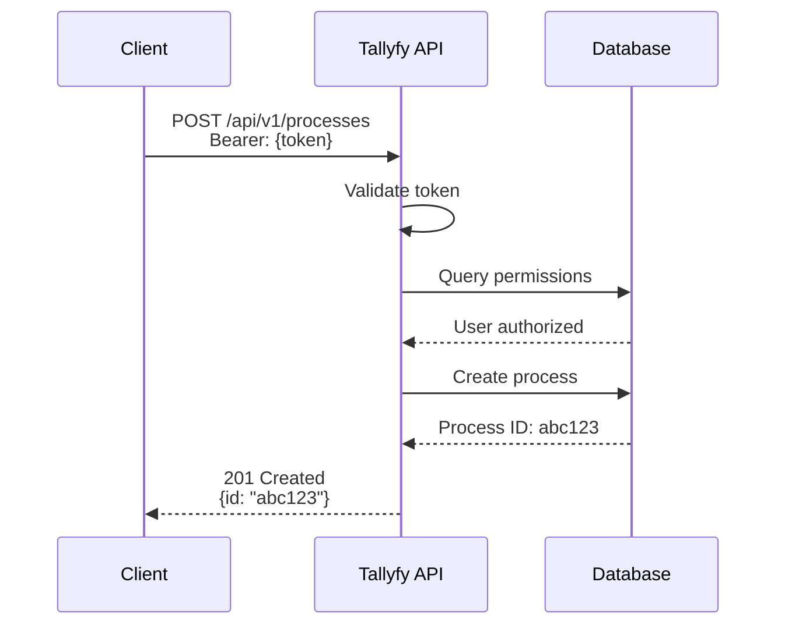
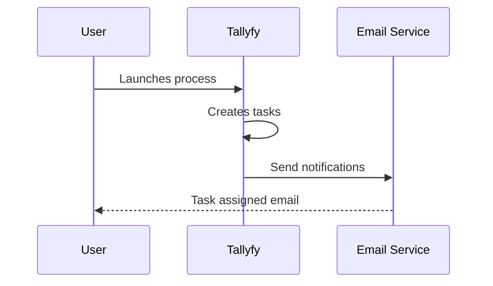
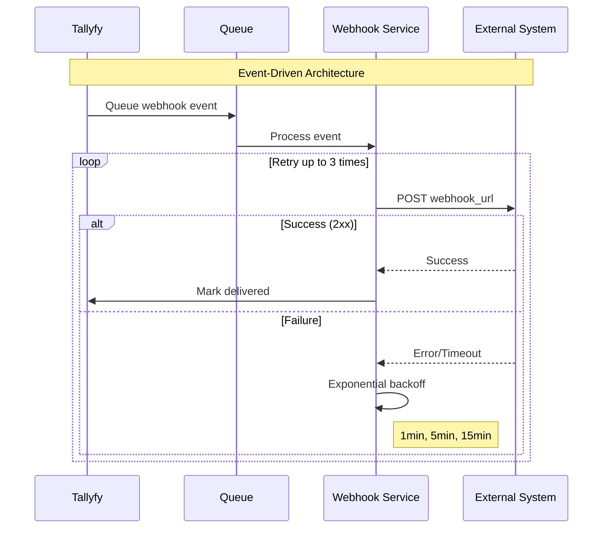
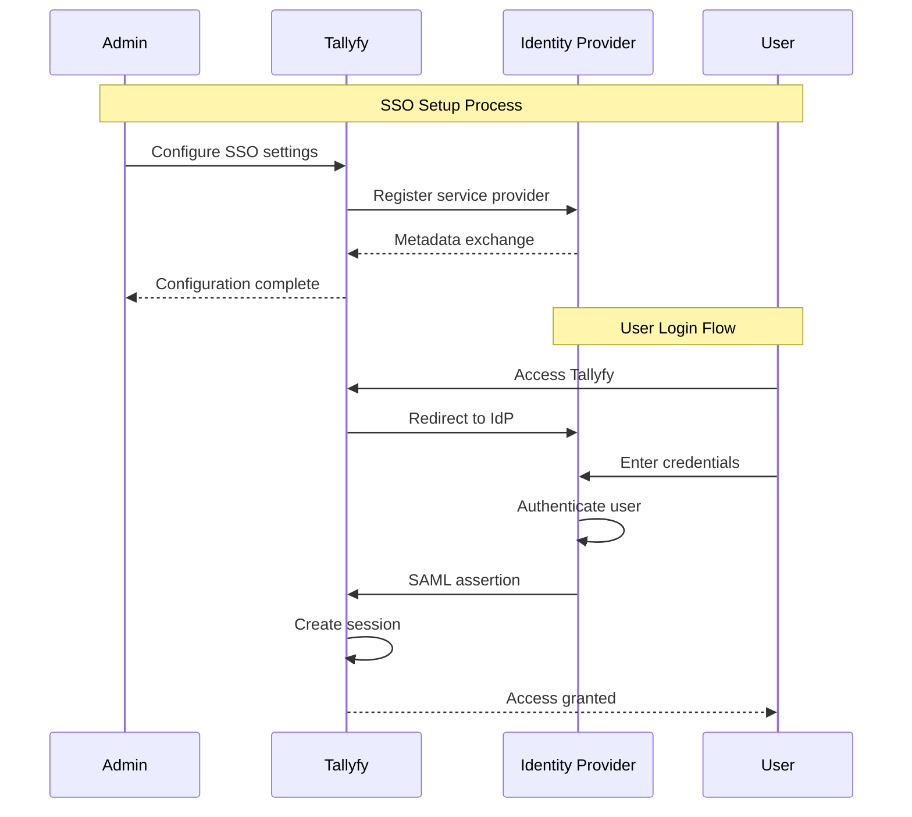
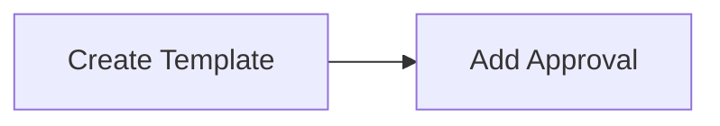

# CLAUDE.md

This file provides guidance to Claude Code (claude.ai/code) when working with code in this repository.

## 🚨 CRITICAL: Humanizing Rules Integration

**ALL AI content operations MUST incorporate the comprehensive humanizing guidelines from `humanizing-rules.md`**. These rules ensure content appears natural, human-written, and undetectable as AI-generated.

**Before any AI content work**: Review and apply the humanizing rules found in `/Users/amit/Documents/GitHub/documentation/humanizing-rules.md`

**Required in every AI prompt**: Include humanizing guidelines for conversational tone, varied sentence rhythm, specific examples, answer-first structure, and elimination of AI-typical phrases.

## ROLE & PRIMARY OBJECTIVE

You are working with Tallyfy's comprehensive product documentation. Your role is to act as a workflow expert and exceptionally skilled technical writer creating documentation for Tallyfy - a workflow and business process management SaaS platform.

**Primary Mission**: Write clear, concise articles that help non-technical users understand how to use specific Tallyfy features. Every piece of content must serve the singular goal of making users successful with the product while following all humanizing rules to ensure natural, human-like writing.

## PROJECT OVERVIEW

This is a **documentation website** for Tallyfy's suite of products built with **Astro and Starlight**.

**📁 COMPLETE DOCUMENTATION STRUCTURE**: See `DOCUMENTATION_STRUCTURE.md` for comprehensive organization guide including 585 .mdx files across 99 directories, search strategies, and file patterns.

### Tallyfy Products Overview
- **Tallyfy Pro** (Primary focus): Create, launch, track and improve repeatable business processes
  - Location: `/src/content/docs/pro/` (512 files - 89% of all documentation)
  - Core areas: documenting/ (155 files), tracking-and-tasks/ (65 files), integrations/ (149 files)
- **Tallyfy Answers**: Vector-based search engine
  - Location: `/src/content/docs/answers/` (16 files)
- **Tallyfy Denizen**: Localized images based on user location
  - Location: `/src/content/docs/denizen/` (2 files)
- **Tallyfy Manufactory**: Events ingestion and lifecycle engine
  - Location: `/src/content/docs/manufactory/` (45 files)

### Tallyfy Pro Terminology & Concepts
- **Templates**: Where you define your process (API calls these "blueprints")
  - Two types: Document templates and Procedure templates
- **Processes**: Running instances of launched templates that you can track
- **Steps vs Tasks**: 
  - In a procedure template: single items are called "steps"
  - In a launched process: single items are called "tasks"
- **Automations**: "If this then that" rules
- **Views**:
  - Tasks view: Individual tasks assigned across all processes
  - Tracker view: Birds-eye view at per-process level
- **User Roles**: Administrator, Standard, and Light (Light users cannot edit/create templates)
- **Guests**: Email addresses outside your company (unlimited free)
- **Features**: API-first architecture, Free SSO for all customers

### Core Concepts Reference Links (Pro Product)
Use these absolute paths for internal linking:
```
Procedure templates: `/products/pro/documenting/templates/`
Document templates: `/products/pro/documenting/documents/`
Templates (overall): `/products/pro/documenting/templates/`
Processes: `/products/pro/tracking-and-tasks/processes/`
Automations: `/products/pro/documenting/templates/automations/`
Tasks: `/products/pro/tracking-and-tasks/tasks/`
Members: `/products/pro/documenting/members/`
Member roles: `/products/pro/documenting/members/`
Invite a member: `/products/pro/documenting/members/how-to-invite-and-activate-members-on-tallyfy/`
Guests: `/products/pro/documenting/guests/`
Form fields: `/products/pro/tracking-and-tasks/tasks/what-are-form-fields-in-tallyfy/`
Pricing: `/products/pro/pricing/`
Security: `/products/pro/compliance/`
Compliance: `/products/pro/compliance/`
Language translation: `/products/pro/miscellaneous/how-can-i-translate-content-in-tallyfy/`
Snippets: `/products/pro/documenting/templates/snippets/`
Variables: `/products/pro/documenting/templates/variables/`
Job titles: `/products/pro/documenting/templates/edit-templates/understanding-assignment-types/`
Launching a process: `/products/pro/launching/`
Tasks view: `/products/pro/tracking-and-tasks/tasks-view/`
Tracker view: `/products/pro/tracking-and-tasks/tracker-view/`
Personal settings: `/products/pro/settings/personal-settings/`
Organization settings: `/products/pro/settings/org-settings/`
Integrations: `/products/pro/integrations/`
Tallyfy Analytics: `/products/pro/integrations/analytics/`
Middleware: `/products/pro/integrations/middleware/`
API: `/products/pro/integrations/open-api/`
Webhooks: `/products/pro/integrations/webhooks/`
Contact support: `/products/pro/miscellaneous/support/how-can-i-contact-tallyfys-support-team/`
```

## FINDING & UPDATING DOCUMENTATION

### Documentation Discovery Strategies
When identifying where to update documentation, use this search hierarchy:

1. **Check existing file coverage first**:
   ```bash
   # Find by feature area
   find /src/content/docs/pro/documenting/templates -name "*.mdx"
   find /src/content/docs/pro/tracking-and-tasks/tasks -name "*.mdx"
   
   # Search by keywords
   grep -r "assignment\|assign" /src/content/docs/pro --include="*.mdx"
   grep -r "automation\|rule" /src/content/docs/pro --include="*.mdx"
   ```

2. **Use the comprehensive structure map**: `DOCUMENTATION_STRUCTURE.md` contains complete file inventory

3. **Follow established patterns**:
   - User management issues → `pro/documenting/members/` or `pro/documenting/guests/`
   - Task/assignment problems → `pro/tracking-and-tasks/tasks/`
   - Template creation → `pro/documenting/templates/edit-templates/`
   - Process launching → `pro/launching/` or `pro/tracking-and-tasks/processes/`
   - Integration setup → `pro/integrations/[vendor]/`
   - Automation rules → `pro/documenting/templates/automations/`

### Quick File Location Commands
```bash
# Most common documentation areas (use these to narrow search)
ls /src/content/docs/pro/documenting/templates/     # 84 files - Template creation
ls /src/content/docs/pro/tracking-and-tasks/tasks/ # 25 files - Task management  
ls /src/content/docs/pro/integrations/             # 149 files - All integrations
ls /src/content/docs/pro/documenting/members/      # 19 files - User management

# Find specific topics
grep -l "how to assign" /src/content/docs/pro/**/*.mdx
grep -l "template\|blueprint" /src/content/docs/pro/**/*.mdx
```

### Update vs. Create Decision Matrix
- **UPDATE existing file**: When topic fits within current article scope (90% of cases)
- **CREATE new file**: Only when entirely new feature/workflow needs dedicated coverage
- **Reference DOCUMENTATION_STRUCTURE.md**: For complete context before making changes

### Maintaining Documentation Structure Map
**CRITICAL**: When adding/removing/moving documentation files, update the structure map:

```bash
# Regenerate documentation structure map after any file changes
cd /documentation/vimeo_transcripts
python3 -c "
import os, glob
from pathlib import Path

# Count all .mdx files and update DOCUMENTATION_STRUCTURE.md
docs_dir = '/Users/amit/Documents/GitHub/documentation/src/content/docs'
all_files = glob.glob(os.path.join(docs_dir, '**/*.mdx'), recursive=True)
total_files = len(all_files)

# Update the file count in DOCUMENTATION_STRUCTURE.md
structure_file = '/Users/amit/Documents/GitHub/documentation/DOCUMENTATION_STRUCTURE.md'
with open(structure_file, 'r') as f:
    content = f.read()

# Replace the total file count
import re
content = re.sub(r'\*\*Total\*\*: \d+ \.mdx files', f'**Total**: {total_files} .mdx files', content)

with open(structure_file, 'w') as f:
    f.write(content)

print(f'Updated DOCUMENTATION_STRUCTURE.md with {total_files} total files')
"

# Also update CLAUDE.md references if the count changed significantly
# (Manual step - update the "576 .mdx files" references in CLAUDE.md if needed)
```

**Workflow Integration**: 
- Run structure update after creating new articles
- Update file counts in CLAUDE.md if they change by >5%
- Regenerate complete structure map monthly or after major reorganizations

## DEVELOPMENT COMMANDS

```bash
# Development
npm install                    # Install dependencies
npm run dev                   # Start development server

# Content Automation (Python scripts)
python scripts/generate-snippets.py --files [files] --dir [directory] --token [api-key] --prompt [base64-prompt]
python scripts/generate-related-articles.py --dir [directory] --answers_api_key [key]
python scripts/markdown-lint.py --dir [directory]
python scripts/check-deleted-files.py --dir [directory]
python scripts/update-documentation-structure.py     # Update structure map after file changes
```

## PLATFORM & TECHNICAL REQUIREMENTS

### Documentation Platform
- **Platform**: Astro Starlight
- **Format**: Markdown files (.mdx)
- **Editing**: All edits must be in markdown using standard syntax

### Article Structure Rules
1. **Headers** (DO NOT EDIT except for new articles):
   ```yaml
   ---
   id: c15bf2be31c3a7fbded5d13fce7aaab9
   sidebar:
     order: 15
   description: [AI-generated comprehensive description]
   title: [Article title in sentence case]
   ---
   ```
   - New articles must use ID: `0000000000000000000000000000000000`
   - **description** field is generated server-side
   - **sidebar.order**: Use sequential numbers (1, 2, 3...) for articles within a section to control display order

2. **Component Imports**:
   - **Required placement**: Immediately after the frontmatter YAML, before any content
   - **For Related articles**: `import { CardGrid, LinkTitleCard } from "~/components";`
   - **For procedural content**: `import { Steps } from '@astrojs/starlight/components';`
   - **For tabs/asides**: `import { Tabs, TabItem, Aside } from '@astrojs/starlight/components';`
   - **Multiple imports example**:
     ```markdown
     ---
     title: Your article title
     ---
     
     import { CardGrid, LinkTitleCard } from "~/components";
     import { Steps } from '@astrojs/starlight/components';
     
     ## Your content starts here
     ```
   - **CRITICAL**: Missing imports will cause build failures

3. **Content Hierarchy**:
   - Start with H2 (`##`), never H1
   - Don't skip heading levels (H2 → H3 → H4)
   - All headings use sentence case (lowercase except proper nouns)

4. **Related Articles Section** (CRITICAL RULES):
   
   ⚠️ **ABSOLUTE PROHIBITION FOR EXISTING ARTICLES**: 
   - **NEVER EVER modify the Related articles section in existing articles**
   - **This section is AUTOMATICALLY GENERATED by GitHub Actions**
   - **Any manual changes WILL BE OVERWRITTEN**
   - **DO NOT touch even if descriptions seem wrong or spacing is off**
   - **The ONLY exception**: When creating a NEW article that doesn't exist yet
   
   - **For NEW articles ONLY**: Can include initial sample Related articles section
   - **For EXISTING articles**: HANDS OFF - no exceptions, no edits, no fixes
   - **Required format**:
     ```markdown
     ## Related articles
     <CardGrid>
     <LinkTitleCard header="<b>Category > Title</b>" href="/full/path/to/article/" > Description of the article content. </LinkTitleCard>
     </CardGrid>
     ```
   - **Import requirement**: Must have `import { CardGrid, LinkTitleCard } from "~/components";` at top of file
   - **Header format**: Use category prefix like "API >", "Members >", "Settings >"
   - **URLs**: Always include trailing slash in href
   - **Descriptions**: Write complete sentences describing the article content
   - **GitHub Actions Warning**: The `generate-related-articles.py` script runs automatically on GitHub and will overwrite ANY manual changes to Related articles sections

### Content Creation Rules
- Only create new articles when absolutely necessary
- When handling GitHub tickets, evaluate if documentation changes are needed
- Include prerequisites section for procedural articles
- Follow consistent structure based on content type (concept/task/reference/troubleshooting)
- **Directory structure requirement**: When creating new folders, always include an `index.mdx` file as the landing page for that directory to prevent build errors and provide proper navigation

### Content Automation System
This repository uses a sophisticated Python-based content automation system:

1. **Content IDs**: Generated server-side with MD5 hashes for unique page identification
2. **AI-Generated Descriptions**: `generate-snippets.py` uses Claude AI to create page descriptions
3. **Related Articles**: `generate-related-articles.py` fetches cross-references via Answers API
4. **Content Validation**: `markdown-lint.py` validates frontmatter structure and MDX syntax

### Content Validation
Run `python scripts/markdown-lint.py --dir src/content/docs` to validate:
- Frontmatter YAML structure
- Required fields presence
- UUID format validation
- Sidebar order requirements

## WRITING STYLE GUIDELINES

**CRITICAL**: All writing must follow the comprehensive humanizing guidelines in `humanizing-rules.md`. The rules below supplement but do not replace the humanizing requirements.

### Answer-First Content Structure (From Humanizing Rules)

Apply the answer-first pattern from `humanizing-rules.md`:
- Provide complete, actionable answer in first 2-3 sentences
- Use conversational tone with natural speech patterns
- Include specific examples and concrete details
- Vary sentence rhythm throughout

**See humanizing-rules.md for complete guidelines on natural content structure.**

### Voice & Tone (Enhanced by Humanizing Rules)
- **Apply all humanizing-rules.md guidelines first**
- Direct & Clear with conversational elements
- Simple language with varied sentence rhythm
- Natural contractions and personal pronouns
- Professional but conversational tone
- Eliminate all AI-typical phrases and patterns


### Language Rules (Following Humanizing Guidelines)

**MANDATORY**: Apply ALL language rules from `humanizing-rules.md` including:
- Conversational tone with natural speech patterns
- Dramatic sentence length variation (3-30 words)
- Strategic use of contractions and colloquial language
- Specific examples with concrete details
- Elimination of AI-typical phrases

**Additional technical writing requirements**:
- **Active voice**: "The system sends an email" not "An email is sent by the system"
- **Present tense**: For instructions and descriptions
- **American English**: Spelling and grammar
- **Global audience**: No idioms, cultural references, or colloquialisms
- **Specific nouns**: Replace "it", "this", "the platform" with "Tallyfy", "the template", etc.
- **Clear pronoun references**: Apply humanizing-rules.md guidelines for pronoun clarity

### Words to Avoid (From Humanizing Rules)

**CRITICAL**: Follow ALL avoidance guidelines in `humanizing-rules.md` including:
- All AI-typical sentence starters and phrases
- Corporate jargon and empty buzzwords
- Vague statements without concrete evidence
- Made-up technical terminology
- Empty summary sentences
- Overused AI adjectives without context

**See humanizing-rules.md for complete list of words, phrases, and patterns to avoid.**

### Acceptable Writing Patterns (Often Mistaken as "AI-Like")

These patterns are effective when used intentionally with substance:

- **Intentional repetition for clarity**: Repeating complex concepts in simpler terms
  - Good: "Vector databases store embeddings - mathematical representations that capture meaning. In other words, vector databases help find results that are 'close' in meaning, not just exact text matches."
- **Signposting phrases**: Use when followed by valuable content
  - Good: "Essentially, instead of classifying the document as a whole, we classify each section independently."
  - Only use when the following content genuinely clarifies or adds value
- **Parallel structure**: For organizing related ideas
  - Good: "The system scales across inputs, stays responsive under load, and returns consistent results even with noisy prompts."
- **Declarative openings**: Bold claims work when backed by evidence
  - Good: "LLM evaluations are hard to get right. Many rely on user-defined gold labels or vague accuracy metrics, which fail for subjective or multi-step tasks."
- **Hyphens for rhythm and clarity**: Use spaced hyphens for emphasis and natural speech patterns
  - Good: "Templates define your process - think of them as reusable blueprints - while processes are the actual running instances."
  - **Important**: Always use regular hyphens with spaces ( - ) not em-dashes (—) or en-dashes (–)
  - Format: `space hyphen space` like "this - not this—or this–"
- **Strategic fragments for emphasis**: Occasionally use sentence fragments for impact (use EXTREMELY sparingly)
  - Good: "Want to automate task assignments? Simple. Just configure the automation rules in your template."
  - Good: "The result? A 40% reduction in process completion time."
  - Only use 1-2 fragments per article maximum, and only when it genuinely adds emphasis
- **Conversational asides with parentheses**: Add brief, helpful context in a natural voice
  - Good: "You can assign tasks to job titles (not just specific people), which means new team members automatically get the right work."
  - Good: "The API returns results in JSON format (yes, it's that straightforward)."
  - Keep asides brief and genuinely helpful—never forced
- **Personal phrasing within professional bounds**: Use specific, experience-based language
  - Good: "After helping 500+ companies implement workflows, we've found that simple templates work best."
  - Good: "You'll notice the difference immediately—tasks that took hours now take minutes."
  - Ground claims in concrete experience or data

## CONTENT ORGANIZATION

### Document Structure
- **Focused content**: One main topic per article
- **Clear sections**: Descriptive headings and subheadings
- **Logical flow**: Include transitions between sections
- **Front-loaded information**: Key points first
- **Paragraph guidelines**:
  - 3-5 sentences maximum
  - 50-120 words per paragraph
  - One idea per paragraph
- **High information density**: Every sentence must provide value
  - Bad: "As someone who manages workflows, you've probably noticed inefficiencies. This post guides you through optimization. We'll cover the pitfalls that make processes feel slow."
  - Good: "Manual task assignment wastes 2 hours daily for most managers. Here's how to automate assignments based on workload and expertise."
- **Strategic bullet points**: Use lists only when items are truly parallel and independent
  - Overuse of nested bullets makes content harder to scan
  - When ideas connect or need context, use paragraphs instead
  - Reserve bullets for truly independent items like feature lists or prerequisites

### Content Types
- **Conceptual**: What and why
- **Procedural**: How-to instructions
- **Reference**: Technical details
- **Troubleshooting**: Problem/cause/solution format

### Emphasis & Highlighting
- Limit to 1-3 emphasized items per page
- Use **Note:** prefix for important tips
- Convert key insights to list items for scannability

## FORMATTING CONVENTIONS

### Text Formatting
- **Bold** (`**text**`): UI elements (buttons, menus, fields, options)
- *Italics* (`*text*`): New terms with definitions, placeholders
- `Code` (`` `text` ``): Code snippets, commands, literal text
- No quotes for UI elements
- No underlining (reserved for links)

### Markdown Elements
- **Headings**: Start with `##` (H2), maintain hierarchy
- **Lists**: 
  - Bullets (`-` or `*`) for unordered items
  - Numbers for sequential steps
  - Indent 4 spaces for sub-items
- **Callouts**: Use sparingly
  ```markdown
  :::note[Title]
  Content
  :::
  ```
- **Videos**: 
  ```html
  <lite-vimeo videoid="905736219"></lite-vimeo>
  ```

### Special Components
- **Steps Component**: Only for product instructions
  ```markdown
  <Steps>
  1. Single-level hierarchy only
  2. Images must be inside list items
  </Steps>
  ```
  - Example with image:
  ```markdown
  1. **Step 1:** Configure your settings.
     
     
  ```

## INSTRUCTIONAL CONTENT

### Writing Procedures
- Start with action verbs: "Click **Submit**"
- One action per step
- Include context: "In the **Dashboard**, click..."
- Mark optional steps: "*(Optional)* If you want to..."
- Add verification steps
- Include prerequisites at beginning
- State expected outcomes

### Images & Screenshots
- **When to use**: Only when adding clarity
- **Requirements**:
  - Descriptive alt text
  - Brief introduction before image
  - Annotations (arrows, circles) for key elements
  - High quality, legible text
  - Cropped to relevant portions
- **Alt text format**: ``

### Examples & Code
- Use realistic scenarios (e.g., "ACME Corp")
- Include comments in code samples
- Ensure valid, properly formatted code
- Show complete functionality
- Include expected outputs
- Use appropriate markdown syntax for code blocks

### Advanced Writing Techniques

- **SWBST Pattern** (Somebody Wanted But So Then): Use for explaining decisions or system evolution
  - Somebody: The actor (user, team, system)
  - Wanted: The goal
  - But: The obstacle
  - So: The response
  - Then: The outcome
  - Example: "We used GPT-4 for summarization. We wanted fluent answers, but it hallucinated facts. So we added a retrieval step. Then we re-ranked outputs based on citation accuracy."
- **Contribution commensurate with length**: Ensure value matches article length
  - A 500-word article must provide 500 words of genuine insight
  - Cut content that doesn't directly serve the reader's goal
  - Ask: "Will the reader feel their time was well spent?"


## LINKING & REFERENCES

### Internal Links
- **Format**: Absolute paths without .mdx extension
- **Example**: `/products/pro/tracking-and-tasks/processes/`
- **Public URLs**: Base URL is `https://tallyfy.com/products/`
- **Core Concepts Linking Pattern**: 
  - Link sparingly to core concepts from the reference list when first mentioned in article body
  - Format: `[templates](mdc:products/pro/documenting/templates)`, `[tasks](mdc:products/pro/tracking-and-tasks/tasks)`
  - Only link when it adds value for understanding the current topic
- Link only first occurrence in a section
- Use descriptive anchor text (not "click here")
- Add "See also" sections when helpful

### Linking Best Practices
- Sparingly link to core concepts when helpful
- Verify all links are valid
- Don't over-link (distracts readers)

### External Link Requirements
**All links to domains NOT ending in tallyfy.com must be nofollow and open in new tab:**

**Astro Starlight Format**:
```markdown
[Link Text](https://example.com)<a href="https://example.com" rel="nofollow noopener noreferrer" target="_blank"><sup>[1]</sup></a>
```

**Example**:
```markdown
Learn more at [Google Analytics](https://analytics.google.com)<a href="https://analytics.google.com" rel="nofollow noopener noreferrer" target="_blank"><sup>[1]</sup></a>
```

**Note**: The superscript number should increment for each external link on the page

## ACCESSIBILITY & INCLUSIVITY

### Inclusive Language
- Gender-neutral pronouns ("they" not "he/she")
- No ableist or biased terms
- Diverse examples and scenarios
- No exclusionary or discriminatory language

### Accessibility Requirements
- Don't rely on sensory characteristics ("click **Start**" not "click the green button")
- Always include image alt text
- Standard capitalization for screen readers
- Proper heading structure for navigation
- State required prior knowledge explicitly

## SEO & AI OPTIMIZATION

### Technical SEO Writing Rules

**URL-Friendly Titles**:
- Use descriptive, keyword-rich titles that work as URLs
- Example: "How to Assign Tasks in Tallyfy" → `/how-to-assign-tasks/`
- Avoid special characters, numbers, or dates in titles
- Keep titles under 60 characters

**Search-Optimized Content Patterns**:

**HowTo Content Pattern**:
```markdown
## How to [specific action]

**Time required**: 5 minutes
**Difficulty**: Easy
**Prerequisites**: Administrator or Standard user role

### Steps

1. **Navigate to Templates**: Click the **Templates** tab in the main menu
2. **Create New Template**: Select **Create New** button
3. **Configure Settings**: Add your process steps and automation rules
```

**FAQ Content Pattern**:
```markdown
## Frequently Asked Questions

### Can I assign tasks to multiple people?

Yes, use the group assignment feature. Click **Assign** and select **Group Assignment** to assign the same task to multiple team members.

### How do I track task progress?

The tracker view provides real-time visibility. Navigate to **Tracker** to see all running processes and their current status.
```

### Content Structure for AI
- Small, focused semantic chunks (300-500 words per section)
- Descriptive headings formatted as questions when appropriate
- Standalone paragraphs that make sense out of context
- Front-loaded key information in first 50 words
- Clear subject-verb-object sentences
- Include specific numbers and data points when available

### Optimization Techniques
- Natural keyword variations (e.g., "workflows", "processes", "procedures")
- Entity mentions: Always use "Tallyfy" not "the platform" or "our tool"
- Parenthetical explanations for acronyms: "Service-Level Agreement (SLA)"
- Structured formats (lists, tables, steps) for easy parsing
- Semantic HTML: proper use of `<article>`, `<section>`, `<nav>`
- Internal linking with descriptive anchor text (3-5 per article)


### LLM-Specific Optimization Patterns

**Conversational Markers for AI Understanding**:
- Start procedural content with "To [achieve goal]:" followed by steps
- Use "For example:" to introduce concrete scenarios
- Include "Note:" for important contextual information
- Add "Prerequisites:" sections for complex procedures

**Citation-Worthy Content Structure**:
- **Claim + Evidence**: "Tallyfy automates task assignment based on workload and availability"
- **Problem + Solution**: "If tasks are getting stuck, enable automatic reassignment in the automation rules"
- **Question + Direct Answer**: Use H2/H3 headings as questions when appropriate

**Entity Reinforcement**:
- Mention "Tallyfy" 3-5 times per article naturally
- Connect features to Tallyfy explicitly: "Tallyfy's automation engine" not just "the automation engine"
- Build topic clusters around core entities (templates, processes, automations)

**Semantic Completeness**:
- Define terms on first use: "Templates (reusable process blueprints) help standardize workflows"
- Include related concepts: When discussing tasks, mention assignments, deadlines, and notifications
- Create mini-glossaries for complex topics

**Required Context Clusters**:
When discussing any feature, include ALL related concepts:

*Task Discussion Must Include*:
- Assignment methods (individual, group, job title)
- Due dates and deadline management
- Form fields and data collection
- Comments and collaboration features
- Dependencies and prerequisites
- Completion criteria and validation

*Template Discussion Must Include*:
- Creation and configuration process
- Step/task setup
- Assignment rules and logic
- Automation options
- Launch procedures
- Version control and updates

**LLM Selection Triggers**:
- Use specific numbers: "5 steps", "10-minute setup", "3 approval levels"
- Include comparison phrases: "Unlike spreadsheets, Tallyfy provides..."
- Add outcome statements: "This results in...", "The benefit is..."
- Use if-then constructions: "If you need X, then Tallyfy's Y feature..."
- Problem-solution pairs: "Can't track progress? Tallyfy's dashboard shows real-time status"
- Feature-benefit connection: "Automatic reminders ensure deadlines are never missed"
- Use case specificity: "For HR onboarding, Tallyfy provides complete checklists"

## TROUBLESHOOTING CONTENT

### Format
- Clear problem/cause/solution structure
- Use tables or lists for multiple issues
- Include exact error messages in `code` format
- Specific solutions (not "check your settings")
- Preventative measures when applicable
- Link to support resources for complex issues

## CONTENT MAINTENANCE


### Best Practices
- Test all instructions before publishing
- Maintain consistent terminology throughout documentation
- Write with accessibility in mind
- Consider both human readers and AI systems
- Keep examples realistic and relevant
- Update content when features change


## DEVELOPMENT WORKFLOW

When working with content:

1. Create/edit `.mdx` files in appropriate product directories
2. Content IDs are assigned automatically server-side
3. Run `python scripts/generate-snippets.py` to generate descriptions (requires API key)
4. Run `python scripts/markdown-lint.py` to validate structure
5. Use `npm run dev` to preview changes locally

## AI INTEGRATION

This repository extensively uses Claude AI for content automation:

1. **Content Generation**: `generate-snippets.py` uses Claude API to create descriptions
2. **Related Articles**: Integration with Tallyfy's Answers API for cross-references
3. **Configuration**: AI settings in `.claude/settings.local.json`

## CLAUDE CODE AUTOMATION PHILOSOPHY

### Overview

This codebase supports automated documentation workflows using Claude Code's non-interactive mode. Break large documentation tasks into atomic units that can be executed sequentially via command line, enabling systematic content updates without manual intervention.

### Non-Interactive Command Pattern

Execute specific documentation tasks using:
```bash
claude -p "YOUR_PROMPT_HERE" --dangerously-skip-permissions
```

This command runs Claude with a specific prompt, completes the task, and exits - perfect for scripting and automation.

### Task Queue Pattern

For large documentation projects, use a file-based task queue:

1. **Create prompt files**: Each `.prompt` file contains one specific documentation task
2. **Process sequentially**: Scripts read and execute prompts one by one
3. **Track progress**: Completed tasks are deleted or moved, making workflows resumable

Example directory structure:
```
doc_automation_queue/
├── 001_analyze_missing_docs.prompt
├── 002_create_api_reference.prompt
├── 003_update_changelog.prompt
└── completed/
```

### Example Automation Scripts

#### 1. Bulk Documentation Updates
```bash
#!/bin/bash
# process_doc_queue.sh

for prompt_file in doc_automation_queue/*.prompt; do
    echo "Processing: $prompt_file"
    
    # Read prompt and execute
    prompt=$(cat "$prompt_file")
    claude -p "$prompt" --dangerously-skip-permissions
    
    # Move completed
    mv "$prompt_file" doc_automation_queue/completed/
done
```

#### 2. Generate Missing Documentation
```python
#!/usr/bin/env python3
# generate_missing_docs.py

import subprocess
import os
from pathlib import Path

def generate_doc_for_feature(feature_path):
    prompt = f"""
    Create documentation for {feature_path} following the style guidelines in CLAUDE.md.
    Include: overview, prerequisites, step-by-step instructions, and troubleshooting.
    """
    
    subprocess.run([
        "claude", "-p", prompt, "--dangerously-skip-permissions"
    ])

# Process all features needing documentation
features = Path("src/content/docs/pro").glob("**/*.mdx")
for feature in features:
    if "TODO" in feature.read_text():
        generate_doc_for_feature(feature)
```

### Best Practices for Documentation Automation

1. **Atomic Tasks**: Each prompt should create/update one article or section
2. **Clear Context**: Reference specific files and follow CLAUDE.md guidelines
3. **Validation Steps**: Include prompts to validate generated content
4. **Incremental Updates**: Work on small batches to maintain quality

Example atomic prompts:
```
# Good: Specific and bounded
"Update the API authentication article at /products/pro/integrations/open-api/oauth-authorization-flow.mdx to include the new OAuth 2.0 flow changes from changelog 2025-03-31"

# Bad: Too broad
"Update all API documentation"
```

### Common Documentation Automation Patterns

1. **Changelog-Driven Updates**: Automatically update docs based on changelog entries
2. **Screenshot Updates**: Generate prompts to update screenshots when UI changes
3. **Cross-Reference Validation**: Verify all internal links remain valid
4. **Style Compliance**: Check and fix articles not following guidelines
5. **Missing Content Detection**: Identify and create stub articles for new features

## 📊 Mermaid Diagram Guidelines for Tallyfy Documentation

### When to Use Visual Diagrams - ULTRATHINKING Required

**CRITICAL RULE**: Only add Mermaid diagrams where they provide clear value for understanding complex flows or interactions. Based on extensive analysis, only **10-15% of documentation articles** should have diagrams. Most documentation is better with clear text.

**ULTRATHINKING APPROACH**: Before adding any diagram, you must:
1. Read the ENTIRE article to understand full context
2. Think from three perspectives: beginner, intermediate, expert
3. Ask: "Is the cognitive effort to understand a diagram LESS than understanding the text alone?"
4. Apply the "lagom" principle - not too much, not too little
5. Consider if visual learners specifically benefit
6. Evaluate long-term maintenance burden

#### ✅ Good Candidates for Diagrams (High Value Patterns)
1. **OAuth/API Authorization Flows** → Use `sequenceDiagram`
   - Multi-actor sequences with token exchanges
2. **Automation Logic with AND/OR Conditions** → Use `flowchart`
   - Complex conditional evaluation paths
3. **Webhook Event Processing** → Use `sequenceDiagram`
   - Async flows with queues, retries, callbacks
4. **Process Launch Triggers** → Use `flowchart`
   - Multiple trigger paths converging to single action
5. **Master Template vs Process Relationships** → Use `graph` or `erDiagram`
   - One-to-many spawning patterns
6. **Integration Flows** → Use `sequenceDiagram` or `flowchart`
   - Data moving between Tallyfy and external systems
7. **State Machines** → Use `stateDiagram-v2`
   - Process/task lifecycle transitions

#### ❌ Poor Candidates for Diagrams (Skip These)
- Simple linear processes (≤3 steps) - Use `<Steps>` component instead
- Single API calls without complex flow - Code blocks are clearer
- Basic CRUD operations
- UI navigation - Screenshots are better
- Content easily explained with bullet points
- Troubleshooting checklists - Bullet points work best
- Feature lists or changelogs - Text lists are appropriate
- Simple two-state toggles - Text description is sufficient

### Documentation Areas and Diagram Types

1. **API Documentation** (`/pro/integrations/open-api/`)
   - OAuth flows → sequence diagram (user-facing terms)
   - Request/response cycles → sequence diagram (API terminology)
   - Error handling flows → flowchart with decision diamonds

2. **Webhook Documentation** (`/pro/integrations/webhooks/`)
   - Event triggers → flowchart showing cause and effect
   - Webhook delivery → sequence diagram with retry logic
   - Event processing → flowchart with error branches

3. **Process Documentation** (`/pro/launching/`, `/pro/tracking-and-tasks/`)
   - Process triggers → flowchart with decision nodes
   - Process lifecycle → state diagram
   - Task dependencies → graph showing relationships

4. **Automation Logic** (`/pro/documenting/templates/automations/`)
   - Sequential rule evaluation → flowchart showing position-based order
   - AND/OR combinations → linear flow (NOT nested parentheses)
   - Action execution → sequential flowchart

5. **Integration Patterns** (`/pro/integrations/`)
   - Third-party flows → sequence diagram
   - SSO setup → sequence showing both user and admin actions
   - Data sync → bidirectional arrows in sequence

6. **Manufactory Documentation** (`/manufactory/`)
   - Event pipeline → graph diagram
   - WebSocket connections → state diagram
   - Collector architecture → graph with subgraphs

### Terminology Guidelines for Diagrams

**IMPORTANT**: Choose terminology based on your audience:

**API/Technical Documentation** - Use precise technical terms:
- `POST /api/v1/endpoints`
- `Bearer token`
- `HTTP 201 Created`
- `webhook_url`
- `automation_id`
- `rule.position`
- Database field names

**User-Facing Documentation** - Use friendly business terms:
- "Launch a process"
- "Complete a task"
- "Assign to team member"
- "Automation triggers"
- "When this happens"
- "Workflow rules"
- UI labels and button names

### Content-Specific Diagram Templates

#### For OAuth Documentation


#### For Process Triggers


#### For Webhook Events


#### For Automation Logic (Reflecting Actual System)
```mermaid
%%{init: {'theme':'forest'}}%%
flowchart TD
    Start([Event Triggers Automation]) --> Context[Determine Context<br/>task completion/process start/etc]
    
    Context --> Rules[Load Rules by Position Order]
    
    Rules --> Rule1{Rule 1<br/>Position: 1}
    
    Rule1 -->|Met| Op1{Logic Operator<br/>for Rule 2?}
    Rule1 -->|Not Met| Op1
    
    Op1 -->|AND| Rule2AND{Rule 2 Met?}
    Op1 -->|OR| Rule2OR{Rule 2 Met?}
    Op1 -->|None| CheckActions
    
    Rule2AND -->|Yes + Previous Yes| Continue[Continue to Rule 3...]
    Rule2AND -->|No| NoAction[Skip Actions]
    
    Rule2OR -->|Yes| CheckActions[All Rules Evaluated]
    Rule2OR -->|No + Previous No| NoAction
    
    CheckActions --> Actions[Execute Actions<br/>by Position Order]
    
    Actions --> A1[Action 1: Show/Hide Task]
    A1 --> A2[Action 2: Set Deadline]
    A2 --> A3[Action 3: Assign Users]
    A3 --> A4[Action 4: Change Status]
    
    A4 --> Log[Log in automation_executions]
    NoAction --> Log
    
    Log --> End([Complete])
    
    style Start fill:#E8F4FF
    style End fill:#D4EDDA
    style CheckActions fill:#D4EDDA
    style NoAction fill:#FFF3CD
    
    Note over Rule1,Rule2OR: Rules evaluated sequentially<br/>by position field, no parentheses<br/>or complex precedence
```

### Webhook and API Visualization Best Practices

#### API Call Representation

**Use API Terminology for Technical Documentation:**


**Use User-Facing Terms for End-User Documentation:**


#### Webhook Flow Patterns

**Standard Webhook with Retry Logic:**


#### SSO and Authentication Flows

**Collaborative Setup (User + Admin Actions):**


### Auto-Generation Rules

#### When You See These Patterns → Generate Diagrams

1. **Multiple Steps with Arrows** (→, then, after, next)
   - Generate: flowchart
   - Direction: TD or LR based on step count

2. **API Calls with Responses** (POST, GET, returns, responds)
   - Generate: sequenceDiagram
   - Include: Request/response pairs
   - Use API terminology for technical docs
   - Use user-facing terms for end-user docs

3. **Conditional Logic** (if, when, unless, either/or)
   - Generate: flowchart with diamond decision nodes
   - Include: All branches and outcomes

4. **State Transitions** (pending → active → complete)
   - Generate: stateDiagram-v2
   - Include: All states and transitions

5. **System Components** (connects to, sends to, receives from)
   - Generate: graph diagram
   - Include: All components and data flows

6. **Webhook Events** (triggers, fires, notifies)
   - Generate: sequence diagram with retry logic
   - Show queue processing
   - Include error handling

7. **Authentication Flows** (login, SSO, OAuth)
   - Generate: sequence diagram
   - Show both user and system actions
   - Include token/session management

### Diagram Placement & Article Structure

#### Recommended Article Structure with Diagrams
When including a Mermaid diagram, follow this proven structure:
1. **H2 heading** for the concept
2. **One-sentence "What this shows" line** - Brief context
3. **Mermaid code fence** - The diagram itself
4. **3 bullets titled "What to notice"** - Call out key insights
5. **Optional links** to deeper concepts embedded in the diagram

#### Placement Golden Rules
1. **For feature overviews**: Place diagram IMMEDIATELY after overview paragraph
2. **For troubleshooting**: Put at TOP before wall-of-text steps
3. **For concepts**: After the intro, before deep details  
4. **For quick starts**: At the very beginning for 5-second path understanding
5. **For complex flows**: Chapter with anchors and link between sections

#### Visual Best Practices
- **One idea per diagram** - Split if >30 nodes
- **Labels**: ≤5 words per node; edges are verbs ("sends", "approves")
- **Flow direction**: 
  - LR (left-right) for features and processes
  - TD (top-down) for troubleshooting and decision trees
- **Decisions**: Always use diamonds with at least two labeled exits
- **Swimlanes**: Use `subgraph` with recognizable titles ("Your Workspace", "Tallyfy Cloud")
- **Consistency**: Reuse node names across pages ("Task", "Approval")

#### Quality Checklist
- **Clarity**: Is the diagram easier to understand than text?
- **Completeness**: Are all paths and error states shown?
- **Accuracy**: Does it reflect the actual system behavior?
- **Simplicity**: One concept per diagram, <30 nodes ideal, 50 max
- **Mobile-friendly**: Readable on small screens
- **Value-add**: Would removing the diagram hurt understanding?
- **Maintenance**: Will this need frequent updates?

### Hyperlinks in Mermaid Diagrams

#### Making Diagrams Interactive Navigation Hubs
Transform diagrams into clickable navigation tools using the `click` syntax:



#### Hyperlink Support by Diagram Type
- ✅ **Full support**: `flowchart`, `classDiagram`, `stateDiagram-v2`
- ❌ **No support**: `sequenceDiagram`, `erDiagram`, `journey`, `timeline`, `gantt`, `pie`, `gitGraph`
- **Note**: Edges/lines cannot be made clickable in any diagram type

#### Link Patterns
1. **Internal docs**: `click NodeA "/products/pro/path/" "Tooltip"`
2. **Same-page anchors**: `click NodeB "#section-id" "Jump to section"`
3. **External sites**: `click NodeC "https://api.tallyfy.com" "API docs"`

**Best Practice**: Add at least 2 `click` links per diagram to make it a navigation hub.

### Practical Mermaid Implementation

#### Creating Effective Prompts for AI
When asking AI to generate Mermaid diagrams, be specific:
- "Create a sequence diagram showing OAuth flow with token refresh"
- "Generate a flowchart for automation rule evaluation with AND/OR logic"
- "Visualize webhook retry mechanism with exponential backoff"

Include these details:
- Tallyfy entities (Template, Process, Task, Step)
- Error conditions and fallback paths
- Timing information (timeouts, retry delays)
- User roles and permissions
- Hyperlinks to related documentation

#### Golden Nuggets for Specific Diagram Types

**Sequence Diagrams**:
- Always add `autonumber` so support can reference "step 3" in tickets
- Use `Note` for explaining the "why" behind critical steps
- Show retry logic with loops and exponential backoff times

**Flowcharts**:
- Put verbs on edges ("sends", "approves", "triggers")
- Use `classDef` to highlight exceptions:
  ```
  classDef danger fill:#fee2e2,stroke:#ef4444
  class ErrorNode danger
  ```
- Create "hub" nodes for grouping related navigation links

**State Diagrams**:
- Add SLAs or timing on transitions: `Under_Review --> Approved: SLA 4h`
- Show triggers on state changes: `Draft --> Submitted: user clicks Submit`

**All Diagrams**:
- Title subgraphs with familiar boundaries ("Your Workspace", "Tallyfy Cloud")
- Keep to "lagom" - not too much, not too little
- Consider adding a "What to notice" bullet list after the diagram

#### Common Tallyfy Entities
**Core**: Template, Process, Step, Task, Form
**Users**: Admin, Member (Standard/Light), Guest, Owner
**Integration**: Webhook, API, WebSocket, Email trigger

#### Technical Constraints
- Maximum 30 nodes ideal, 50 absolute max (performance)
- Avoid nesting beyond 3 levels
- Split complex flows into multiple focused diagrams
- Ensure text remains readable on mobile devices
- One idea per diagram - chapter large flows with anchors

### Mermaid Diagram Maintenance Rules

**CRITICAL**: When updating ANY article that contains Mermaid diagrams, you MUST:

1. **Review Existing Diagrams**: Check if the content changes affect the diagram's accuracy
2. **Update Diagram Content**: If the article changes modify any process, flow, or relationship shown in the diagram, update the Mermaid notation accordingly
3. **Maintain Consistency**: Ensure terminology in the diagram matches the updated article text
4. **Verify Links**: If the diagram contains `click` statements, verify all linked paths remain valid
5. **Apply ULTRATHINKING**: Re-evaluate if the diagram still adds value after the content update
   - If the process simplified to ≤3 steps, consider removing the diagram
   - If complexity increased, consider if a diagram is now needed
6. **Follow All Guidelines**: Apply the complete Mermaid guidelines when making updates:
   - Keep to <30 nodes ideal
   - Maintain appropriate diagram type for content
   - Update labels to ≤5 words
   - Ensure mobile readability
   - Add/update "What to notice" bullets if needed

**Examples of Required Updates**:
- Article changes API endpoint → Update sequence diagram to show new endpoint
- Process step removed → Remove corresponding node from flowchart
- New conditional logic added → Add decision diamond to flowchart
- State transition timing changed → Update SLA notation in state diagram
- Feature renamed → Update all node labels using that feature name
- Integration deprecated → Remove or mark as deprecated in diagram

**Remember**: An outdated diagram is worse than no diagram. Always keep diagrams in sync with article content.

### Mermaid Configuration in Astro Starlight

#### Supported Diagram Types (Mermaid v11.8.1)
All 17 diagram types are technically supported, but use these based on content needs:

**PRIMARY (Use frequently)**:
- `flowchart` - Processes, workflows, decision trees (30+ shape types)
- `sequenceDiagram` - API calls, webhooks, multi-system interactions
- `stateDiagram-v2` - Object lifecycles, status transitions

**SECONDARY (Use when appropriate)**:
- `erDiagram` - Database schemas, entity relationships
- `journey` - User experience flows
- `gantt` - Project timelines (use Timeline for long periods)
- `gitGraph` - Version control, branching strategies
- `mindmap` - Hierarchical concept breakdown
- `timeline` - Historical events, feature evolution

**RARELY (Only if perfect fit)**:
- `classDiagram` - Object-oriented structures
- `pie` - Simple percentages (include sample size in text)
- `quadrantChart` - 2x2 analysis matrices
- `requirementDiagram` - Formal specifications
- `C4Context/C4Container` - System architecture
- `sankey` - Flow volumes
- `block` - Beta feature

#### Platform Configuration
- **Version**: Mermaid v11.8.1
- **Theme**: Neutral (works with light/dark modes)
- **Rendering**: Client-side via rehype-mermaid plugin
- **Font**: Inter Variable (matches documentation font)
- **Colors**: 
  - Primary: `#0066CC` (Tallyfy Blue)
  - Success: `#00AA55` / `fill:#D4EDDA`
  - Error: `#DC3545` / `fill:#F8D7DA`
  - Info: `fill:#E8F4FF`
  - Warning: `fill:#FFF3CD`

## QUICK REFERENCE CHECKLIST

Before submitting documentation:

### Content Structure & Writing
- [ ] Uses H2 for main headings, maintains hierarchy
- [ ] Answer-first structure: Complete answer in first 2-3 sentences
- [ ] Written in simple, clear language (20-year-old comprehension level)
- [ ] UI elements are **bold**
- [ ] One main topic per article
- [ ] High information density - every sentence adds value
- [ ] Active voice and present tense throughout
- [ ] Procedures start with action verbs
- [ ] Varied sentence lengths for natural rhythm

### Mermaid Diagrams (If Applicable)
- [ ] ULTRATHINKING applied - diagram truly adds value (10-15% of articles)
- [ ] Diagram type matches content (sequence for APIs, flowchart for logic)
- [ ] One idea per diagram, <30 nodes ideal
- [ ] Labels ≤5 words, verbs on edges
- [ ] At least 2 `click` links added for navigation
- [ ] Placed appropriately (after overview, before steps, etc.)
- [ ] Includes "What to notice" bullets after diagram
- [ ] Mobile-friendly and readable on small screens
- [ ] Uses appropriate flow direction (LR for features, TD for troubleshooting)

### Content Optimization
- [ ] "Tallyfy" mentioned 1-3 times naturally (not "the platform")
- [ ] Answer provided in first 2-3 sentences
- [ ] Title under 60 characters when possible
- [ ] Includes specific numbers where available
- [ ] Front-loads key information in first paragraph
- [ ] Uses natural keyword variations
- [ ] Includes 3-5 internal links with descriptive anchor text
- [ ] All related concepts included when discussing a feature
- [ ] Content follows HowTo or FAQ patterns when applicable

### Technical Requirements
- [ ] Component imports included after frontmatter when needed
- [ ] Links use absolute paths without .mdx extension
- [ ] Images include descriptive alt text
- [ ] New directories include `index.mdx` files
- [ ] Content automation scripts run successfully
- [ ] No empty summary sentences at paragraph ends
- [ ] Uses spaced hyphens ( - ) not em-dashes (—)

### Quality Checks
- [ ] Pronouns (this, that) have clear references
- [ ] Specific examples instead of vague claims
- [ ] Subject-verb proximity maintained
- [ ] Bullet points used strategically, not excessively
- [ ] Technical terms are real and established
- [ ] Content length justified by value provided
- [ ] Prerequisites stated for complex procedures
- [ ] Expected outcomes clearly defined