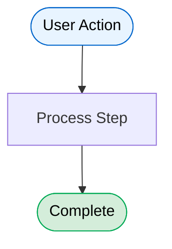
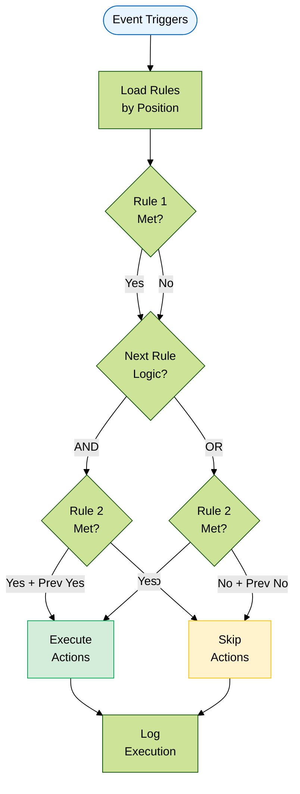
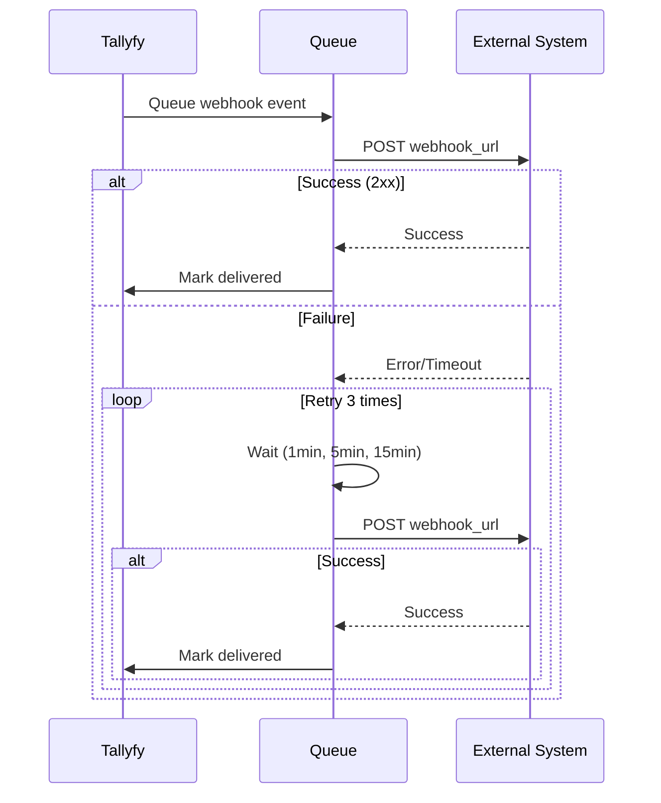
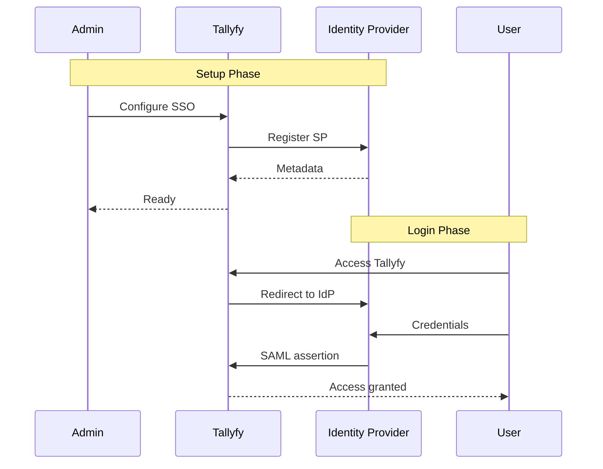

# Tallyfy Documentation

This repository contains the public documentation for Tallyfy products.

## Contributing to Documentation

We welcome contributions to improve our documentation. Whether you've found a typo, want to clarify instructions, or add helpful examples, your contributions help make our documentation better for everyone.

### How to Contribute

#### 1. Fork the Repository

Click the "Fork" button at the top right of this page to create your own copy of the documentation repository.

#### 2. Clone Your Fork

```bash
git clone https://github.com/YOUR-USERNAME/documentation.git
cd documentation
```

Replace `YOUR-USERNAME` with your GitHub username.

#### 3. Create a Branch

Create a new branch for your changes:

```bash
git checkout -b improve-docs-topic-name
```

Use a descriptive branch name that reflects your changes.

#### 4. Make Your Changes

- Edit the relevant `.mdx` files in the `src/content/docs/` directory
- Follow the existing formatting and style conventions
- Keep changes focused and specific

#### 5. Test Your Changes Locally (Optional)

If you want to preview your changes:

```bash
npm install
npm run dev
```

#### 6. Commit Your Changes

```bash
git add .
git commit -m "Brief description of your changes"
```

#### 7. Push to Your Fork

```bash
git push origin improve-docs-topic-name
```

#### 8. Create a Pull Request

1. Go to your fork on GitHub
2. Click "Compare & pull request"
3. Provide a clear title and description of your changes
4. Submit the pull request

### Contribution Guidelines

#### What We Accept

✅ **We welcome:**
- Typo and grammar fixes
- Clarifications to existing content
- Better examples or use cases
- Corrections to outdated information
- Improvements to formatting and readability

❌ **Please avoid:**
- Major structural changes without discussion
- Adding new features or product documentation (contact us first)
- Promotional content or external links
- Changes to technical architecture files

#### Style Guidelines

- Use clear, simple language
- Write in present tense
- Keep sentences concise
- Follow American English spelling
- Bold UI elements using `**text**`

#### Using Mermaid Diagrams

We use Mermaid diagrams to visualize complex workflows, API interactions, and system architectures. Mermaid enables you to create diagrams using simple text-based syntax.

> **Important**: Only use diagrams where they add clear value. Simple processes with 3 steps or fewer usually don't need diagrams.

##### Quick Example

Add a diagram to any documentation page using a code block with the `mermaid` language identifier:

````markdown

````

##### When to Use Diagrams

✅ **Good candidates for diagrams:**
- Multi-step processes where sequence matters
- Conditional logic with multiple branches
- System interactions between Tallyfy and external services
- User-system collaboration (e.g., SSO setup)
- Complex automation rules with multiple conditions
- API request/response flows with authentication
- Webhook event flows with retry logic

❌ **Avoid diagrams for:**
- Simple linear processes (3 steps or fewer)
- Single API calls without complex flow
- Basic CRUD operations
- Content better explained with text
- UI navigation (use screenshots instead)

##### Diagram Types by Documentation Area

| Documentation Area | Diagram Type | Key Elements |
|---|---|---|
| **API Documentation** | `sequenceDiagram` | Request/response, authentication, error handling |
| **Webhook Documentation** | `sequenceDiagram` | Event triggers, retry logic, queue processing |
| **Process Workflows** | `flowchart TD` | Decision nodes, branches, outcomes |
| **Automation Logic** | `flowchart TD` | Sequential rules, AND/OR logic, actions |
| **SSO/Authentication** | `sequenceDiagram` | User + admin actions, token flow |
| **System Architecture** | `graph TD` | Components, data flow, connections |

##### Real-World Examples

###### Automation Rule Evaluation (Reflects Actual System)



###### Webhook with Retry Logic



###### SSO Setup (User + Admin Collaboration)



##### Terminology Guidelines

**For API/Technical Docs** - Use technical terms:
- `POST /api/v1/processes`
- `Bearer token`
- `HTTP 201 Created`
- `webhook_url`
- Database field names

**For User-Facing Docs** - Use business terms:
- "Launch a process"
- "Complete a task"
- "Assign to team"
- "Automation triggers"
- UI labels and button names

##### Best Practices

1. **Keep diagrams focused** - One concept per diagram
2. **Prioritize vertical layouts** - Use `flowchart TD` over `flowchart LR` for mobile readability
3. **Ensure dark mode compatibility**:
   - Always specify text color: `color:#000` for light backgrounds
   - Use semantic classes with explicit colors:
   ```mermaid
   classDef start fill:#E8F4FF,stroke:#0066CC,color:#000
   classDef success fill:#D4EDDA,stroke:#00AA55,color:#000
   classDef error fill:#F8D7DA,stroke:#DC3545,color:#000
   classDef warning fill:#FFF3CD,stroke:#FFC107,color:#000
   ```
4. **Mobile-friendly design**:
   - Maximum 3-4 words per line in nodes
   - Use `<br/>` for line breaks: `User clicks<br/>Launch button`
   - Test at 320px, 768px, and 1024px viewport widths
   - Keep node labels under 20 characters
5. **Ensure proper text spacing**:
   - Check for missing spaces between words
   - Avoid concatenated text like `UserclicksLaunchbutton`
   - Use clear line breaks for long labels
6. **Add context** - Include descriptive text before/after diagrams
7. **Match audience** - API terms for developers, business terms for users
8. **Show error paths** - Include failure scenarios and retry logic
9. **Test in both themes** - Verify readability in light AND dark modes
10. **Break complex diagrams** - Split 50+ node diagrams into smaller focused ones

For comprehensive Mermaid documentation, see the [Mermaid Official Docs](https://mermaid.js.org/) or test your diagrams in the [Mermaid Live Editor](https://mermaid.live/).

### Review Process

Once you submit a pull request:

1. Our team will review your changes
2. We may suggest modifications or ask questions
3. Once approved, we'll merge your contribution
4. Your changes will be live on our documentation site

### Questions?

If you're unsure about a contribution or need help, please open an issue to discuss your proposed changes before creating a pull request.

## Time-Sensitive Content Monitoring

### Overview
Documentation requires regular updates to maintain accuracy, especially for articles referencing external vendors, third-party services, or evolving technologies. This section identifies patterns that indicate content may need updates.

### High-Priority Update Categories

#### 1. AI/ML Services (Monthly Review Recommended)
These services evolve rapidly with new models, API changes, and feature updates:
- OpenAI/ChatGPT integrations
- Claude/Anthropic integrations  
- Computer AI agents (Manus, Twin, Skyvern)
- Location: `/src/content/docs/pro/integrations/computer-ai-agents/`, `/src/content/docs/pro/integrations/mcp-server/`

#### 2. Authentication Providers (Quarterly Review)
Security protocols and SSO configurations change regularly:
- Okta, OneLogin, Auth0 integrations
- Azure AD, Google Workspace SSO
- OAuth/SAML protocol updates
- Location: `/src/content/docs/pro/integrations/authentication/`

#### 3. Analytics & BI Platforms (Quarterly Review)
Connection methods and APIs frequently update:
- Tableau, Power BI, Sigma Computing
- Google Analytics (especially GA4 migrations)
- Location: `/src/content/docs/pro/integrations/analytics/`

#### 4. Cloud Services (Bi-Monthly Review)
Platform updates affect integrations:
- AWS services (S3, Lambda, Athena, Redshift)
- Azure services (Cognitive AI, Translation)
- Google Cloud services
- Location: `/src/content/docs/pro/integrations/azure-translation/`

#### 5. Middleware Platforms (Quarterly Review)
API changes and new features require updates:
- Zapier, Make.com, n8n
- Microsoft Power Automate
- Location: `/src/content/docs/pro/integrations/middleware/`

### Content Age Indicators

Articles requiring review based on age and content type:
- **30 days**: AI services, version-specific references, pricing
- **60 days**: Analytics platforms, communication tools
- **90 days**: Authentication providers, business systems
- **180 days**: General documentation without vendor references

### Update Triggers

Review and update documentation when:
1. **Vendor announces major updates** - New API versions, deprecated features
2. **Security advisories** - Authentication protocol changes, vulnerability patches
3. **Pricing changes** - Subscription tiers, feature availability
4. **UI/UX changes** - Screenshots, navigation instructions
5. **Deprecation notices** - Sunset features, migration requirements
6. **Changelog entries** - New Tallyfy features affecting integrations

### Files Requiring Frequent Updates

Based on analysis, these files have the highest update frequency needs:

**Critical (Monthly)**:
- `/pro/integrations/computer-ai-agents/vendors/*.mdx`
- `/pro/integrations/mcp-server/**/*.mdx`
- `/pro/changelog/**/*.mdx`

**Important (Quarterly)**:
- `/pro/integrations/authentication/*.mdx`
- `/pro/integrations/analytics/*.mdx`
- `/pro/integrations/middleware/*.mdx`
- `/pro/pricing/*.mdx`

**Standard (Semi-Annual)**:
- `/pro/integrations/webhooks/*.mdx`
- `/pro/integrations/open-api/*.mdx`
- `/pro/compliance/*.mdx`

### Monitoring Best Practices

1. **Automated Scanning**: Use scripts to identify articles with vendor references
2. **Age Tracking**: Monitor days since last modification
3. **Vendor Watching**: Subscribe to vendor changelogs and announcement channels
4. **User Feedback**: Track support tickets mentioning outdated documentation
5. **Regular Audits**: Quarterly reviews of high-priority categories

## Automation & AI Support

This documentation repository supports AI-driven automation for large-scale documentation tasks. We use Claude Code to break down complex documentation projects into manageable, automated workflows. This approach helps maintain consistency and quality across our extensive documentation while reducing manual effort.

### Documentation Update Automation

For systematic updates of time-sensitive content, we use queue-based processing:
1. Identify eligible articles using vendor patterns and age thresholds
2. Create update prompts for each article requiring refresh
3. Process updates using Claude's non-interactive mode
4. Validate changes before deployment

See `/temporary/doc-updater/` for automation scripts and queue management tools.

## License

By contributing to this repository, you agree that your contributions will be owned by Tallyfy.

---

Thank you for helping improve Tallyfy documentation! 🙏
