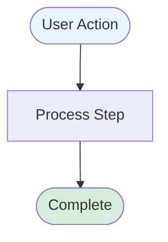
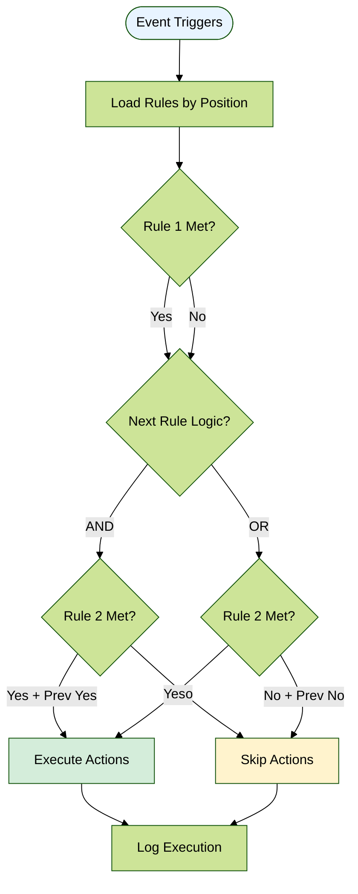
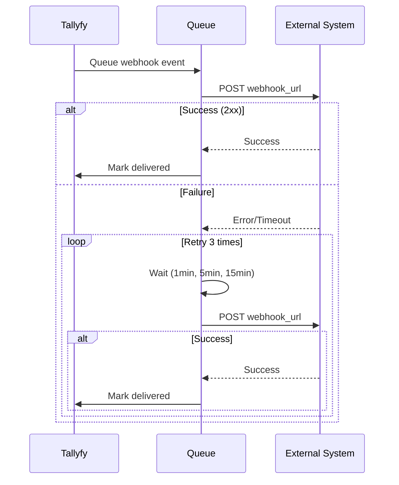
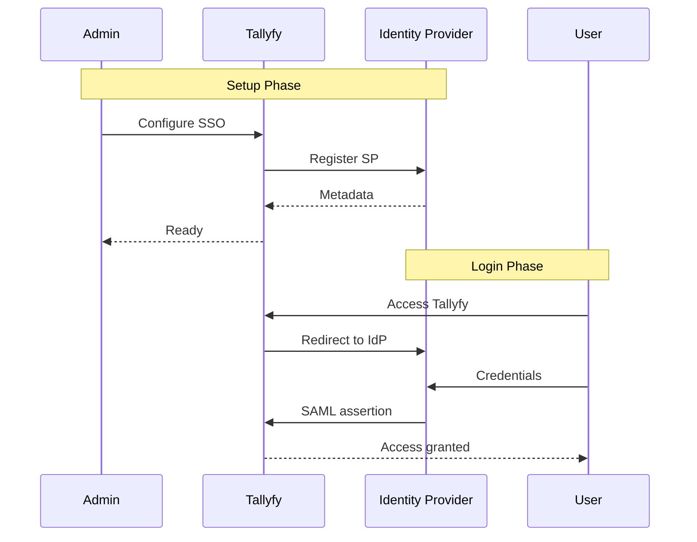

# Tallyfy Documentation

This repository contains the public documentation for Tallyfy products.

## Contributing to Documentation

We welcome contributions to improve our documentation. Whether you've found a typo, want to clarify instructions, or add helpful examples, your contributions help make our documentation better for everyone.

### How to Contribute

#### 1. Fork the Repository

Click the "Fork" button at the top right of this page to create your own copy of the documentation repository.

#### 2. Clone Your Fork

```bash
git clone https://github.com/YOUR-USERNAME/documentation.git
cd documentation
```

Replace `YOUR-USERNAME` with your GitHub username.

#### 3. Create a Branch

Create a new branch for your changes:

```bash
git checkout -b improve-docs-topic-name
```

Use a descriptive branch name that reflects your changes.

#### 4. Make Your Changes

- Edit the relevant `.mdx` files in the `src/content/docs/` directory
- Follow the existing formatting and style conventions
- Keep changes focused and specific

#### 5. Test Your Changes Locally (Optional)

If you want to preview your changes:

```bash
npm install
npm run dev
```

#### 6. Commit Your Changes

```bash
git add .
git commit -m "Brief description of your changes"
```

#### 7. Push to Your Fork

```bash
git push origin improve-docs-topic-name
```

#### 8. Create a Pull Request

1. Go to your fork on GitHub
2. Click "Compare & pull request"
3. Provide a clear title and description of your changes
4. Submit the pull request

### Contribution Guidelines

#### What We Accept

✅ **We welcome:**
- Typo and grammar fixes
- Clarifications to existing content
- Better examples or use cases
- Corrections to outdated information
- Improvements to formatting and readability

❌ **Please avoid:**
- Major structural changes without discussion
- Adding new features or product documentation (contact us first)
- Promotional content or external links
- Changes to technical architecture files

#### Style Guidelines

- Use clear, simple language
- Write in present tense
- Keep sentences concise
- Follow American English spelling
- Bold UI elements using `**text**`

#### Using Mermaid Diagrams

We use Mermaid diagrams to visualize complex workflows, API interactions, and system architectures. Mermaid enables you to create diagrams using simple text-based syntax.

> **Important**: Only use diagrams where they add clear value. Simple processes with 3 steps or fewer usually don't need diagrams.

##### Quick Example

Add a diagram to any documentation page using a code block with the `mermaid` language identifier:

````markdown

````

##### When to Use Diagrams

✅ **Good candidates for diagrams:**
- Multi-step processes where sequence matters
- Conditional logic with multiple branches
- System interactions between Tallyfy and external services
- User-system collaboration (e.g., SSO setup)
- Complex automation rules with multiple conditions
- API request/response flows with authentication
- Webhook event flows with retry logic

❌ **Avoid diagrams for:**
- Simple linear processes (3 steps or fewer)
- Single API calls without complex flow
- Basic CRUD operations
- Content better explained with text
- UI navigation (use screenshots instead)

##### Diagram Types by Documentation Area

| Documentation Area | Diagram Type | Key Elements |
|---|---|---|
| **API Documentation** | `sequenceDiagram` | Request/response, authentication, error handling |
| **Webhook Documentation** | `sequenceDiagram` | Event triggers, retry logic, queue processing |
| **Process Workflows** | `flowchart TD` | Decision nodes, branches, outcomes |
| **Automation Logic** | `flowchart TD` | Sequential rules, AND/OR logic, actions |
| **SSO/Authentication** | `sequenceDiagram` | User + admin actions, token flow |
| **System Architecture** | `graph LR` | Components, data flow, connections |

##### Real-World Examples

###### Automation Rule Evaluation (Reflects Actual System)



###### Webhook with Retry Logic



###### SSO Setup (User + Admin Collaboration)



##### Terminology Guidelines

**For API/Technical Docs** - Use technical terms:
- `POST /api/v1/processes`
- `Bearer token`
- `HTTP 201 Created`
- `webhook_url`
- Database field names

**For User-Facing Docs** - Use business terms:
- "Launch a process"
- "Complete a task"
- "Assign to team"
- "Automation triggers"
- UI labels and button names

##### Best Practices

1. **Keep diagrams focused** - One concept per diagram
2. **Use consistent styling**:
   - Start nodes: `fill:#E8F4FF`
   - Success: `fill:#D4EDDA`
   - Error: `fill:#F8D7DA`
   - Warning/Skip: `fill:#FFF3CD`
3. **Mobile-friendly** - Test readability on small screens
4. **Add context** - Include descriptive text before/after diagrams
5. **Match audience** - API terms for developers, business terms for users
6. **Show error paths** - Include failure scenarios and retry logic

For comprehensive Mermaid documentation, see the [Mermaid Official Docs](https://mermaid.js.org/) or test your diagrams in the [Mermaid Live Editor](https://mermaid.live/).

### Review Process

Once you submit a pull request:

1. Our team will review your changes
2. We may suggest modifications or ask questions
3. Once approved, we'll merge your contribution
4. Your changes will be live on our documentation site

### Questions?

If you're unsure about a contribution or need help, please open an issue to discuss your proposed changes before creating a pull request.

## Automation & AI Support

This documentation repository supports AI-driven automation for large-scale documentation tasks. We use Claude Code to break down complex documentation projects into manageable, automated workflows. This approach helps maintain consistency and quality across our extensive documentation while reducing manual effort.

## License

By contributing to this repository, you agree that your contributions will be owned by Tallyfy.

---

Thank you for helping improve Tallyfy documentation! 🙏
