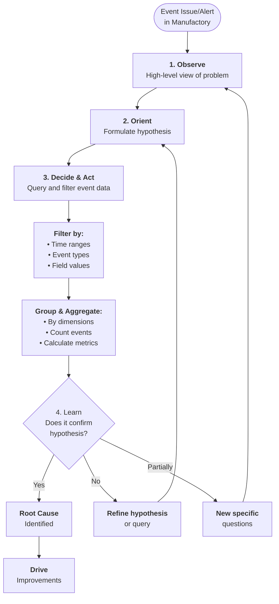

Once your applications are instrumented to send rich, structured events to Tallyfy Manufactory, the next step is to transform that raw data into actionable insights. Effective event analysis allows you to understand the behavior of your event-driven systems, troubleshoot issues, and continuously improve your processes.

## The goal of event analysis in Tallyfy Manufactory

Event analysis is more than just looking at logs or event streams. It's an active process of interrogating your event data to answer specific questions about your workflows that involve Tallyfy Manufactory. The primary goals are to understand:

*   **What happened?** Reconstruct sequences of events and actions.
*   **Why did it happen?** Identify root causes of failures or unexpected behavior.
*   **What is the impact?** Assess the scope and severity of issues, or measure the success of your processes.

While Tallyfy Manufactory is an event ingestion and lifecycle engine, it may offer features for basic event searching and viewing. For deeper analysis, you might export event data from Manufactory (if available) or ensure events are also sent to dedicated observability or analytics platforms where more sophisticated querying can occur.

## The core analysis loop for event data

A systematic approach to analyzing event data, often called the "core analysis loop," can be highly effective, especially when investigating issues related to Tallyfy Manufactory event processing:

1.  **Observe:** Start with a high-level view. This could be an alert, a customer report, or a general question about an event flow managed by Manufactory (e.g., "Why did event processing for Project X spike in failures last night?").
2.  **Orient:** Formulate a hypothesis. Based on your understanding of the system and the initial observation, what do you suspect might be happening with the events in Manufactory? (e.g., "I suspect a specific actor in Project X is failing due to a malformed payload.")
3.  **Decide & Act:** Test your hypothesis by querying and filtering the event data. This might involve:
    *   Filtering events by time ranges, specific event types (e.g., `OrderFailedToProcess`), or particular field values (`user_id = '123'`, `manufactory_actor_status = 'error'`).
    *   Grouping events by dimensions to see distributions (e.g., group by `event_source` to see event volumes from different systems sending data to Manufactory, or group by `error_code` for events processed by a Manufactory actor).
    *   Aggregating data if your analysis tool supports it (e.g., counting events, calculating average processing times if such data is part of your events or provided by Manufactory).
4.  **Learn & Iterate:** Examine the results of your query. Does it confirm or refute your hypothesis? Does it provide a clear answer or lead to new, more specific questions? Refine your query or hypothesis and repeat the loop.

This iterative process of questioning and refining helps you drill down from a general problem to a specific root cause within your event streams, including those managed by Tallyfy Manufactory.

### How the analysis loop works

This diagram shows the cyclical nature of event analysis - moving from observation through hypothesis testing to actionable insights.

**What to notice:**
- The process is iterative - you may need several cycles to reach the root cause
- Each "No" result from hypothesis testing leads to refinement, not failure
- Partial confirmations generate new, more specific questions that restart the loop

## Common analytical questions for Tallyfy Manufactory users

Here are some typical questions you might seek to answer by analyzing event data related to Tallyfy Manufactory:

*   **Event Volume & Flow:**
    *   "How many `NewUserSignup` events did Tallyfy Manufactory ingest from our website yesterday?"
    *   "What is the distribution of event sources sending data to our `OrderProcessing` Manufactory project?"
    *   "Did we see an unexpected spike or drop in events for the `InventoryUpdate` workflow that Manufactory handles?"
*   **Event Success & Failure within Manufactory:**
    *   "What percentage of events processed by Manufactory actor `PaymentGatewayConnector` are resulting in a 'failure' status?"
    *   "What are the most common error messages or codes for events that failed processing within a specific Manufactory trigger?"
    *   "Are events from a particular `customer_id` experiencing a higher failure rate within our Manufactory invoicing project?"
*   **Performance & Latency (if events contain timing data or Manufactory provides it):**
    *   "What is the average time it takes for an event to be processed from ingestion by Manufactory to the completion of its final triggered actor in workflow Z?"
    *   "Are there specific Manufactory actors or routing rules within our projects that appear to be introducing significant latency?"
*   **Specific Event Investigation:**
    *   "Show me all events and their states related to `order_id: ORD-12345` that were handled by any Tallyfy Manufactory project."
    *   "What was the exact payload of `event_id: evt-abcdef123456` when it was ingested by Manufactory, and which actors did it trigger?"

## Techniques for analyzing event data from Manufactory

To answer the questions above, you'll employ various analytical techniques on your event data (whether directly in Manufactory if it has such tools, or in an external platform):

*   **Filtering:** This is fundamental. Narrow down your dataset to only the events relevant to your investigation. For example, in a system analyzing Manufactory events, you might filter for `event_type = "ShipmentNotificationFailed" AND manufactory_project_id = "LogisticsUpdates"`.
*   **Grouping (and Aggregating):** Group events by common attributes to see patterns and distributions. Then, aggregate values within those groups. For example, `GROUP BY manufactory_actor_name, COUNT(event_id) WHERE status = 'ERROR'` would show you which actors are failing most often.
*   **Time-series Analysis:** Look at how event metrics (like counts or failure rates) change over time. Plotting the number of failed events processed by a Manufactory project per hour can reveal trends or correlate failures with other system activities.
*   **Correlation:** Identify potential relationships between different event attributes or between different types of events. For instance, "Do `PaymentProcessed` events (potentially from a Manufactory actor) take longer when the `payment_gateway_region` attribute is 'EU' compared to 'US'?"
*   **Anomaly Detection (Conceptual):** This involves identifying unusual patterns or significant deviations from normal behavior in your event streams. While complex anomaly detection might require specialized tools, even simple visual inspection of time-series graphs of Manufactory event volumes can reveal anomalies.

## Leveraging Tallyfy Manufactory's features for analysis

How you analyze event data will depend on Tallyfy Manufactory's specific capabilities. Consider:

*   **Built-in Querying/Searching:** Does Manufactory offer an interface to search or filter ingested events based on their attributes directly within its UI?
*   **Dashboards and Visualizations:** Does Manufactory provide any out-of-the-box dashboards or visualizations for key event metrics (e.g., event throughput, error rates for projects or actors)?
*   **Data Export:** Can event data (or summaries) be exported from Manufactory for analysis in external tools like business intelligence platforms, data warehouses, or using custom scripts?
*   **Logs and Audit Trails:** How can logs or audit trails generated by Manufactory itself be used to complement event data during an investigation?

Understanding these features will help you determine the most efficient way to analyze data directly related to Manufactory's operations.

## From analysis to action

The ultimate goal of analyzing Tallyfy Manufactory event data is to drive improvements. Insights gained can lead to:

*   **Better System Design:** Identifying problematic event schemas or inefficient workflow designs.
*   **Optimized Workflows:** Streamlining processes that involve Manufactory based on performance data.
*   **Enhanced Actor Logic:** Refining the logic within Manufactory actors to handle edge cases or improve efficiency.
*   **More Effective Alerts and SLOs:** Using historical event analysis to set realistic and meaningful alerts (as discussed in a subsequent article).
*   **Improved Support:** Providing support teams with better tools and understanding to resolve issues related to event-driven processes managed by Manufactory.

## Developing your analytical skills

Becoming proficient at analyzing event data from Tallyfy Manufactory is a skill that develops over time:

*   **Start with simple questions** and gradually tackle more complex analytical tasks.
*   **Practice the core analysis loop** regularly, even for non-critical investigations, to build intuition.
*   **Share your findings and techniques** with your team to foster collective learning and discover new ways to leverage Manufactory data.

By actively engaging with your event data, you can unlock powerful insights into the health and performance of the critical business processes managed by Tallyfy Manufactory. 

import { CardGrid, LinkTitleCard } from "~/components";

## Related articles
<CardGrid>
<LinkTitleCard header="<b>Best Practices > What is observability?</b>" href="/products/manufactory/best-practices/what-is-observability/" > Observability enables deep understanding of complex systems through detailed event data analysis to explore and debug both known and unknown issues without relying solely on predefined metrics. </LinkTitleCard>
<LinkTitleCard header="<b>Manufactory > Introduction to observability best practices</b>" href="/products/manufactory/best-practices/" > This comprehensive guide explains how observability practices enable deep understanding of event-driven systems through Tallyfy Manufactory by providing structured approaches to monitoring troubleshooting and analyzing system behavior using rich event data. </LinkTitleCard>
<LinkTitleCard header="<b>Best Practices > Best practices for instrumenting applications</b>" href="/products/manufactory/best-practices/instrumenting-applications-for-manufactory/" > Well-structured event data with thoughtful instrumentation enables precise routing effective troubleshooting and meaningful analysis in event-driven workflows while providing rich context through standardized fields timestamps and business-specific information. </LinkTitleCard>
<LinkTitleCard header="<b>Best Practices > Adopting an observability culture</b>" href="/products/manufactory/best-practices/adopting-observability-culture/" > An observability culture prioritizes data-driven understanding of system behavior through proactive questioning shared responsibility blameless incident analysis and continuous improvement using event data and insights from Tallyfy Manufactory. </LinkTitleCard>
</CardGrid>