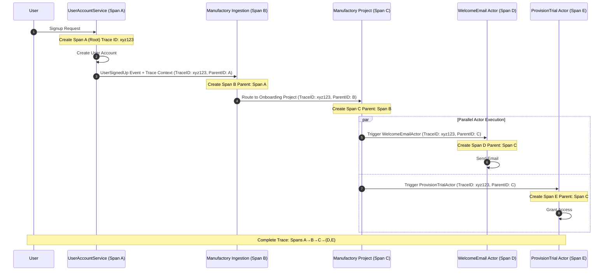

In complex event-driven architectures, a single initial event can trigger a cascade of actions across multiple services and components. Tallyfy Manufactory often plays a key role in these flows, ingesting events, routing them, or triggering specific actors. Distributed tracing provides a way to visualize and understand these intricate journeys.

## What is distributed tracing?

Distributed tracing is a technique used to monitor and profile applications, especially those built using a microservices architecture. It tracks the progression of a single request or, in our context, a single initiating event, as it moves through various services or processing stages. 

Imagine you're sending a package. Distributed tracing is like having a master tracking number that allows you to see every hub your package passes through, how long it stayed at each point, and its final delivery status. This gives you a complete picture of the journey.

Key components of distributed tracing include:

*   **Trace:** Represents the entire end-to-end journey of a request or event.
*   **Span:** Represents a single, named, timed operation within a trace. A trace is made up of one or more spans. For example, an event being ingested by Tallyfy Manufactory could be one span, and a Manufactory actor processing that event could be another span within the same trace.
*   **Trace ID:** A unique identifier shared by all spans within a single trace.
*   **Span ID:** A unique identifier for an individual span.
*   **Parent Span ID:** An identifier that links a span to its parent span, creating a chronological and hierarchical relationship.

These relationships are often visualized using waterfall diagrams, which clearly show the sequence, duration, and dependencies of operations within a trace.

## Why distributed tracing is valuable for Tallyfy Manufactory

For Tallyfy Manufactory users, distributed tracing offers several significant benefits when observing event-driven workflows:

*   **Visualizing end-to-end event flows:** You can see how an event originating from one system travels, gets ingested and processed by Tallyfy Manufactory, and then potentially triggers various [actors](/products/manufactory/actors/) or other downstream systems. This holistic view is invaluable.
*   **Pinpointing bottlenecks and failures:** If an event-driven process is slow or failing, a trace can quickly show which specific service, Manufactory project, or actor is causing the delay or error.
*   **Debugging complex interactions:** Event-driven systems often involve asynchronous operations and intricate inter-service communication. Tracing helps make sense of these by showing the exact path and timing of related events and actions, including those managed by Manufactory.
*   **Understanding event lineage:** Easily trace an event from its initial creation, through its handling by Tallyfy Manufactory, to its ultimate outcome or impact on other systems.

## Core components of a trace in the context of Manufactory events

When an event processed by or interacting with Tallyfy Manufactory is part of a distributed trace, its span data should include:

*   **Trace ID:** The unique identifier for the overall workflow or transaction this event belongs to (e.g., a customer placing an online order might have a single trace ID covering all related events and service calls).
*   **Span ID:** A unique ID for this specific processing step (e.g., `Manufactory-Ingest-OrderCreatedEvent`, `Manufactory-Actor-DispatchNotification`).
*   **Parent Span ID:** If this Manufactory-related span was triggered by a previous operation (e.g., an API call that emitted an event to Manufactory), this ID links it back to that parent operation.
*   **Service Name / Actor Name:** Clearly identifies the system or specific Tallyfy Manufactory component (like a project or actor) that performed the work represented by this span.
*   **Timestamps and Durations:** Essential for understanding when the operation started and how long it took, which is critical for performance analysis.

## Best practices for implementing tracing with Manufactory

To effectively trace event workflows involving Tallyfy Manufactory, consider these best practices:

*   **Context Propagation:** This is the most crucial aspect. The `Trace ID` and `Parent Span ID` (and other relevant trace context like sampling decisions) must be consistently passed along with events. This includes:
    *   When an event is initially sent to Tallyfy Manufactory.
    *   When Tallyfy Manufactory itself emits new events or triggers downstream actors or external systems.
    *   Utilize standard propagation formats like W3C Trace Context or B3, typically embedded in HTTP headers (for REST API interactions with Manufactory) or message metadata (for message queue interactions).
*   **Instrumenting Services Interacting with Manufactory:**
    *   Services that send events to Tallyfy Manufactory should either start a new trace (if they are the originators) or continue an existing trace by creating a new child span.
    *   Actors within Tallyfy Manufactory, or external systems triggered by Manufactory events, should create their own child spans, linking back to the trace context of the event that triggered them.
*   **Naming Spans Effectively:** Use clear, descriptive, and consistent names for your spans. This makes traces much easier to understand. Examples for Manufactory-related spans:
    *   `Manufactory::EventIngest::OrderCreated`
    *   `Manufactory::Project::ProcessNewUser::RouteEvent`
    *   `Manufactory::Actor::SendWelcomeEmail`
*   **Adding Relevant Attributes (Tags) to Spans:** Enrich your spans with key-value pairs (attributes or tags) that provide context. For Manufactory events, this could include:
    *   Event-specific data: `event_type`, `event_id`, relevant business identifiers like `order_id` or `user_id`.
    *   Manufactory-specific identifiers: `manufactory.project_id`, `manufactory.trigger_id`, `manufactory.actor_id`.
    *   Technical details: `http.method`, `status_code` (for API interactions with Manufactory).

## Conceptual example: Tracing an event through Tallyfy Manufactory

Let's imagine a new customer completes a signup form on your application:

1.  **Span A (Root or Child of API Span):** Your `UserAccountService` receives the signup request. It creates a span named `CreateUserAccount`. As part of this, it generates a `UserSignedUp` event.
2.  The `UserAccountService` sends the `UserSignedUp` event to a Tallyfy Manufactory endpoint, ensuring the `Trace ID` from Span A and Span A's ID (as Parent Span ID) are propagated with the event.
3.  **Span B (Child of Span A):** Tallyfy Manufactory ingests the `UserSignedUp` event. A span named `Manufactory::EventIngest::UserSignedUp` is created (conceptually, by your instrumentation or how Manufactory itself might participate in tracing).
4.  **Span C (Child of Span B):** A Manufactory [project](/products/manufactory/projects/) configured for `UserSignedUp` events processes it. A span named `Manufactory::Project::Onboarding::ProcessUserSignedUp` might represent this routing/evaluation logic.
5.  **Span D (Child of Span C):** The project triggers a `WelcomeEmailActor` within Manufactory. This actor creates a span `Manufactory::Actor::WelcomeEmailActor::SendEmail`.
6.  **Span E (Child of Span C):** The project also triggers a `ProvisionTrialAccessActor`. This actor creates a span `Manufactory::Actor::ProvisionTrial::GrantAccess`.

If the customer later reports not receiving a welcome email, this distributed trace would immediately show whether Manufactory received the initial event, if it triggered the `WelcomeEmailActor`, and potentially if that actor encountered an error. This significantly speeds up troubleshooting.

### Visualizing the trace flow

This diagram shows how trace context propagates through the entire event processing pipeline.

**What to notice:**
- **Trace ID propagation** - The same Trace ID (xyz123) flows through all services, linking every operation to the original request
- **Parent-child relationships** - Each span references its parent, creating a clear hierarchy: A spawns B, B spawns C, and C spawns both D and E in parallel
- **Parallel execution visibility** - The diagram clearly shows how Manufactory can trigger multiple actors simultaneously, with both operations tracked as separate child spans

## Tools and considerations

It's important to note that while Tallyfy Manufactory processes events that are part of a distributed trace, it isn't typically a distributed tracing backend itself. You would generally use a dedicated tracing system (open source options like Jaeger or Zipkin, or various commercial observability platforms) to collect, store, and visualize these traces.

Tallyfy Manufactory's crucial role in this ecosystem is to faithfully carry forward any trace context it receives with an event and to allow its own operations (like actor executions) to be instrumented as part of that broader trace. Your instrumentation within services sending events to Manufactory, and within actors or services triggered by Manufactory, is key to achieving this end-to-end visibility. 

import { CardGrid, LinkTitleCard } from "~/components";

## Related articles
<CardGrid>
<LinkTitleCard header="<b>Best Practices > Best practices for instrumenting applications</b>" href="/products/manufactory/best-practices/instrumenting-applications-for-manufactory/" > Well-structured event data with thoughtful instrumentation enables precise routing effective troubleshooting and meaningful analysis in event-driven workflows while providing rich context through standardized fields timestamps and business-specific information. </LinkTitleCard>
<LinkTitleCard header="<b>Manufactory > Introduction to observability best practices</b>" href="/products/manufactory/best-practices/" > This comprehensive guide explains how observability practices enable deep understanding of event-driven systems through Tallyfy Manufactory by providing structured approaches to monitoring troubleshooting and analyzing system behavior using rich event data. </LinkTitleCard>
<LinkTitleCard header="<b>Best Practices > Understanding structured events</b>" href="/products/manufactory/best-practices/understanding-structured-events/" > Structured events in Tallyfy Manufactory use key-value pairs with specific fields and rich context to enable efficient routing processing analysis and monitoring of system activities through well-organized machine-parsable data formats. </LinkTitleCard>
<LinkTitleCard header="<b>Best Practices > What is observability?</b>" href="/products/manufactory/best-practices/what-is-observability/" > Observability enables deep understanding of complex systems through detailed event data analysis to explore and debug both known and unknown issues without relying solely on predefined metrics. </LinkTitleCard>
</CardGrid>