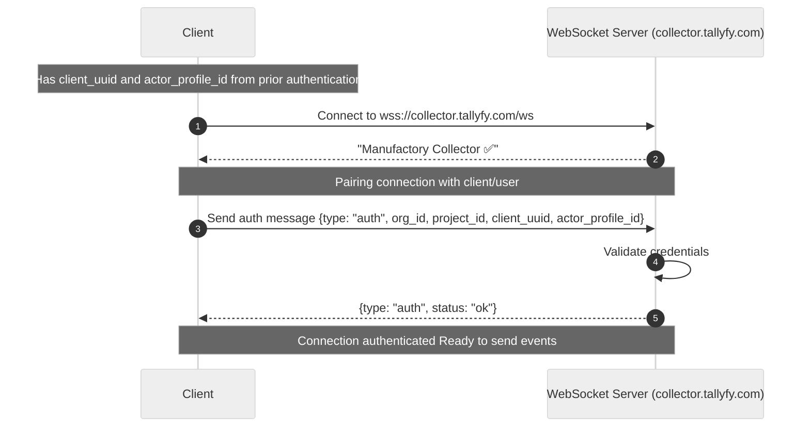

After successful authentication and getting client UUID along with actor profile ID, you can connect to the Tallyfy Manufactory websocket server: `wss://collector.tallyfy.com/ws`

Once a websocket connection is established you will receive a message `Manufactory Collector ✅`

## WebSocket Authentication Flow

This diagram shows the complete authentication handshake between your client and the Manufactory WebSocket server.



### What to notice

- **Two-phase authentication**: First the WebSocket connection itself, then the authentication message exchange
- **Required credentials**: The auth message must include all five required keys (type, org_id, project_id, client_uuid, actor_profile_id)
- **Sequential flow**: Each step must complete successfully before proceeding - the connection won't accept events until authentication succeeds

The next step is that we need to pair the connection with the client/end-user. This is where actor profile ID and client UUID become active.

### Required keys

- `type` (required) string - The message type, in this case we will be using `auth`.
- `org_id` (required) string - Manufactory org ID.
- `project_id` (required) number - The project ID associated with this schema.
- `actor_profile_id` (required) number - The actor profile ID we got after authentication.
- `client_uuid` (required) string - the generated UUID we got after authentication.
### Websocket message example
```json
{
  "type": "auth",
  "org_id": "xyz",
  "project_id": 12345,
  "client_uuid": "e17a56a9-596f-40e6-b01c-d37136df1de8",
  "actor_profile_id": 1
}
```

### Websocket reply example

```json
{
  "type": "auth",
  "status": "ok"
}
```

Now we are able to send actor's generated events via the open websocket channel.

import { CardGrid, LinkTitleCard } from "~/components";

## Related articles
<CardGrid>
<LinkTitleCard header="<b>Websocket > Authentication for the web socket collector</b>" href="/products/manufactory/collector/websocket/auth/" > Tallyfy Manufactory requires websocket client authentication through a POST /auth endpoint using organization ID project ID and actor profile data to generate a 12-hour session UUID. </LinkTitleCard>
<LinkTitleCard header="<b>Collector > Collecting events via websocket</b>" href="/products/manufactory/collector/websocket/" > Tallyfy Manufactory's websocket connection enables real-time bidirectional communication between browser and server for persistent data exchange sessions. </LinkTitleCard>
<LinkTitleCard header="<b>Websocket > Send events via the web socket</b>" href="/products/manufactory/collector/websocket/send_events/" > Websocket events can be sent to Tallyfy Manufactory using a JSON message containing a type field set to "event" and an attributes object with the event data which returns a confirmation message upon successful processing. </LinkTitleCard>
<LinkTitleCard header="<b>Manufactory > Collector</b>" href="/products/manufactory/collector/" > The Tallyfy Manufactory collector enables sending actor data and events through REST API websocket or CLI agent methods with data viewable in a custom interface after creating required schemas. </LinkTitleCard>
</CardGrid>