import { Steps } from '@astrojs/starlight/components';

Want approval workflows where rejections send work back for fixes? Here's how. You'll build multi-level approvals that automatically reopen previous steps when someone hits reject - keeping quality high without grinding everything to a halt.

## What is the use case for this automation?

You know those approvals that need multiple sign-offs? Multi-level loops handle them perfectly:

- **Financial approvals**: Purchase requests that need manager approval, then finance approval, then executive sign-off
- **Content publishing**: Draft → Editor review → Legal review → Final approval
- **Contract management**: Initial draft → Department head → Legal → CFO → CEO  
- **Quality control**: Product inspection → Supervisor check → Quality manager sign-off

Here's the magic - when someone rejects at any level, the work automatically bounces back to whoever needs to fix it. No chasing people down.

## How do I create a multi-level approval workflow?

Here's how your multi-level approval workflow flows with automatic rejection handling:

```mermaid
flowchart TD
    Create[Create Request] --> Manager{Manager<br/>Approval}
    Manager -->|✅| Finance{Finance<br/>Approval}
    Manager -->|❌| Create
    
    Finance -->|✅| COO{COO<br/>Approval}
    Finance -->|❌| Create
    
    COO -->|✅| Complete([Approved])
    COO -->|❌| Create
    
    click Manager "/products/pro/documenting/templates/automations/actions/status-actions/" "Learn about status actions for re-opening tasks"
    click Finance "/products/pro/documenting/templates/automations/actions/visibility-actions/" "Learn about visibility rules for approval flow"
    click COO "/products/pro/tutorials/how-to/track-and-run-complex-approval-workflows/" "See complex approval workflow patterns"
```



**What to notice:**
- 🔄 Every rejection automatically re-opens the creation task - no manual tracking needed
- 🎯 Later approvals only show after earlier ones pass (visibility rules control this)  
- 💡 COO rejection can re-open multiple steps simultaneously for faster corrections

<Steps>
1. **Set up your approval chain steps**
   
   Start with your [template](/products/pro/documenting/templates/) and map out who approves what. You'll use **Approve/Reject** type steps:
   - Step 1: "Create wire transfer request" (Regular task)
   - Step 2: "Manager review" (Approve/Reject)
   - Step 3: "Finance department approval" (Approve/Reject)  
   - Step 4: "COO final approval" (Approve/Reject)

2. **Create re-open rules for each approval level**
   
   Next, set up what happens when someone hits reject. For each approval step, create a [status action](/products/pro/documenting/templates/automations/actions/status-actions/) rule:
   
   **Rule 1: Manager rejection reopens creation**
   ```
   IF (Manager review) is Rejected
   THEN Re-open task "Create wire transfer request"
   ```
   
   **Rule 2: Finance rejection reopens creation**
   ```
   IF (Finance department approval) is Rejected
   THEN Re-open task "Create wire transfer request"
   ```
   
   **Rule 3: COO rejection can reopen multiple steps**
   ```
   IF (COO final approval) is Rejected
   THEN Re-open task "Create wire transfer request"
   AND Re-open task "Manager review"
   ```

3. **Add visibility rules to control flow**
   
   Don't show later approvals until earlier ones pass. Simple:
   ```
   IF (Manager review) is Approved
   THEN Show "Finance department approval"
   ```
   ```
   IF (Finance department approval) is Approved
   THEN Show "COO final approval"
   ```
</Steps>

## Advanced approval patterns

### Conditional approval routing

Need different approvers for different amounts? You can route based on any criteria:

```
IF (Purchase Amount) is greater than $50,000
AND (Manager review) is Approved
THEN Show "Board approval required"
```

### Parallel approvals with synchronization

What if legal, compliance, and finance all need to review at the same time? Here's how parallel approvals work:

```mermaid
flowchart TD
    Initial[Initial Review] --> Legal{Legal}
    Initial --> Compliance{Compliance}
    Initial --> Finance{Finance}
    
    Legal & Compliance & Finance -->|All ✅| Final[Final Implementation]
    Legal & Compliance & Finance -->|Any ❌| Initial
    
    click Legal "/products/pro/documenting/templates/automations/actions/visibility-actions/" "Learn about parallel visibility rules"
    click Final "/products/pro/documenting/templates/automations/conditions/" "Learn about AND conditions for synchronization"
```



**What to notice:**
- 🚀 All three approvals trigger simultaneously after initial review
- ⏸️ Final step waits until ALL parallel approvals complete
- ❌ Any rejection sends the whole thing back to start

Easy setup with visibility rules:

```
IF (Initial review) is Completed
THEN Show "Legal approval" 
AND Show "Compliance approval"
AND Show "Finance approval"
```

Wait for everyone to approve before moving on:
```
IF (Legal approval) is Approved
AND (Compliance approval) is Approved
AND (Finance approval) is Approved
THEN Show "Final implementation"
```

### Escalation paths

Approvals getting stuck? Here's your fix:

1. Set the initial approval deadline
2. Create an escalation step assigned to senior management  
3. Use deadline automation to trigger escalation

When time's up, Tallyfy bumps it to the boss. Done.

## Best practices for approval loops

Want your approval loops to actually work? Follow these:

- **Clear rejection reasons**: Add comment fields so reviewers explain what needs fixing. Nobody likes guessing why their work got rejected
- **Notification setup**: Turn on email notifications - people need to know when tasks bounce back to them
- **Loop limits**: Think about adding a counter. After 3 rejections, maybe it's time for a meeting instead
- **Documentation**: Put clear instructions in each step. Tell people exactly what you're looking for
- **Audit trail**: Good news - Tallyfy tracks every approval and rejection automatically. CYA built right in

:::note[Understanding re-open behavior]
When a task is reopened in Tallyfy:
- Its status changes from "Completed" back to "Active"
- Original assignees are notified
- Any data entered previously remains intact
- The task appears again in the assignee's active tasks
:::

## Real-world example: Property listing approval

Let me show you how a real estate agency nailed their listing approvals:

```mermaid
flowchart TD
    Agent[Create Listing] --> Manager{Manager<br/>Review}
    Manager -->|✅| Marketing{Marketing<br/>Review}
    Manager -->|❌| Agent
    
    Marketing -->|✅| Compliance{Compliance<br/>Check}
    Marketing -->|❌| Agent
    
    Compliance -->|✅| Publish([Published<br/>to MLS])
    Compliance -->|❌| Agent
    
    click Compliance "/products/pro/documenting/templates/automations/actions/status-actions/" "Learn how rejections trigger re-opens"
    click Manager "/products/pro/documenting/templates/automations/actions/visibility-actions/" "See how visibility rules control flow"
```



**The magic here:**
- 📸 Marketing rejection = agent gets specific feedback on photos
- 📋 Compliance issues = both agent AND manager get notified
- ✅ Every listing hits the market looking perfect

Every listing hits the market looking perfect. Agents know exactly what to fix when something's off. No more "please see me" sticky notes.

import { CardGrid, LinkTitleCard } from "~/components";

## Related articles
<CardGrid>
<LinkTitleCard header="<b>How To > Track and run complex approval workflows</b>" href="/products/pro/tutorials/how-to/track-and-run-complex-approval-workflows/" > Tallyfy transforms complex approval workflows into trackable automated processes with clear visibility accountability and dynamic routing that eliminates status confusion and bottlenecks through intelligent form design conditional logic real-time monitoring and collaborative communication features. </LinkTitleCard>
<LinkTitleCard header="<b>Actions > Automate changing the status of tasks</b>" href="/products/pro/documenting/templates/automations/actions/status-actions/" > Status actions automatically re-open completed tasks when specific conditions are met and are primarily used for approval workflows feedback loops and quality control processes where steps need to be revisited for corrections or revisions. </LinkTitleCard>
<LinkTitleCard header="<b>Power Automate > Building approval workflows with Power Automate</b>" href="/products/pro/integrations/middleware/power-automate/building-approval-workflows-with-power-automate/" > Power Automate approvals enable formal sign-off workflows by sending requests to designated approvers and integrating with Tallyfy tasks through automated triggers email notifications and Microsoft Teams responses. </LinkTitleCard>
<LinkTitleCard header="<b>Actions > Automate hiding or showing tasks</b>" href="/products/pro/documenting/templates/automations/actions/visibility-actions/" > Visibility actions in Tallyfy automatically show or hide process steps based on specific conditions to ensure complete process integrity while displaying only relevant steps when needed preventing missed requirements and maintaining workflow efficiency. </LinkTitleCard>
</CardGrid>