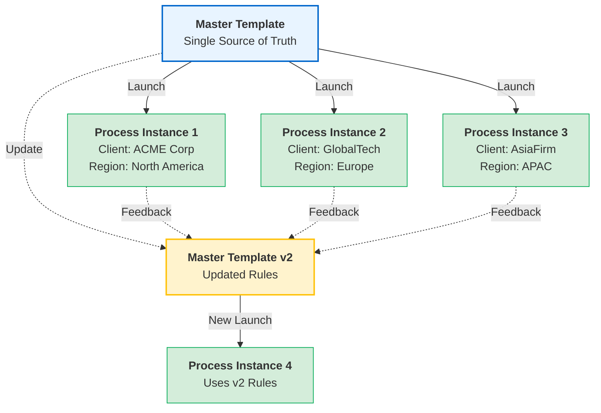

import { Steps } from '@astrojs/starlight/components';

## Single source of truth architecture

Master templates in Tallyfy act as your single source of truth - one authoritative version that generates customized processes. Unlike managing multiple document copies where version control becomes a nightmare, updates to the master template ensure consistency while preserving the flexibility of individual process instances.

Think of it like a cookie cutter (master template) and the cookies you make (launched processes). Same shape, sure - but each cookie can have different icing, sprinkles, or decorations.

## Template to process relationship

This shows how one master template spawns multiple customized processes while maintaining version independence.

**What to notice:**
- **One-to-many relationship** - A single master template creates unlimited process instances, each with unique customizations for different clients or regions
- **Version independence** - Processes launched from v1 continue unchanged even after the template updates to v2, ensuring in-flight work stays consistent
- **Continuous improvement loop** - Feedback from running processes helps improve future template versions without disrupting current operations

## Key distinctions explained

### Master templates (blueprints)
- **Purpose**: Define the standard process structure and rules
- **Editing**: Only authorized template editors can modify
- **Content**: Contains placeholders, automation rules, and standard text
- **Versions**: Maintains revision history for compliance
- **Location**: Found in Templates section of Tallyfy

### Launched processes (active instances)
- **Purpose**: Execute the actual work with real data
- **Editing**: Users fill in fields and complete tasks
- **Content**: Contains actual client names, dates, and specific information
- **Status**: Tracks progress through active workflow
- **Location**: Found in Processes section of Tallyfy

## How customization works

### At the template level
You control exactly what users can and can't change when they launch a process from your template:

<Steps>
1. **Set field permissions**: Mark fields as editable or read-only
2. **Define conditional paths**: Create IF-THEN rules for dynamic workflows
3. **Establish automation**: Set up rules for assignments and deadlines
4. **Lock standard content**: Protect compliance text and procedures
</Steps>

### At the process level
Here's what happens when someone launches a process from your template:

<Steps>
1. **Fill in specific data**: Client names, project details, dates
2. **Activate conditional paths**: Selections determine which tasks appear
3. **Customize allowed sections**: Edit fields marked as editable
4. **Maintain unique timeline**: Each process has its own deadlines
</Steps>

## Real-world example - Global consulting firm

**Challenge**: CBRE manages hundreds of playbooks with multiple variations:
- Agency vs. Principal delivery models
- Different service types (fleet, workplace, on-the-go)
- Regional requirements (North America, Europe, Asia)

**Traditional approach problems**:
- 100+ PowerPoint files with slight variations
- Manual updates to each file when standards change
- Version control nightmare with local copies
- No way to filter content dynamically

**Tallyfy solution**:
- One master template with all variations
- Dynamic filtering based on user selections
- Instant updates when standards change
- Each launched process shows only relevant content

## Benefits over document-based systems

| Traditional Documents | Tallyfy Templates |
|----------------------|-------------------|
| 100 copies of same SOP | 1 master template |
| Manual version tracking | Automatic versioning |
| Update each copy separately | Update master once |
| Static content for all | Dynamic, filtered content |
| Lost customizations in updates | Preserved instance data |
| Email chains for status | Real-time progress tracking |
| Scattered feedback | Centralized comments |

## Common misconceptions clarified

### "Can I edit the template while a process is running?"
Yes - but here's the thing. Changes only affect future launched processes. Running processes continue with the version they started with. This keeps everything consistent.

### "If I update a template, will running processes break?"
No. Running processes keep their original structure. Your in-flight work stays safe while you improve the template for future use.

### "Can different teams have different versions?"
Forget versions - use conditional logic instead. One template shows different content based on team, region, or whatever criteria you need.

### "How do I manage 12+ variations?"
Don't create 12 separate templates. Use conditional visibility and dynamic fields. One smart template replaces dozens of static documents.

## Implementation best practices

### 1. Design for reusability
- Identify common elements across all variations
- Use [snippets](/products/pro/documenting/templates/snippets/) for repeated content
- Build in flexibility with [variables](/products/pro/documenting/templates/variables/)

### 2. Plan your customization strategy
- Decide what users can change vs. what stays locked
- Use form fields to capture variation needs
- Set up automation rules for different paths

### 3. Test before full rollout
- Launch test processes for each major variation
- Verify conditional logic works correctly
- Gather feedback from pilot users

### 4. Maintain the master
- Regular reviews of the master template
- Update based on process feedback
- Version documentation for major changes

## Migration tip for enterprises

Ready to move from multiple documents to Tallyfy? Here's your roadmap:

<Steps>
1. **Identify commonalities**: Find shared content across all versions
2. **Map variations**: Document what makes each version different
3. **Build smart**: Create one template with conditional logic
4. **Import content**: Use AI import to convert fastest version
5. **Add intelligence**: Layer in automation and conditions
6. **Test thoroughly**: Verify all paths work correctly
7. **Train teams**: Focus on the "why" of single source benefits
</Steps>

## Key takeaway

Master templates give you control and standardization. Launched processes give you flexibility and customization. Simple.

This architecture eliminates version control chaos while making sure everyone follows the latest approved procedures. You get both compliance and agility - no trade-offs required.

import { CardGrid, LinkTitleCard } from "~/components";

## Related articles
<CardGrid>
<LinkTitleCard header="<b>Documenting > Templates</b>" href="/products/pro/documenting/templates/" > Tallyfy templates function as strategic reusable blueprints that standardize business processes by defining workflow steps structure and logic to ensure consistent quality execution across organizations while enabling customization for specific instances and providing comprehensive benefits including improved training efficiency reduced errors and scalable operations management. </LinkTitleCard>
<LinkTitleCard header="<b>Tracking And Tasks > More about processes</b>" href="/products/pro/tracking-and-tasks/processes/" > A process in Tallyfy is a single execution instance of a template blueprint that represents actual work being done with its own unique identity activity log and ability to be tracked and modified independently from the original template. </LinkTitleCard>
<LinkTitleCard header="<b>Pro > Essentials</b>" href="/products/pro/documenting/" > Tallyfy transforms static business documentation into live workflows through three template types - Procedure Templates for sequential processes Document Templates for reusable formatted content and Form Templates for data collection - ensuring consistent execution with real-time tracking and continuous improvement capabilities. </LinkTitleCard>
<LinkTitleCard header="<b>Pro > Launching</b>" href="/products/pro/launching/" > Process launching in Tallyfy transforms static workflow templates into active trackable processes with specific assignments and deadlines that operate independently with their own timeline participants and progress tracking. </LinkTitleCard>
</CardGrid>