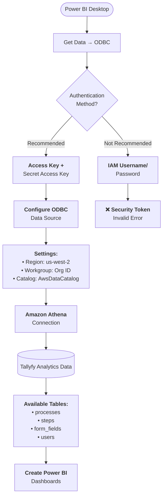

import { Steps } from '@astrojs/starlight/components';

## Power BI Integration with Tallyfy Analytics

Connect Power BI to Tallyfy Analytics and you'll unlock powerful workflow visualization capabilities. Here's how to set up the connection through Amazon Athena - it takes about 15 minutes from start to finish.

### Integration Benefits

- **Advanced Visualization** - Build interactive dashboards showing process bottlenecks and team performance
- **Data-Driven Decisions** - Track workflow metrics that actually matter to your business
- **Custom Analysis** - Create metrics tailored to your organization's specific KPIs
- **Automated Reporting** - Schedule weekly reports that land in stakeholders' inboxes automatically
- **Centralized Data** - Merge Tallyfy data with your CRM, ERP, or other business systems

## Connection Architecture

This diagram shows how Power BI connects to your Tallyfy data through Amazon Athena.

**What to notice:**
- The recommended authentication path (Access Key/Secret) leads directly to a successful connection
- IAM credentials will cause authentication errors - avoid this path entirely
- All connections must go through the us-west-2 region - no other regions will work

## Authentication Methods

Amazon Athena hosts your Tallyfy data. You have two ways to authenticate:

| Authentication Method | Description | Recommendation |
|----------------------|-------------|----------------|
| IAM Username/Password | Web console credentials | Not recommended for Power BI |
| Access Key/Secret | Token-based authentication | Recommended for Power BI |

:::caution[Authentication Best Practice]
Token-based authentication is the way to go for Power BI. Why? Using IAM credentials typically triggers this frustrating error: "The security token included in the request is invalid"
:::

When Tallyfy activates your Analytics subscription, you get two credential sets. Keep them straight:

- **AWS IAM Login** (username/password) - Only for the AWS web console
- **Access Key and Secret Access Key** - These are your Power BI connection keys

## Connection Setup Process

### Requirements

- Power BI Desktop installed on your computer
- Tallyfy Analytics subscription activated
- Amazon Athena ODBC driver installed
- Authentication credentials provided by Tallyfy

### Step 1: Install the Amazon Athena ODBC Driver

<Steps>
1. Download the appropriate Amazon Athena ODBC driver from the [AWS documentation page](https://docs.aws.amazon.com/athena/latest/ug/connect-with-odbc.html/)
2. Run the installer and follow the on-screen instructions
3. Complete the installation before proceeding to the next step
</Steps>

### Step 2: Configure the ODBC Connection

<Steps>
1. On Windows, open the ODBC Data Source Administrator (64-bit)
2. Navigate to the **System DSN** tab
3. Click **Add** to create a new data source
4. Select the **Amazon Athena ODBC Driver** and click **Finish**
5. Configure the connection using the settings detailed below
6. Click **Test** to verify the connection works
7. Click **OK** to save the connection
</Steps>

Here's exactly what to enter for each setting:

| Setting | Value |
|---------|-------|
| Data Source Name | Tallyfy Analytics |
| Description | Tallyfy workflow data |
| AWS Region | us-west-2 |
| S3 Output Location | As provided by Tallyfy |
| Authentication Option | IAM Profile |
| Access Key | Your Tallyfy-provided Access Key |
| Secret Key | Your Tallyfy-provided Secret Access Key |
| Workgroup | Your organization ID (as provided by Tallyfy) |
| Catalog | AwsDataCatalog |

### Step 3: Connect Power BI to Amazon Athena

<Steps>
1. Launch Power BI Desktop
2. Click **Get Data** in the ribbon menu
3. Select **More...** to view all connectors
4. Choose **ODBC** from the Database section and click **Connect**
5. From the DSN dropdown, select the **Tallyfy Analytics** connection you created
6. Click **OK** to establish the connection
7. In the Navigator window, expand **AwsDataCatalog**
8. Select your database (typically your organization name)
9. Choose the tables you want to analyze
10. Click **Load** to import the data into Power BI
</Steps>

## Working with Tallyfy Data

You're connected! Now you can explore these data tables:

- **processes** - Track every process instance with its metadata and status
- **steps** - Analyze task completion times and identify bottlenecks (see note below about time metrics)
- **form_fields** - Extract all the data your teams collect through process forms
- **users** - Monitor team member workload and performance metrics

:::caution[Time metrics in the steps table]
The completion times in the `steps` table show elapsed time, not actual working time. A "3-day" task might be 30 minutes of work interrupted by a weekend. For accurate effort metrics, implement time tracking fields as described in [how to track time spent on tasks](/products/pro/tutorials/how-to/track-time-in-tasks/#analytics-timestamps-inherit-these-challenges).
:::

### Important Configuration Notes

Here's what catches most people off guard:

- You must connect to the **us-west-2** region - other regions won't work
- Your workgroup needs to match your organization ID exactly
- The catalog name is always **AwsDataCatalog** (yes, with that exact capitalization)
- Use Direct Query mode when working with datasets over 1GB
- Set up refresh scheduling if you need reports updated automatically

## Video Tutorial

Want to see the whole process in action? Watch this:

<lite-vimeo videoid="359564159"></lite-vimeo>

## Troubleshooting

Connection not working? Let's fix that:

- Double-check you're using the Access Key and Secret Access Key - not those IAM credentials
- Make sure your ODBC driver is the 64-bit version (32-bit won't work with Power BI Desktop)
- Verify you've entered **us-west-2** as the region - it's easy to miss
- Check if your Tallyfy Analytics subscription is still active
- Sometimes Power BI Desktop needs a restart after configuring ODBC - annoying but it works

Still stuck? Contact Tallyfy Support with the exact error message you're seeing.

import { CardGrid, LinkTitleCard } from "~/components";

## Related articles
<CardGrid>
<LinkTitleCard header="<b>Analytics > Power BI</b>" href="/products/pro/integrations/analytics/powerbi/" > Power BI integration transforms Tallyfy workflow data into interactive visualizations and actionable insights through Amazon Athena connectivity enabling process optimization team performance analysis and executive reporting with real-time data access and customizable dashboards. </LinkTitleCard>
<LinkTitleCard header="<b>Tableau > Connect Tableau to Tallyfy</b>" href="/products/pro/integrations/analytics/tableau/how-can-i-connect-tableau-to-my-tallyfy-data/" > This content explains how to connect Tableau to Tallyfy Analytics data through Amazon Athena by installing required drivers setting up authentication credentials and configuring the connection to create workflow visualization dashboards. </LinkTitleCard>
<LinkTitleCard header="<b>Analytics > How Tallyfy Analytics works</b>" href="/products/pro/integrations/analytics/how-does-tallyfy-analytics-process-my-data/" > Tallyfy Analytics transforms workflow data through a five-step process of event detection data extraction format conversion to Apache Parquet secure storage in Amazon S3 and credential provisioning for seamless integration with business intelligence tools like Power BI and Tableau. </LinkTitleCard>
<LinkTitleCard header="<b>Integrations > Tallyfy analytics</b>" href="/products/pro/integrations/analytics/" > Tallyfy Analytics is an add-on service that copies workflow data to a dedicated analytical infrastructure allowing users to connect business intelligence tools like Tableau Power BI and Looker for custom reporting advanced SQL queries and comprehensive process analysis with secure private data storage and timestamp tracking capabilities. </LinkTitleCard>
</CardGrid>