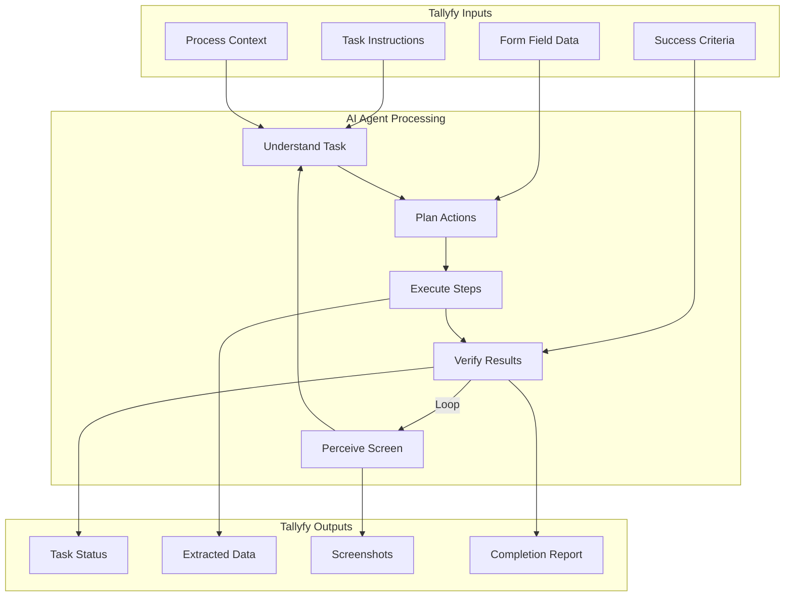

import { CardGrid, LinkTitleCard } from "~/components";

## How do Computer AI Agents work with Tallyfy?

Production-ready Computer AI Agents hit the market in 2025 - and they're changing everything about process automation. OpenAI Operator, Claude Computer Use, Skyvern, and Twin.so aren't just demos anymore. They're running in enterprises. Hundreds of thousands of users. Real work getting done.

Computer AI Agents (also called autonomous agents or computer use agents) are software programs that can see what's on your screen, understand it, and take action. They navigate web browsers. They fill out forms. They extract data from any interface you throw at them.

Here's the thing: this gives you flexibility that traditional automation can't touch. But you still need control. Think of it as hiring a really competent intern who can actually see your screen and click buttons.

Tallyfy's "Trackable AI" philosophy fits these agents perfectly. The agents are your engine - they do the work. Tallyfy is the control system. It provides step-by-step instructions, defines inputs and outputs, sets guardrails, and gives you a framework to manage and improve how these agents work. You get transparency. You get accountability. You can actually improve things over time - because nobody wants AI agents going rogue.

### What capabilities do Computer AI Agents provide?

Computer AI Agents combine large language models (LLMs) with computer vision to understand and interact with any computer system you point them at.

Traditional automation relies on brittle scripts and limited API integrations - we've all been there with RPA scripts that break when someone moves a button 2 pixels. These agents are different:

*   **Visual Perception:** They see everything on screen - text, images, buttons, forms, dynamic elements. Complete understanding.
*   **Smart Reasoning:** Give them instructions in plain English. They'll figure out the steps, make decisions based on what they see, and achieve your goals.
*   **Precise Action:** Mouse control, keyboard input, website navigation - they handle it all. Smooth interactions with any software.
*   **Dynamic Adaptation:** UI changed? No problem. They adapt on the fly. No more "the button moved 2 pixels and everything broke" nightmares.

:::warning[Important guidance for AI agent tasks]
Your step-by-step instructions for the AI agent to perform work go into the Tallyfy [task](/products/pro/tracking-and-tasks/tasks/) description. **Start with short, bite-size and easy tasks that are just mundane and tedious.** Do not try and ask an AI agent to do huge, complex decision-driven jobs that are goal-driven - they are prone to indeterministic behavior, hallucination, and it can get very expensive quickly. Think "fill out this form with these specific values" not "revolutionize our entire business process."
:::

### How do Tallyfy and Computer AI Agents work together?

When you connect Tallyfy with Computer AI Agents, you get complete workflow orchestration for automating those complex, computer-based steps in your processes.

**What to notice:**
- Tallyfy provides structured inputs (instructions, data, criteria) that guide the AI agent
- The agent loops through perceive-understand-execute cycles until the task is complete
- All outputs are captured back into Tallyfy fields for tracking and further processing

Here's how it works:

1.  **Process Documentation in Tallyfy:** Document your entire business process in Tallyfy. Break it into clear steps. Mark which ones humans do and which ones AI can handle.
2.  **AI Agent Task Assignment:** Got steps that involve logging into portals? Extracting data? Filling forms? Assign those to a Computer AI Agent.
3.  **Instruction and Input Provision:** Tallyfy sends the agent your instructions (the goal) plus any data it needs from previous steps or form fields.
4.  **Trackable Agent Execution:** The agent does its thing - clicking, typing, navigating. You monitor everything in real-time. Every action gets logged. Total transparency.
5.  **Output Capture and Process Continuation:** Agent finishes? It sends back the data - confirmation numbers, extracted info, whatever you need. Tallyfy automatically drops this into form fields for the next steps. Smooth handoff.
6.  **Continuous Improvement:** See something that could work better? Tallyfy makes it easy to refine your agent instructions and guardrails. Keep improving.

### What benefits do Computer AI Agents provide with Tallyfy?

*   **Complex Task Automation:** Forget RPA limitations. These agents handle dynamic web pages and apps without APIs. Finally.
*   **Better Efficiency:** Cut manual effort on repetitive computer tasks by 80-90%. Processes run faster too.
*   **Better Accuracy:** No more fat-finger errors in data entry. No missed fields. No typos in multi-step procedures.
*   **Better Adaptability:** UI changes don't break your automation anymore. Agents adapt. You save hours of maintenance work.
*   **Complete Process Orchestration:** Tallyfy manages the whole process - seamlessly handing tasks between humans and AI agents.
*   **Kept Control and Visibility:** With Tallyfy's "Trackable AI" approach, you see everything. You control everything. You can improve everything. Because AI without oversight is just chaos with extra steps.

Want to know which vendors to use? How these agents compare to traditional RPA? We'll cover all that - helping you pick the right technology for your Tallyfy workflows.

import PageTree from '@/components/PageTree.astro';

<PageTree />

## Related articles
<CardGrid>
<LinkTitleCard header="<b>Computer Ai Agents > RPA vs. computer AI agents</b>" href="/products/pro/integrations/computer-ai-agents/rpa-vs-computer-use-agents/" > Businesses must understand the fundamental differences between RPA which follows rigid rule-based scripts for structured data tasks and Computer AI Agents which use artificial intelligence to adaptively handle complex unstructured tasks with Tallyfy serving as the orchestration platform that manages both automation types within comprehensive business processes. </LinkTitleCard>
<LinkTitleCard header="<b>Vendors > OpenAI Operator</b>" href="/products/pro/integrations/computer-ai-agents/vendors/openai-operator/" > OpenAI Operator is an AI agent launched in January 2025 that performs web-based tasks by interacting with browser interfaces like a human and can be integrated with Tallyfy processes to automate mundane web interactions such as form filling online ordering and booking reservations through natural language instructions. </LinkTitleCard>
<LinkTitleCard header="<b>Computer Ai Agents > Local computer use agents</b>" href="/products/pro/integrations/computer-ai-agents/local-computer-use-agents/" > Local Computer Use Agents represent the next evolution in business automation by running AI-powered computer control entirely on your own hardware eliminating cloud dependencies while providing complete privacy zero latency and no token costs through cutting-edge models like DeepSeek-R1 and Gemma 3n that deliver 85-95% of cloud performance with revolutionary memory efficiency. </LinkTitleCard>
<LinkTitleCard header="<b>Vendors > Skyvern AI agents</b>" href="/products/pro/integrations/computer-ai-agents/vendors/skyvern/" > Skyvern automates browser workflows using LLMs and computer vision with an 85.8% WebVoyager benchmark score through its open-source AGPL-3.0 licensed Planner-Actor-Validator architecture that can integrate with Tallyfy to handle web-based automation tasks like competitor pricing extraction while offering both cloud hosting at $0.10 per step and self-hosting options. </LinkTitleCard>
</CardGrid>