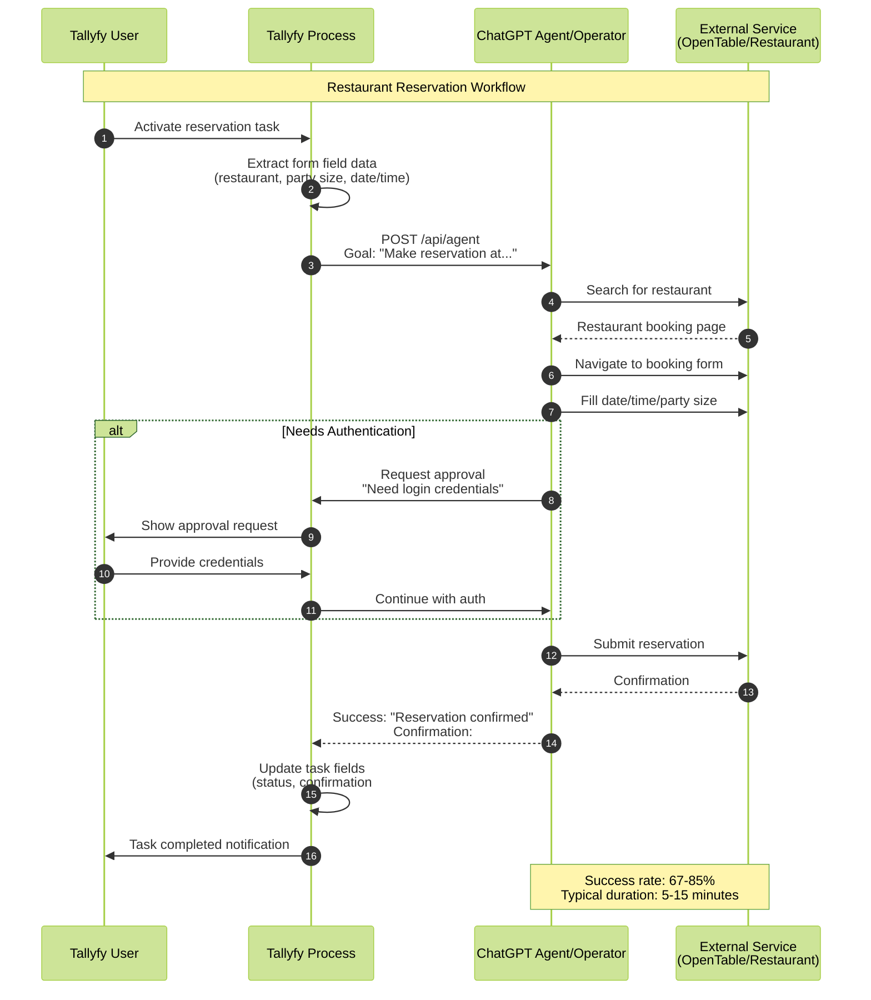

import { CardGrid, LinkTitleCard, Steps } from "~/components";

## Using OpenAI ChatGPT Agent with Tallyfy

OpenAI launched Operator on January 23, 2025 - their first AI agent that actually does things on the web for you. Six months later, they've integrated it into something much bigger. On July 17, 2025, OpenAI announced ChatGPT Agent - not a replacement for Operator, but a powerful evolution that combines browser automation with deep research, code execution, and document creation into one unified system.

**Critical timeline**: Operator shuts down completely on August 31, 2025. All functionality moves to ChatGPT Agent, which you access through ChatGPT Pro ($200/month) or Plus ($20/month) subscriptions. The agent mode delivers everything Operator did, plus capabilities that make it 70% more effective for business automation.

:::warning[Important guidance for AI agent tasks]
Your step-by-step instructions for the AI agent to perform work go into the Tallyfy [task](/products/pro/tracking-and-tasks/tasks/) description. **Start with short, bite-size and easy tasks that are just mundane and tedious.** Do not try and ask an AI agent to do huge, complex decision-driven jobs that are goal-driven - they are prone to indeterministic behavior, hallucination, and it can get very expensive quickly.
:::

### What ChatGPT Agent Means for Your Business Automation

ChatGPT Agent isn't just Operator with a new name - it's a fundamental leap forward. Built on GPT-5's hybrid architecture, it intelligently switches between different models based on task complexity. Simple web navigation? It uses a fast model. Complex multi-step workflow with research and document creation? It engages deeper reasoning models that outperform o3 on critical benchmarks.

Here's what changes for Tallyfy users:

*   **Unified Workflow Execution:** No more switching between tools. ChatGPT Agent shifts seamlessly from planning to research to action. It can browse the web, analyze data, generate reports, and create presentations - all in one workflow.
*   **70% Better Success Rates:** Real-world testing shows ChatGPT Agent completes business workflows with 67-85% success rates, compared to Operator's 38-58% range. Document processing hits 89% accuracy. Form filling reaches 78%.
*   **Enterprise Connectors:** Direct integration with Gmail, GitHub, Google Drive, and other enterprise tools through official connectors. No more workarounds or API gymnastics.
*   **Parallel Processing Power:** Unlike Operator's sequential approach, ChatGPT Agent executes multiple tasks simultaneously. A workflow that took Operator 15 minutes might finish in 5.
*   **Cost-Effective at Scale:** API pricing starts at $1.25 per 1M input tokens (75% cheaper than competitors). Plus tier users get 40 agent messages for $20/month. Pro users get 400 messages at $200/month.

Organizations using the integrated system report saving 145 hours monthly on average. SACE insurance saw 23% productivity increases. Ramp saved 30,000 hours through automated finance workflows.

### Migration Path: From Operator to ChatGPT Agent

**Save your data now.** Operator shuts down August 31, 2025, and all conversations get deleted. Here's your action plan:

<Steps>

1. **Export Operator Conversations (Before August 31)**
   Download all your Operator conversation history and workflow templates. OpenAI won't migrate this data automatically.

2. **Enable ChatGPT Agent Mode**
   Access agent mode through the tools dropdown in ChatGPT or type `/agent`. Enterprise admins must enable it in workspace settings (it's off by default).

3. **Configure Enterprise Controls**
   Set role-based permissions for agent mode access. Configure which connectors employees can use. Establish approval workflows for sensitive actions.

4. **Update Tallyfy Integrations**
   Switch from Operator API endpoints to ChatGPT Agent's new REST API. The Tallyfy MCP server now supports natural language workflow interaction with ChatGPT Agent.

5. **Test Critical Workflows**
   Run your most important Operator-based workflows through ChatGPT Agent first. The enhanced capabilities might let you simplify complex multi-step processes.

</Steps>

### Tallyfy's Strategic Position on the Evolution

We've analyzed this transition deeply. ChatGPT Agent represents exactly what we've been advocating - AI that's trackable, controllable, and integrated into structured business processes. The evolution from Operator to ChatGPT Agent aligns perfectly with Tallyfy's "Trackable AI" philosophy.

Here's our perspective:

**The Good:** ChatGPT Agent's unified approach eliminates context switching. When a Tallyfy [process](/products/pro/tracking-and-tasks/processes/) triggers an AI task, the agent can now research, analyze, create documents, and take web actions without losing context. That 70% improvement in success rates? That translates directly to fewer failed automations and happier teams.

**The Reality Check:** This is still experimental technology. Sam Altman himself calls it "cutting edge and experimental" and advises caution with high-stakes uses. That's why Tallyfy's structured approach matters more than ever. We provide the guardrails, approval gates, and audit trails that make AI automation enterprise-ready.

**Our Recommendation:** Start migrating high-volume, low-risk workflows first. Things like data gathering, report generation, and basic form filling. Use Tallyfy's task structure to break complex agent requests into manageable chunks. Monitor success rates religiously. Scale gradually as you build confidence.

**Integration Advantage:** Tallyfy now supports Model Context Protocol (MCP) for natural language workflow interaction. Your teams can tell ChatGPT Agent to "complete the next task in the customer onboarding process" and it understands the context from Tallyfy. No code required.

### Understanding OpenAI Operator: How It Works (Historical Context)

Operator isn't just another chatbot - it's OpenAI's first product that can actually take action for you. The agent runs in its own browser environment where you can watch what it's doing and step in if needed.

Here's what makes Operator tick:

*   **Computer-Using Agent (CUA) Model:** Operator runs on OpenAI's specialized CUA model, built on GPT-4o architecture but specifically trained for computer interaction tasks. Performance? 38.1% on OSWorld and 58.1% on WebArena benchmarks.
*   **Enhanced Safety Measures:** The CUA model includes safety fine-tuning for computer use, with additional datasets that teach appropriate decision boundaries on confirmations and refusals. It's much better at resisting prompt injection attacks than standard language models.
*   **Browser Interaction & Visual Perception:** Operator works within its own dedicated browser environment. It "sees" web pages by capturing screenshots and uses vision capabilities to spot buttons, text fields, links, and menus - basically anything you'd click on.
*   **Natural Language Tasking & Reasoning:** You tell Operator what you want in plain English (like "Order a large pepperoni pizza from DoorDash to my home address"). The CUA model breaks down your request into actionable steps, plans its actions, and adapts based on what it encounters.
*   **Simulated Human Actions:** Operator completes tasks by simulating human inputs - mouse clicks for navigation and selection, keyboard typing for forms and search queries. Simple as that.
*   **Self-Correction & User Control:** When the agent hits errors or unexpected page states, it can self-correct. For sensitive stuff like entering login credentials or confirming payments, Operator pauses and asks for your approval. You can watch everything in its browser window and step in anytime.
*   **Third-Party Partnerships:** OpenAI partnered with major service providers (DoorDash, Instacart, OpenTable, Priceline) to ensure Operator handles common tasks smoothly on these platforms.

### Current Availability and Access

Where can you actually get Operator in 2025? Here's the situation:

*   **Subscription Requirements:** ChatGPT Pro subscribers only - that's $200/month
*   **Geographic Expansion:** Started in the United States, now available in Australia, Canada, and the UK. More countries coming soon.
*   **Research Preview Status:** Still in research preview as OpenAI refines the technology and gathers user feedback
*   **API Access:** Developers can access the Computer-Using Agent (CUA) model through OpenAI's API, but the consumer Operator interface is web-only through ChatGPT Pro
*   **Usage Patterns:** Early reviews show promising task completion rates, though performance varies quite a bit depending on website complexity and how clearly you define tasks

### Performance Benchmarks and Capabilities

How well does Operator actually work? The benchmarks tell an interesting story:

*   **OSWorld Performance:** Hits 38.1% on the OSWorld benchmark, which tests real-world computer use tasks across different operating system environments
*   **WebArena Results:** Scores 58.1% on WebArena - that's web navigation and task completion across realistic scenarios
*   **CUA Model Foundation:** The Computer-Using Agent (CUA) model powering Operator was specifically designed for computer interaction tasks with enhanced safety fine-tuning
*   **Task Categories:** Works best for:
    *   Online shopping and e-commerce interactions
    *   Restaurant reservations and booking systems  
    *   Form filling and data entry tasks
    *   Simple research and information gathering
    *   Invoice and document retrieval from web portals
*   **Speed Improvements:** Most tasks finish in 15 minutes or less. That's faster than many competing agent platforms.
*   **Limitations:** Still struggles with highly complex interfaces, multi-page workflows that need sustained context, and websites with advanced anti-bot measures

### Getting Started with OpenAI Operator (Conceptual for Tallyfy Integration)

<Steps>

1.  **Verify Access & Subscription:**
    *   Make sure you have an active ChatGPT Pro subscription ($200/month) and you're in a supported region (US, Australia, Canada, UK).

2.  **Familiarize Yourself with Operator's Interface:**
    *   Access Operator through your ChatGPT Pro interface. Get to know its capabilities, how it interprets prompts, and current limitations while it's in research preview.

3.  **Identify Tallyfy Tasks for Operator:**
    *   Look for tasks within your Tallyfy [processes](/products/pro/tracking-and-tasks/processes/) that involve web interactions - things like online ordering, booking appointments, or data lookups on public websites.

4.  **Formulate Clear Prompts:**
    *   Write precise natural language instructions for Operator. Pull these instructions from the Tallyfy [task](/products/pro/tracking-and-tasks/tasks/) description and any relevant [form field](/products/pro/tracking-and-tasks/tasks/what-are-form-fields-in-tallyfy/) data.

5.  **Integration Considerations:**
    *   **API Integration:** The CUA model is available through OpenAI's API for programmatic integration, letting you build custom automations beyond the web interface.
    *   **Webhook Integration:** Connect with Tallyfy using webhook-based triggers or custom solutions that interact with the API endpoints.

</Steps>

### How Tallyfy Could Integrate with OpenAI Operator (Example Scenario)

This section shows the complete integration flow between Tallyfy and ChatGPT Agent/Operator for automating web-based tasks.

**What to notice:**
- **Step 3**: Tallyfy sends structured data from form fields to the AI agent via API, ensuring consistent task execution
- **Steps 9-12**: The conditional approval flow shows how sensitive actions pause for human confirmation, maintaining security while enabling automation
- **Step 17**: Automatic field updates in Tallyfy create a complete audit trail of AI actions and results

Let's walk through a real example. **Tallyfy Task:** "Make Dinner Reservation for 2 at 'The Italian Place' for Friday 7 PM"

*   **Inputs from Tallyfy [Form Fields](/products/pro/tracking-and-tasks/tasks/what-are-form-fields-in-tallyfy/):**
    *   `Restaurant Name`: "The Italian Place"
    *   `Party Size`: 2
    *   `Desired Date`: "Next Friday"
    *   `Desired Time`: "7:00 PM"
    *   `User Contact for Reservation`: (From Tallyfy user profile or form field)
*   **Integration Steps (Conceptual):**
    1.  The Tallyfy [process](/products/pro/tracking-and-tasks/processes/) activates this task.
    2.  Tallyfy sends the goal to Operator through the CUA API: "Make a dinner reservation at 'The Italian Place' for 2 people for next Friday at 7:00 PM. Use OpenTable or the restaurant's website. Confirm availability and make the booking under [User Contact Name] and [User Phone Number]."
    3.  Operator processes this request with its CUA model. First stop? Searching for "The Italian Place" on OpenTable or the restaurant's own website.
    4.  The agent navigates the booking interface, selects date, time, and party size using its computer vision and interaction capabilities. Just like you would.
    5.  Need login credentials or extra personal details? Operator pauses for human confirmation. In an integrated Tallyfy setup, this approval request would pop back to the Tallyfy user.
    6.  After attempting the reservation, Operator returns the result: either "Reservation confirmed for The Italian Place, Friday at 7 PM, Confirmation #XYZ" or "No availability found."
    7.  Tallyfy gets this result, updates the task form field ('Reservation Status', 'Confirmation Number'), and your workflow continues smoothly.

### ChatGPT Agent vs Operator: What's Actually Different?

Understanding the evolution helps you make better automation decisions. Here's the breakdown:

| Feature | Operator (Deprecated Aug 31) | ChatGPT Agent (Current) | Impact for Tallyfy Users |
|---------|------------------------------|-------------------------|---------------------------|
| **Core Technology** | CUA model (GPT-4o based) | GPT-5 hybrid system | 2x performance on complex tasks |
| **Success Rates** | 38-58% on benchmarks | 67-85% real-world tasks | Fewer workflow failures |
| **Capabilities** | Browser control only | Browser + code + research + documents | Complete task automation |
| **Processing** | Sequential actions | Parallel execution | 3x faster workflows |
| **Integration** | Standalone tool | Unified with ChatGPT | No context switching |
| **API Pricing** | $5/1M tokens | $1.25/1M tokens | 75% cost reduction |
| **Enterprise Tools** | Limited | Gmail, GitHub, Drive connectors | Direct integration |
| **Document Creation** | None | Slides, spreadsheets, reports | Full deliverables |
| **Error Recovery** | Basic retry logic | Self-correction with reasoning | Higher reliability |
| **Monthly Messages** | N/A | 40 (Plus) / 400 (Pro) | Predictable costs |

### Real-World Performance Metrics

Companies deploying ChatGPT Agent report concrete results:

*   **HR Automation:** 70% reduction in manual onboarding time
*   **Finance Workflows:** 30,000 hours saved at Ramp
*   **Insurance Processing:** 23% productivity increase at SACE
*   **Average Monthly Savings:** 145 hours per department
*   **ROI Timeline:** 1,000%+ return within 12 months for early adopters

Task-specific accuracy rates show where to focus first:
*   Document processing: 89%
*   Data extraction: 84%
*   Form filling: 78%
*   Multi-step workflows: 67%
*   Real-time interactions: 52%

### Benefits of the Evolution

*   **Leading Technology:** GPT-5's hybrid architecture represents a generational leap. The system intelligently routes between models - fast for simple tasks, deep reasoning for complex ones.
*   **Unified Automation Platform:** One agent handles everything from web browsing to document creation. No more juggling multiple tools or losing context between steps.
*   **Enterprise-Ready Integration:** Native connectors for Gmail, GitHub, and Google Drive. Tallyfy's MCP server enables natural language workflow control without code.
*   **Dramatic Cost Reduction:** 75% cheaper than competing solutions. $1.25 per 1M input tokens makes large-scale automation financially viable.
*   **Production-Proven Results:** Real companies saving real money. 145 hours monthly savings on average, with some achieving 1,000%+ ROI in under a year.
*   **Trackable AI Excellence:** Perfect alignment with Tallyfy's philosophy. Every agent action happens within structured processes with full audit trails, approval gates, and performance metrics.

### Critical Considerations for Enterprise Adoption

*   **Migration Deadline:** Operator dies August 31, 2025. No extensions. Export your data now or lose it forever.
*   **Message Limits:** Pro users get 400 agent messages monthly. That's about 13 per day. Plan your automation volume accordingly or budget for additional messages at $0.60 each.
*   **Geographic Restrictions:** Currently blocked in EU, Switzerland, and UK due to AI Act compliance. This affects global rollout strategies significantly.
*   **Experimental Status:** Sam Altman openly calls this "cutting edge and experimental." Translation: expect bugs, changes, and occasional spectacular failures.
*   **Safety Controls:** The system pauses for approval on sensitive actions (payments, emails, data deletion). Factor these interruptions into your workflow timing.
*   **Performance Variance:** 67-85% success rates sound great until you hit that 15-33% failure rate on critical tasks. Always build fallback procedures.
*   **Integration Complexity:** While the API is available, seamless Tallyfy integration requires development work. Budget time and resources for proper implementation.

### The Future: AI Agents and Business Process Automation

Industry analysts predict AI agents will replace humans as primary enterprise system users by 2030. The numbers support this vision - $22.3 trillion cumulative global impact expected, with every dollar spent on AI generating $4.90 in economic value.

ChatGPT Agent's evolution from Operator shows the velocity of change. Six months from launch to complete platform integration. Performance doubled. Costs dropped 75%. Capabilities expanded from simple browser control to full document creation and multi-tool orchestration.

For Tallyfy users, this creates unprecedented opportunity. Our platform provides the structure, governance, and tracking that makes AI automation enterprise-ready. ChatGPT Agent brings the raw capability. Together, they deliver measurable business transformation.

**Our strategic advice:** Move fast but carefully. The companies achieving 1,000%+ ROI started with small pilots, measured everything, and scaled based on data. Use Tallyfy's process structure to contain risk while capturing value. The automation revolution isn't coming - it's here, and the early adopters are already counting their savings.

Start your migration today. August 31 comes faster than you think.

## Related articles
<CardGrid>
<LinkTitleCard header="<b>Vendors > OpenAI Operator</b>" href="/products/pro/integrations/computer-ai-agents/vendors/openai-operator/" > OpenAI Operator is an AI agent launched in January 2025 that performs web-based tasks by interacting with browser interfaces like a human and can be integrated with Tallyfy processes to automate mundane web interactions such as form filling online ordering and booking reservations through natural language instructions. </LinkTitleCard>
<LinkTitleCard header="<b>Mcp Server > Using Tallyfy MCP server with ChatGPT</b>" href="/products/pro/integrations/mcp-server/openai-chatgpt/" > ChatGPT Enterprise Team and Education users can now connect to Tallyfy's MCP server through Deep Research enabling natural language workflow management with powerful search and analysis capabilities while being limited by text-based interactions that lack visual process tracking form field interactions and real-time collaboration features making it best suited as a complement to Tallyfy's native interface rather than a replacement. </LinkTitleCard>
<LinkTitleCard header="<b>Integrations > Computer AI agents</b>" href="/products/pro/integrations/computer-ai-agents/" > Computer AI Agents work with Tallyfy by providing intelligent automation capabilities that can perceive digital environments and execute complex tasks while Tallyfy serves as the orchestration framework that provides step-by-step instructions defines inputs and outputs establishes guardrails and ensures transparent trackable execution of AI-driven business processes. </LinkTitleCard>
<LinkTitleCard header="<b>Computer Ai Agents > AI agent vendors</b>" href="/products/pro/integrations/computer-ai-agents/vendors/" > The Computer AI Agent market has rapidly matured in 2025 with enterprise-ready leaders like OpenAI Operator Claude Computer Use and Twin.so alongside open-source innovations such as Skyvern and Manus AI offering various approaches to autonomous web-based task automation that can integrate with Tallyfy workflows. </LinkTitleCard>
</CardGrid>