import { CardGrid, LinkTitleCard, Steps } from "~/components";

## Using OpenAI ChatGPT Agent with Tallyfy

OpenAI launched Operator on January 23, 2025 - their first AI agent that actually does things on the web for you. Six months later, they've integrated it into something much bigger. On July 17, 2025, OpenAI announced ChatGPT Agent - not a replacement for Operator, but a powerful evolution that combines browser automation with deep research, code execution, and document creation into one unified system.

**Critical timeline**: Operator shuts down completely on August 31, 2025. All functionality moves to ChatGPT Agent, which you access through ChatGPT Pro ($200/month) or Plus ($20/month) subscriptions. The agent mode delivers everything Operator did, plus capabilities that make it 70% more effective for business automation.

ChatGPT Agent changes the economics of automation. Traditional BPM platforms start at $50,000 annually. RPA licenses run $1,000+ per bot monthly. ChatGPT Agent? $200/month for 400 automated tasks, or $1.25 per million tokens via API. You're getting enterprise-grade automation at startup prices - with natural language control instead of complex scripting.

:::warning[Important guidance for AI agent tasks]
Your step-by-step instructions for the AI agent to perform work go into the Tallyfy [task](/products/pro/tracking-and-tasks/tasks/) description. **Start with short, bite-size and easy tasks that are just mundane and tedious.** Do not try and ask an AI agent to do huge, complex decision-driven jobs that are goal-driven - they are prone to indeterministic behavior, hallucination, and it can get very expensive quickly.
:::

### How ChatGPT Agent Works with Tallyfy

This flowchart shows how Tallyfy orchestrates ChatGPT Agent's browser automation, code execution, and research capabilities to complete complex workflow tasks.

```mermaid
flowchart TD
    T["📋 Tallyfy Task<br/>Instructions + Form Data"] --> W["🔄 Webhook/API"]
    W --> C["🤖 ChatGPT Agent"]
    
    C --> P["Plan Execution"]
    P --> B["🌐 Browser Tasks"]
    P --> R["🔍 Deep Research"]
    P --> E["⚡ Code Execution"]
    P --> D["📄 Doc Creation"]
    
    B --> O["Task Output"]
    R --> O
    E --> O
    D --> O
    
    O --> U["📊 Update Tallyfy<br/>Results in Fields"]
    U --> N["✅ Next Task"]
```



**What to notice:**
- **Multiple capabilities** - ChatGPT Agent switches between browser control, research, code execution, and document creation based on task needs
- **Unified processing** - All agent actions happen within a single workflow context, maintaining state across different capabilities
- **Structured results** - Outputs are captured as JSON data that maps directly to Tallyfy form fields for seamless process continuation

### What ChatGPT Agent Means for Your Business Automation

ChatGPT Agent combines Operator's browser control with new capabilities - code execution, deep research, and document creation. The system switches between different AI models based on task complexity. Simple form filling uses a fast model. Complex research with multiple steps engages deeper reasoning models.

Most teams juggle multiple tools right now. Zapier for simple connections. RPA for data entry. Manual work for everything else. ChatGPT Agent consolidates these into one conversational interface that understands context and adapts to changes.

Here's what changes for Tallyfy users:

*   **Unified Workflow Execution:** No more switching between tools. ChatGPT Agent shifts seamlessly from planning to research to action. It can browse the web, analyze data, generate reports, and create presentations - all in one workflow.
*   **70% Better Success Rates:** Real-world testing shows ChatGPT Agent completes business workflows with 67-85% success rates, compared to Operator's 38-58% range. Document processing hits 89% accuracy. Form filling reaches 78%.
*   **Enterprise Connectors:** Direct integration with Gmail, GitHub, Google Drive, and other enterprise tools through official connectors. No more workarounds or API gymnastics.
*   **Parallel Processing Power:** Unlike Operator's sequential approach, ChatGPT Agent executes multiple tasks simultaneously. A workflow that took Operator 15 minutes might finish in 5.
*   **Cost-Effective at Scale:** API pricing starts at $1.25 per 1M input tokens (75% cheaper than competitors). Plus tier users get 40 agent messages for $20/month. Pro users get 400 messages at $200/month. Compare that to Workato's $1,000+/month starting price or Salesforce Flow's $75/user/month - you're getting AI that understands context for less than traditional rule-based automation.

Early adopters report significant time savings. Document processing that took hours now takes minutes. Form filling accuracy improved from 60% manual accuracy to 78% with ChatGPT Agent. Invoice processing dropped from 15 minutes per invoice to 4 minutes.

### Migration Path: From Operator to ChatGPT Agent

**Save your data now.** Operator shuts down August 31, 2025, and all conversations get deleted. Here's your migration action plan:

<Steps>

1. **Export Operator Conversations (Before August 31)**
   Download all your Operator conversation history and workflow templates. OpenAI won't migrate this data automatically.

2. **Enable ChatGPT Agent Mode**
   Access agent mode through the tools dropdown in ChatGPT or type `/agent`. Enterprise admins must enable it in workspace settings (it's off by default).

3. **Configure Enterprise Controls**
   Set role-based permissions for agent mode access. Configure which connectors employees can use. Establish approval workflows for sensitive actions.

4. **Update Tallyfy Integrations**
   Switch from Operator API endpoints to ChatGPT Agent's new REST API. The Tallyfy MCP server now supports natural language workflow interaction with ChatGPT Agent.

5. **Test Critical Workflows**
   Run your most important Operator-based workflows through ChatGPT Agent first. The enhanced capabilities might let you simplify complex multi-step processes.

</Steps>

### How Tallyfy Works with ChatGPT Agent

Tallyfy provides the structure and control layer for ChatGPT Agent automation. The agent handles the execution - Tallyfy manages the orchestration.

**Integration advantages**:

*   **Trackable Execution:** Every agent action happens within a Tallyfy process. Full audit trail. Complete visibility. You know exactly what the AI did and when.
*   **Natural Language Control:** With MCP support, tell ChatGPT Agent to "complete the next task in customer onboarding" and it understands Tallyfy's context. No complex prompts needed.
*   **Error Recovery:** When agents hit issues, Tallyfy's conditional logic routes tasks to humans. Partial completions get flagged for review. Nothing falls through cracks.
*   **Gradual Scaling:** Start with simple tasks like form filling. Build confidence. Then expand to complex workflows. Tallyfy's structure lets you control the pace.

**Recommended approach**: Begin with high-volume, low-risk tasks. Data entry, report generation, information gathering. Use Tallyfy to break complex requests into manageable steps. Monitor success rates. Adjust instructions based on results.

### Understanding OpenAI Operator: How It Works (Historical Context)

Operator isn't just another chatbot - it's OpenAI's first product that can actually take action for you. The agent runs in its own browser environment where you can watch what it's doing and step in if needed.

Here's what makes Operator tick:

*   **Computer-Using Agent (CUA) Model:** Operator runs on OpenAI's specialized CUA model, built on GPT-4o architecture but specifically trained for computer interaction tasks. Performance? 38.1% on OSWorld and 58.1% on WebArena benchmarks.
*   **Enhanced Safety Measures:** The CUA model includes safety fine-tuning for computer use, with additional datasets that teach appropriate decision boundaries on confirmations and refusals. It's much better at resisting prompt injection attacks than standard language models.
*   **Browser Interaction & Visual Perception:** Operator works within its own dedicated browser environment. It "sees" web pages by capturing screenshots and uses vision capabilities to spot buttons, text fields, links, and menus - basically anything you'd click on.
*   **Natural Language Tasking & Reasoning:** You tell Operator what you want in plain English (like "Order a large pepperoni pizza from DoorDash to my home address"). The CUA model breaks down your request into actionable steps, plans its actions, and adapts based on what it encounters.
*   **Simulated Human Actions:** Operator completes tasks by simulating human inputs - mouse clicks for navigation and selection, keyboard typing for forms and search queries. Simple as that.
*   **Self-Correction & User Control:** When the agent hits errors or unexpected page states, it can self-correct. For sensitive stuff like entering login credentials or confirming payments, Operator pauses and asks for your approval. You can watch everything in its browser window and step in anytime.
*   **Third-Party Partnerships:** OpenAI partnered with major service providers (DoorDash, Instacart, OpenTable, Priceline) to ensure Operator handles common tasks smoothly on these platforms.

### Current Availability and Access

ChatGPT Agent is available now through multiple access points:

*   **ChatGPT Plus:** $20/month - includes 40 agent messages monthly
*   **ChatGPT Pro:** $200/month - includes 400 agent messages monthly  
*   **Enterprise Plans:** Custom pricing with volume discounts and admin controls
*   **API Access:** OpenAI Agents SDK available at $1.25/1M input tokens
*   **Geographic Availability:** United States, Canada, UK, Australia (EU pending regulatory approval)
*   **Enterprise Features:** SAML SSO, SCIM provisioning, role-based access controls for workspace admins

### Performance Benchmarks and Capabilities

How well does Operator actually work? The benchmarks tell an interesting story:

*   **OSWorld Performance:** Hits 38.1% on the OSWorld benchmark, which tests real-world computer use tasks across different operating system environments
*   **WebArena Results:** Scores 58.1% on WebArena - that's web navigation and task completion across realistic scenarios
*   **CUA Model Foundation:** The Computer-Using Agent (CUA) model powering Operator was specifically designed for computer interaction tasks with enhanced safety fine-tuning
*   **Task Categories:** Works best for:
    *   Online shopping and e-commerce interactions
    *   Restaurant reservations and booking systems  
    *   Form filling and data entry tasks
    *   Simple research and information gathering
    *   Invoice and document retrieval from web portals
*   **Speed Improvements:** Most tasks finish in 15 minutes or less. That's faster than many competing agent platforms.
*   **Limitations:** Still struggles with highly complex interfaces, multi-page workflows that need sustained context, and websites with advanced anti-bot measures

### Getting Started with OpenAI Operator (Conceptual for Tallyfy Integration)

<Steps>

1.  **Verify Access & Subscription:**
    *   Make sure you have an active ChatGPT Pro subscription ($200/month) and you're in a supported region (US, Australia, Canada, UK).

2.  **Familiarize Yourself with Operator's Interface:**
    *   Access Operator through your ChatGPT Pro interface. Get to know its capabilities, how it interprets prompts, and current limitations while it's in research preview.

3.  **Identify Tallyfy Tasks for Operator:**
    *   Look for tasks within your Tallyfy [processes](/products/pro/tracking-and-tasks/processes/) that involve web interactions - things like online ordering, booking appointments, or data lookups on public websites.

4.  **Formulate Clear Prompts:**
    *   Write precise natural language instructions for Operator. Pull these instructions from the Tallyfy [task](/products/pro/tracking-and-tasks/tasks/) description and any relevant [form field](/products/pro/tracking-and-tasks/tasks/what-are-form-fields-in-tallyfy/) data.

5.  **Integration Considerations:**
    *   **API Integration:** The CUA model is available through OpenAI's API for programmatic integration, letting you build custom automations beyond the web interface.
    *   **Webhook Integration:** Connect with Tallyfy using webhook-based triggers or custom solutions that interact with the API endpoints.

</Steps>

### Complete Integration Example: Restaurant Reservation Workflow

Let's walk through exactly how Tallyfy orchestrates a ChatGPT Agent task. You'll see the data flow, decision points, and error handling in action.

**Scenario**: Your sales team needs dinner reservations for client meetings. Here's how it works with Tallyfy + ChatGPT Agent.


**Data Flow Details**:

1. **Tallyfy triggers the task** with form field data:
   - Restaurant name from dropdown selection
   - Party size from number field
   - Date/time from datetime picker
   - Special requests from text field

2. **Webhook payload** includes structured data:
   ```json
   {
     "task_id": "abc123",
     "instructions": "Make dinner reservation",
     "data": {
       "restaurant": "The Italian Place",
       "party_size": 4,
       "datetime": "2025-11-07T19:00:00",
       "notes": "Quiet table if possible"
     }
   }
   ```

3. **ChatGPT Agent processes** the request:
   - Searches for the restaurant on OpenTable
   - Navigates the booking interface
   - Enters all required information
   - Handles edge cases (login required, special requests)

4. **Result capture** in Tallyfy:
   - Success: Confirmation number stored in form field
   - Failure: Task reassigned to human with context
   - Partial success: Notes added for follow-up

### Technical Integration with ChatGPT Agent API

Connect Tallyfy to ChatGPT Agent through multiple integration paths. Pick what works for your technical setup.

#### Option 1: Direct API Integration

Use the OpenAI Agents SDK with MCP support for powerful, direct integration:

```python
from openai_agents import Agent, Session
import requests

# Initialize ChatGPT Agent
agent = Agent(
    name="workflow_agent",
    instructions="Execute Tallyfy workflow tasks",
    tools=["browser", "file_search", "code_execution"]
)

# Process Tallyfy webhook
def process_tallyfy_task(webhook_data):
    session = Session()
    
    # Extract task details
    task = webhook_data['task']
    instructions = task['description']
    form_data = task['form_fields']
    
    # Execute with agent
    result = session.run(
        agent=agent,
        prompt=f"{instructions}\nData: {form_data}"
    )
    
    # Send result back to Tallyfy
    update_tallyfy_task(task['id'], result)
```

#### Option 2: Model Context Protocol (MCP) Integration

MCP provides standardized communication between Tallyfy and ChatGPT Agent. Think of it as a universal adapter for AI systems.

**Setting up MCP Server for Tallyfy**:

```javascript
// tallyfy-mcp-server.js
import { MCPServer } from '@openai/mcp-sdk';

const server = new MCPServer({
  name: 'tallyfy-workflows',
  version: '1.0.0',
  
  tools: [
    {
      name: 'get_next_task',
      description: 'Fetch next task from Tallyfy process',
      parameters: {
        process_id: 'string',
        user_id: 'string'
      }
    },
    {
      name: 'complete_task',
      description: 'Mark Tallyfy task as complete',
      parameters: {
        task_id: 'string',
        output_data: 'object'
      }
    }
  ],
  
  handlers: {
    get_next_task: async (params) => {
      // Fetch from Tallyfy API
      const task = await tallyfy.getNextTask(params);
      return task;
    },
    
    complete_task: async (params) => {
      // Update Tallyfy
      await tallyfy.completeTask(params);
      return { success: true };
    }
  }
});

server.start();
```

**Using MCP in ChatGPT Agent**:

Once your MCP server runs, ChatGPT Agent can naturally interact with Tallyfy:

- "Get the next task in the customer onboarding process"
- "Complete the current task with confirmation number ABC123"
- "Check if there are any blocked tasks in process XYZ"

The agent understands your Tallyfy context through MCP - no complex prompts needed.

#### Option 3: Webhook + Queue Architecture

For high-volume automation, implement a queue-based system:

```mermaid
flowchart TD
 T["Tallyfy Process"] -->|"Webhook"| Q["Message"]
 W2 --> R
 W3 --> R
 
 R -->|"Update via API"| T
 
 ```

This architecture handles:
- Rate limiting (40-400 messages/month based on plan)
- Retry logic for failed tasks
- Parallel processing for faster throughput
- Cost optimization through batching

### Practical Use Cases with Real Examples

#### 1. Invoice Processing Automation

**The Task**: Extract invoice data from supplier portals and update accounting system.

**How it works**:
1. Tallyfy triggers task with supplier name and login credentials (stored securely)
2. ChatGPT Agent navigates to supplier portal
3. Downloads latest invoices (PDF/Excel)
4. Extracts key data: invoice number, amount, due date
5. Returns structured data to Tallyfy
6. Next task: Human reviews and approves
7. Final task: Automated entry into QuickBooks via API

**Success metrics**: 89% accuracy on document extraction, 4 minutes average processing time.

#### 2. Customer Onboarding Workflow

**The Task**: Set up new customer accounts across multiple systems.

**ChatGPT Agent handles**:
- Creating Slack workspace invite
- Setting up shared Google Drive folder
- Configuring project in Asana
- Generating welcome email draft
- Scheduling kickoff meeting via Calendly

**Human handles**:
- Reviewing contract terms
- Customizing welcome message
- Leading kickoff call

**Result**: 70% reduction in onboarding time, from 3 hours to 45 minutes.

#### 3. Competitive Intelligence Gathering

**The Task**: Weekly competitor pricing and feature updates.

**Automation flow**:
1. ChatGPT Agent visits 5 competitor websites
2. Captures pricing tables and feature lists
3. Identifies changes from last week
4. Generates comparison spreadsheet
5. Creates executive summary with insights
6. Tallyfy routes to marketing team for review

**Value delivered**: 8 hours of manual research automated to 30-minute review.

### Configuration Best Practices

#### Setting Up ChatGPT Agent for Tallyfy

<Steps>

1. **Enable Agent Mode in ChatGPT**
   - ChatGPT Pro/Plus subscription required
   - Access via tools dropdown or type `/agent`
   - Enterprise: Admin must enable in workspace settings

2. **Configure Tallyfy Webhooks**
   ```
   Webhook URL: https://your-integration.com/chatgpt-agent
   Method: POST
   Authentication: Bearer token
   Retry policy: 3 attempts with exponential backoff
   ```

3. **Define Task Instructions**
   Write clear, specific instructions in task descriptions:
   - Good: "Navigate to acme.com/invoices, download all PDFs from November 2025"
   - Bad: "Get the invoices"

4. **Set Up Error Handling**
   - Create fallback assignments to humans
   - Add conditional logic for partial completions
   - Log all agent actions for debugging

5. **Implement Security Measures**
   - Never store passwords in task descriptions
   - Use secure credential management (environment variables)
   - Restrict agent permissions to necessary sites only
   - Enable approval gates for sensitive actions

6. **Monitor and Optimize**
   - Track success rates by task type
   - Identify patterns in failures
   - Refine instructions based on results
   - A/B test different prompt structures

</Steps>

### Cost Analysis and ROI

#### Pricing Breakdown

| Plan | Monthly Cost | Agent Messages | Additional Messages | Best For |
|------|--------------|----------------|-------------------|----------|
| **ChatGPT Plus** | $20 | 40 | $0.60 each | Small teams, testing |
| **ChatGPT Pro** | $200 | 400 | $0.60 each | Production workloads |
| **API Access** | Pay-per-use | Unlimited | $1.25/1M tokens | High-volume automation |
| **Enterprise** | Custom | Custom | Volume discounts | Large organizations |

#### ROI Calculation Example

**Scenario**: 50-person company automating invoice processing

- Tasks automated: 200 invoices/month
- Time saved per invoice: 15 minutes
- Total time saved: 50 hours/month
- Hourly rate: $35
- **Monthly savings**: $1,750

- ChatGPT Pro subscription: $200
- Integration setup (one-time): $2,000 (amortized: $167/month)
- **Monthly cost**: $367

**Net savings**: $1,383/month (377% ROI)
**Payback period**: 1.4 months

### Troubleshooting Common Issues

#### Agent Can't Complete Task

**Symptoms**: Task fails repeatedly, agent reports "unable to proceed"

**Common causes and fixes**:
1. **Website has anti-bot measures**: Use manual fallback for these sites
2. **Instructions too vague**: Add specific button names, URLs, exact text to search
3. **Login required**: Ensure credentials are provided correctly
4. **Dynamic content**: Add wait instructions ("wait for loading to complete")
5. **Popup blockers**: Instruct agent to handle popups explicitly

#### Integration Not Triggering

**Checklist**:
- Webhook URL correct and accessible
- Authentication tokens valid
- Tallyfy process published and active
- Task assignment rules configured
- Network firewall allows outbound webhooks
- Check webhook logs for error responses

#### Partial Task Completion

**Handling incomplete work**:
1. Agent returns partial data → Tallyfy conditional logic routes to human
2. Set up "verification required" flag in form fields
3. Create review step after agent tasks
4. Log partial results for pattern analysis

### ChatGPT Agent vs Operator: Feature Comparison

Understanding what changed helps you plan your migration and set expectations with your team.

| Feature | Operator (Ending Aug 31) | ChatGPT Agent (Current) | Impact for Tallyfy |
|---------|---------------------------|-------------------------|---------------------|
| **Core Technology** | CUA model (GPT-4o) | GPT-5 hybrid system | 2x performance gains |
| **Success Rates** | 38-58% benchmarks | 67-85% real tasks | Fewer failed workflows |
| **Capabilities** | Browser only | Browser + code + research + docs | Complete automation |
| **Processing** | Sequential | Parallel execution | 3x faster completion |
| **Integration** | Standalone | Unified with ChatGPT | Better context retention |
| **API Pricing** | N/A | $1.25/1M tokens | 75% cheaper than rivals |
| **Enterprise Tools** | Limited | Gmail, GitHub, Drive | Direct connectors |
| **Document Creation** | None | Slides, sheets, reports | Full deliverables |
| **Error Recovery** | Basic retry | Self-correction + reasoning | Higher reliability |
| **MCP Support** | None | Full support | Natural language control |

### Limitations and Considerations

**Current limitations to plan around**:

*   **Message limits:** 40-400 messages per month depending on plan. Additional messages cost $0.60 each.
*   **Processing time:** Tasks typically complete in 5-30 minutes. Not suitable for real-time requirements.
*   **Geographic restrictions:** Not available in EU, Switzerland, or several other regions due to regulatory requirements.
*   **Experimental status:** OpenAI calls this "cutting edge and experimental" - expect occasional failures and changes.
*   **Security considerations:** Agent can access any website you authorize. Implement strict credential management.
*   **Cost at scale:** While cheaper than traditional automation, costs can add up with high volume. Calculate ROI carefully.

**Best practices for production use**:

1. Always have human fallback for critical processes
2. Test thoroughly before deploying to production
3. Monitor success rates and adjust prompts regularly
4. Use conditional logic in Tallyfy for error handling
5. Keep instructions simple and specific
6. Avoid tasks requiring complex decision-making

### Migration Timeline from Operator

**Critical dates**:
- **July 17, 2025**: ChatGPT Agent launched
- **August 31, 2025**: Operator shutdown - all data deleted
- **September 2025**: Expected MCP support in ChatGPT desktop app
- **Q4 2025**: Anticipated EU availability pending AI Act compliance

**Migration checklist**:
- [ ] Export all Operator conversations before August 31
- [ ] Document critical Operator workflows
- [ ] Test equivalent flows in ChatGPT Agent
- [ ] Update integration endpoints
- [ ] Train team on new interface
- [ ] Update documentation and SOPs

## Related articles
<CardGrid>
<LinkTitleCard header="<b>Vendors > OpenAI Operator</b>" href="/products/pro/integrations/computer-ai-agents/vendors/openai-operator/" > OpenAI Operator is an AI agent launched in January 2025 that performs web-based tasks by interacting with browser interfaces like a human and can be integrated with Tallyfy processes to automate mundane web interactions such as form filling online ordering and booking reservations through natural language instructions. </LinkTitleCard>
<LinkTitleCard header="<b>Mcp Server > Using Tallyfy MCP server with ChatGPT</b>" href="/products/pro/integrations/mcp-server/openai-chatgpt/" > ChatGPT Enterprise Team and Education users can now connect to Tallyfy's MCP server through Deep Research enabling natural language workflow management with powerful search and analysis capabilities while being limited by text-based interactions that lack visual process tracking form field interactions and real-time collaboration features making it best suited as a complement to Tallyfy's native interface rather than a replacement. </LinkTitleCard>
<LinkTitleCard header="<b>Integrations > Computer AI agents</b>" href="/products/pro/integrations/computer-ai-agents/" > Computer AI Agents work with Tallyfy by providing intelligent automation capabilities that can perceive digital environments and execute complex tasks while Tallyfy serves as the orchestration framework that provides step-by-step instructions defines inputs and outputs establishes guardrails and ensures transparent trackable execution of AI-driven business processes. </LinkTitleCard>
<LinkTitleCard header="<b>Computer Ai Agents > AI agent vendors</b>" href="/products/pro/integrations/computer-ai-agents/vendors/" > The Computer AI Agent market offers both enterprise-ready solutions like OpenAI Operator Claude Computer Use and Twin.so alongside open-source alternatives like Skyvern and Manus AI each bringing unique strengths for different workflows from consumer tasks to developer automation with integration capabilities for handling mundane web-based processes. </LinkTitleCard>
</CardGrid>