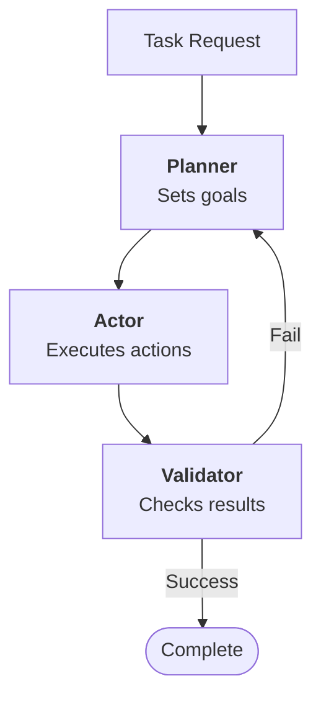
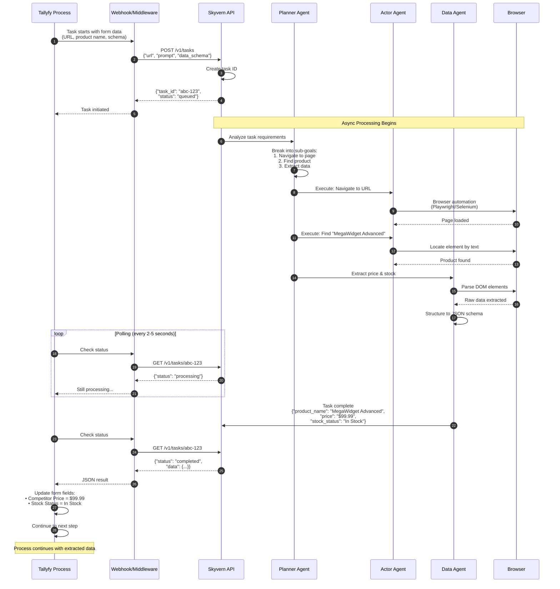

import { CardGrid, LinkTitleCard, Steps } from "~/components";

## Automating Browser Tasks with Skyvern and Tallyfy

Skyvern automates browser workflows using LLMs and computer vision - and it's completely open source (AGPL-3.0 license). The latest version just hit 85.8% on the WebVoyager benchmark. That's impressive. What makes it particularly useful for Tallyfy users? You can describe what you want in plain English, and Skyvern figures out how to interact with web pages to get it done.

:::warning[Important guidance for AI agent tasks]
Your step-by-step instructions for the AI agent to perform work go into the Tallyfy [task](/products/pro/tracking-and-tasks/tasks/) description. **Start with short, bite-size and easy tasks that are just mundane and tedious.** Do not try and ask an AI agent to do huge, complex decision-driven jobs that are goal-driven - they are prone to indeterministic behavior, hallucination, and it can get very expensive quickly.
:::

### Understanding Skyvern AI agents

Remember those brittle automation scripts that break every time a website changes? Skyvern takes a different approach. Its AI agents look at what's actually on the screen, figure out what needs to be done, and execute the plan in real-time. Even works on sites it's never seen before.

Here's what you need to know about Skyvern:

*   **Open Source with Cloud Option:** The core Skyvern logic is open-source (AGPL-3.0), allowing for self-hosting. They also offer Skyvern Cloud (`app.skyvern.com`) with additional features like anti-bot measures, proxy networks, and CAPTCHA solvers.
*   **State-of-the-Art Performance:** Skyvern 2.0 scored 85.8% on the WebVoyager benchmark - higher than Google Mariner (83.5%) and AgentE (73.1%). They tested it on 5,750 tasks across 452 different websites.
*   **LLM and Computer Vision Powered:** Skyvern supports multiple LLM providers including OpenAI, Anthropic, Azure OpenAI, AWS Bedrock, Ollama, OpenRouter, Gemini, and Novita AI. It uses Python 3.11-3.13 compatibility and browser automation libraries like Playwright for interaction.
*   **Advanced Features:** Handles CAPTCHAs, 2FA authentication (including QR codes, email, and SMS), proxy networks for different locations, even credit card processing. Want to see what it's doing? You can livestream the browser viewport.
*   **API-Driven & Scalable:** Run thousands of automation tasks at once. The infrastructure can handle it.
*   **Transparent Pricing:** $0.10 per step on the cloud version. You get $5 free credit to start.

### How Skyvern Works: Planner-Actor-Validator Architecture

The secret behind Skyvern 2.0's performance? A multi-agent system that actually works. Here's how they split up the work:

**1. Planner Agent**
- Decides on goals to accomplish on a website
- Maintains working memory of the overall objective and progress
- Breaks down complex tasks into manageable sub-goals

**2. Actor Agent** 
- Given a narrowly scoped goal, executes specific actions on the website
- Reports back on completion status and any issues encountered
- Handles detailed browser interactions and element identification

**3. Validator Agent**
- Assesses whether goals were successfully achieved
- Provides feedback to both Actor and Planner agents
- Ensures quality control and error correction

The old version (Skyvern 1.0) only scored 45% on WebVoyager. Why? Not enough memory and couldn't handle complex reasoning. The new architecture fixed both problems.

#### Multi-Agent Architecture Flow

This shows how Skyvern's three core agents collaborate with continuous feedback loops to achieve 85.8% accuracy on complex web tasks.



**What to notice:**
- The **continuous feedback loops** between agents enable self-correction without human intervention
- **Specialized sub-agents** handle specific challenges like 2FA, making the system robust against real-world web complexity
- The **retry logic with new approaches** explains why Skyvern succeeds where traditional scripts fail on dynamic websites

They also built specialized sub-agents for specific jobs:

1.  **Interactable Element Agent:** Parses HTML to identify and extract all interactive elements (buttons, forms, links, etc.).
2.  **Navigation Agent:** Plans the sequence of actions needed to navigate websites and progress toward goals.
3.  **Data Extraction Agent:** Extracts specific data from webpages and structures it into user-defined formats like JSON or CSV.
4.  **Password Agent:** Securely handles login forms with integration to password managers (Bitwarden, 1Password, LastPass).
5.  **2FA Agent:** Manages two-factor authentication prompts during login processes.
6.  **Dynamic Auto-complete Agent:** Handles complex auto-complete form fields like address lookups or searchable dropdowns.

### Getting Started with Skyvern

You've got two options: use their managed cloud service or self-host it. Let's walk through both.

<Steps>

1.  **Choose Your Deployment Model:**
    *   **Skyvern Cloud:** Head to `app.skyvern.com` and create an account. This gets you up and running in minutes - they handle all the infrastructure, anti-bot measures, proxies, and CAPTCHA solving. It's $0.10 per step with $5 free credit.
    *   **Self-Hosted (Local/Docker):** Perfect if you need full control or want to take advantage of the open-source nature.

2.  **Self-Hosting Skyvern (if chosen):**
    *   **Prerequisites:** Make sure you have Python 3.11, 3.12, or 3.13. For Docker, ensure Docker Desktop is running.
    *   **Local Install:**
        1.  Install Skyvern: `pip install skyvern`
        2.  Configure: Run `skyvern init`. This creates a `.env` file for your LLM API keys and other settings.
        3.  Launch Server: `skyvern run server`
        4.  Launch UI: `skyvern run ui` (access at `http://localhost:8080`)
    *   **Docker Compose Setup:**
        1.  Clone the Skyvern GitHub repository: `git clone https://github.com/Skyvern-AI/skyvern.git`
        2.  Navigate to the cloned directory.
        3.  Configure `docker-compose.yml` with your LLM provider API key(s).
        4.  Run: `docker compose up -d`
        5.  Access UI: `http://localhost:8080`

3.  **Configure LLM Providers:**
    *   Skyvern works with pretty much every major LLM provider - OpenAI, Anthropic, Azure OpenAI, AWS Bedrock, Ollama, OpenRouter, Gemini, Novita AI, and any OpenAI-compatible endpoints. Just add your API keys.

4.  **Define Your First Task or Workflow:**
    *   **Tasks:** A single request to Skyvern. You need to specify:
        *   `url`: The starting URL for the task.
        *   `prompt`: A natural language instruction detailing the goal.
        *   `data_schema` (optional): A JSONC formatted schema if you want Skyvern to extract data in a specific structure.
        *   `error_codes` (optional): To define specific situations where Skyvern should stop.
    *   **Workflows:** For more complex operations, you can chain multiple tasks with features including navigation, actions, data extraction, loops, file parsing, sending emails, and text prompts.

5.  **Execute and Monitor:**
    *   Fire up tasks through the Skyvern UI or API. Here's the cool part - you can livestream what the agent sees in the browser. Makes debugging so much easier.

</Steps>

### How Tallyfy Integrates with Skyvern (Example Scenario)

Let's see how this works in practice. Say you need to check competitor pricing as part of your workflow.

**Tallyfy Task:** "Extract Competitor Pricing for Product X"

*   **Inputs from Tallyfy [Form Fields](/products/pro/tracking-and-tasks/tasks/what-are-form-fields-in-tallyfy/):**
    *   `Competitor Site URL`: `https://competitor-store.com/products/comparable-to-x`
    *   `Product Name on Competitor Site`: "MegaWidget Advanced"
    *   `Data Schema (JSONC)`:
        ```jsonc
        {
          "product_name": "string", // Should match 'MegaWidget Advanced'
          "price": "string",
          "stock_status": "string"
        }
        ```

#### Tallyfy-Skyvern Integration Flow

This demonstrates how Tallyfy orchestrates Skyvern's browser automation with asynchronous API communication to extract competitor data.



**What to notice:**
- **Steps 1-5** show the asynchronous task creation, preventing Tallyfy from blocking while Skyvern works
- **Steps 10-13** demonstrate the polling pattern that lets Tallyfy check completion status without maintaining an open connection
- **Step 16** shows how the structured JSON response maps directly back to Tallyfy form fields for seamless data flow

*   **Integration Steps (Conceptual - API route):**
    1.  When the Tallyfy task starts, a webhook or middleware calls the Skyvern API's endpoint for creating/running a task.
    2.  The API request to Skyvern includes:
        *   `url`: `https://competitor-store.com/products/comparable-to-x` (from Tallyfy)
        *   `prompt`: "Navigate to the product page. Find the product named 'MegaWidget Advanced'. Extract its current price and stock status. If the product is not found, indicate 'Product not found'."
        *   `data_schema`: The JSONC schema defined above (from Tallyfy).
    3.  Skyvern's Planner Agent figures out what to do. The Actor Agent navigates to find the product. The Data Extraction Agent pulls the price and stock info.
    4.  Tallyfy checks with Skyvern - "Are you done yet?"
    5.  When it's ready, Skyvern sends back clean JSON: `{"product_name": "MegaWidget Advanced", "price": "$99.99", "stock_status": "In Stock"}`
    6.  Tallyfy takes that data, updates your form fields (like 'Competitor Price' and 'Competitor Stock Status'), and moves to the next step in your [process](/products/pro/tracking-and-tasks/processes/).

### Benefits

*   **State-of-the-Art Performance:** That 85.8% accuracy on WebVoyager? Best in the industry right now.
*   **Flexibility of Open Source:** Self-host it, customize it, own it. No vendor lock-in.
*   **Resilience to UI Changes:** Website redesign? Skyvern adapts. Traditional RPA scripts would just break.
*   **Handles Complex Web Elements:** CAPTCHAs, 2FA, proxy networks - it tackles the stuff that usually blocks automation.
*   **Structured Data Output:** Get your data as clean JSON or CSV. Tallyfy can use it immediately.
*   **Scalable Automation:** Need to run 1,000 tasks at once? The API can handle it.
*   **Transparent Pricing:** $0.10 per step. Simple math for your budget planning.

### Potential Considerations

*   **Prompt Engineering:** Your prompts need to be crystal clear. Vague instructions = failed tasks. Spend time getting them right.
*   **Resource Requirements for Self-Hosting:** Running LLMs and browser automation locally? You'll need serious hardware - plenty of CPU, RAM, and maybe a GPU if you're using local vision models.
*   **Learning Curve:** The Planner-Actor-Validator system is powerful, but it takes time to understand how to use it effectively.
*   **AGPL-3.0 License:** Planning to modify the code and run a public service? The AGPL-3.0 license requires you to share your modifications.
*   **Rate Limits and Anti-Bot Measures:** Websites still have defenses. Even Skyvern can trigger them if you're too aggressive. The cloud version helps with proxies and anti-bot measures, though.
*   **Task Complexity:** Complex multi-step tasks across different websites? You'll need to break them down carefully. Even Skyvern 2.0 has limits.

Combine Tallyfy's process orchestration with Skyvern's browser automation, and you can automate workflows that traditional RPA tools can't even touch. That's the power of modern AI agents.

## Related articles
<CardGrid>
<LinkTitleCard header="<b>Integrations > Computer AI agents</b>" href="/products/pro/integrations/computer-ai-agents/" > Computer AI Agents work with Tallyfy by providing intelligent automation capabilities that can perceive digital environments and execute complex tasks while Tallyfy serves as the orchestration framework that provides step-by-step instructions defines inputs and outputs establishes guardrails and ensures transparent trackable execution of AI-driven business processes. </LinkTitleCard>
<LinkTitleCard header="<b>Computer Ai Agents > AI agent vendors</b>" href="/products/pro/integrations/computer-ai-agents/vendors/" > The Computer AI Agent market has rapidly matured in 2025 with enterprise-ready leaders like OpenAI Operator Claude Computer Use and Twin.so alongside open-source innovations such as Skyvern and Manus AI offering various approaches to autonomous web-based task automation that can integrate with Tallyfy workflows. </LinkTitleCard>
<LinkTitleCard header="<b>Vendors > Twin.so AI agents</b>" href="/products/pro/integrations/computer-ai-agents/vendors/twin/" > Twin.so provides enterprise-grade AI agents that automate complex web browser interactions through natural language goals and has demonstrated production-scale success serving 500,000 European SMBs through their Invoice Operator partnership with Qonto and OpenAI while offering industry-leading performance with 6-second latency per step and 84% accuracy that can integrate with Tallyfy to handle browser-based automation tasks within structured business processes. </LinkTitleCard>
<LinkTitleCard header="<b>Vendors > OpenAI Operator</b>" href="/products/pro/integrations/computer-ai-agents/vendors/openai-operator/" > OpenAI Operator is an AI agent launched in January 2025 that performs web-based tasks by interacting with browser interfaces like a human and can be integrated with Tallyfy processes to automate mundane web interactions such as form filling online ordering and booking reservations through natural language instructions. </LinkTitleCard>
</CardGrid>