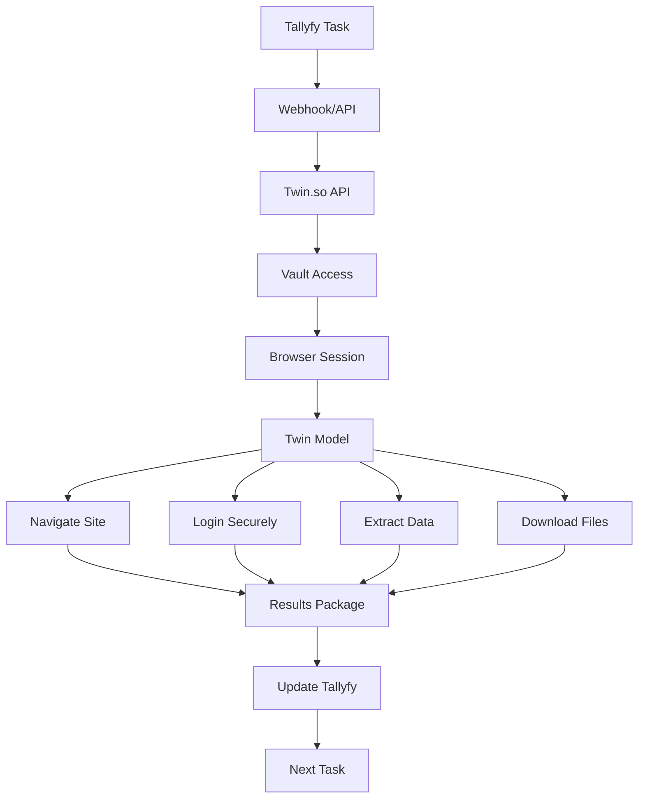
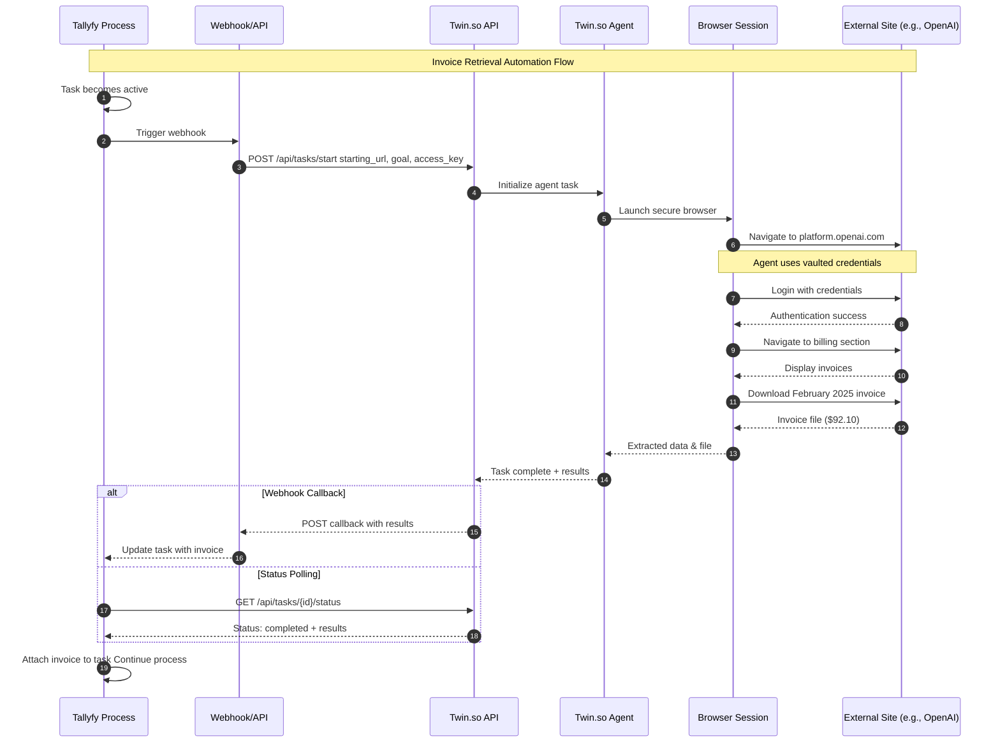

import { CardGrid, LinkTitleCard, Steps } from "~/components";

## Leveraging Twin.so AI agents with Tallyfy

Twin.so's AI agents can automate complex web operations - they interact with websites just like you would, clicking buttons and filling forms through a browser. Twin Labs (founded 2024) has already proven this works at scale. Their "Invoice Operator" serves 500,000 European SMBs through partnerships with Qonto and OpenAI. This makes Twin.so perfect for Tallyfy integration, especially when you're stuck without APIs or traditional automation options.

:::warning[Important guidance for AI agent tasks]
Your step-by-step instructions for the AI agent to perform work go into the Tallyfy [task](/products/pro/tracking-and-tasks/tasks/) description. **Start with short, bite-size and easy tasks that are just mundane and tedious.** Do not try and ask an AI agent to do huge, complex decision-driven jobs that are goal-driven - they are prone to indeterministic behavior, hallucination, and it can get very expensive quickly.
:::

### How Twin.so Works with Tallyfy

This flowchart shows how Tallyfy orchestrates Twin.so's enterprise-grade browser automation to retrieve documents and data from web portals automatically.

**What to notice:**
- **Enterprise security** - Credentials stored in encrypted vaults, never exposed in task descriptions or logs
- **Production scale** - Same infrastructure serving 500,000 European SMBs through Qonto partnership
- **Intelligent navigation** - Twin Model with OpenAI CUA enhancement adapts to website changes in real-time

### Understanding Twin.so AI agents

Twin.so calls their AI agents "skilled agents" - and for good reason. You give them a goal, they figure out how to navigate and interact with any website. No APIs needed. They work directly with web interfaces.

Here's what makes Twin.so agents stand out:

*   **Browser-Based Interaction:** Agents run in remote Chromium browser sessions. They control the interface to get things done.
*   **Natural Language Goals:** Just give the agent a `starting URL` and tell it what you want in plain English. It figures out the rest.
*   **Production-Scale Deployment:** Invoice Operator handles millions of invoices monthly for 500,000 European SMBs through Qonto. That's real-world scale.
*   **OpenAI CUA Integration:** Twin was one of only 15 companies chosen to alpha-test OpenAI's Computer-Using Agent (CUA) model - the same tech behind OpenAI's Operator.
*   **Adaptive and Robust:** Unlike brittle RPA scripts that break when a button moves, Twin.so agents adapt to website changes. They reason through each step in real-time.
*   **Secure Access:** Your credentials stay safe in Twin.so Vaults. Agents use your private `access key` to log into apps automatically.
*   **Enterprise Infrastructure:** Built for scale with low-latency browser infrastructure. We're talking enterprise-grade security here.
*   **Performance Leadership:** The latest Twin A3 crushes it - 6-second latency per step, $0.03 cost per step, and 84% accuracy. That's industry-leading performance.

### How Twin.so Works in Detail

The magic happens through Twin.so's **Twin Agent** and their proprietary **Twin Model** (also called Twin's Action Model).

1.  **Task Initialization:** Every Twin Agent task needs just two things:
    *   A `starting URL`: Where the agent starts working
    *   A `goal`: What you want done, in plain English
2.  **Execution Environment:** Tasks run in secure, remote browser sessions. Twin.so's specialized Kubernetes infrastructure keeps latency under 50-100ms - even when handling thousands of tasks.
3.  **The Twin Model - Multimodal Understanding and Action:** This AI brain powers everything. Enhanced with OpenAI's CUA model, it's optimized for real customer needs:
    *   **Perceive Web Environments:** The model sees buttons, forms, text - everything on a website. It understands context too.
    *   **Decide Optimal Actions:** Looking at the webpage and your goal, the model figures out what to do next.
    *   **Translate to Browser Instructions:** Those decisions become actual browser commands - clicks, typing, navigation.
4.  **Performance Evolution:** Look at how far Twin has come in just three generations:
    *   **Twin A1:** 35s latency/step, $1.10 cost/step, 54% accuracy
    *   **Twin A2:** 19s latency/step, $0.15 cost/step, 68% accuracy  
    *   **Twin A3:** 6s latency/step, $0.03 cost/step, 84% accuracy
5.  **Collaboration with Leading Models:** Twin doesn't work alone. They leverage OpenAI's CUA model and collaborate directly with OpenAI's research team to nail specific customer use cases.
6.  **Output Generation:** When the job's done, you get structured results - whether that's downloaded files, extracted data, or confirmation that the task completed successfully.

### Real-World Success: Invoice Operator

Want proof this works? Check out Twin.so's first major deployment:

*   **Partnership:** Built with Qonto (European fintech) and OpenAI
*   **Scale:** 500,000 SMBs across Europe use it daily
*   **Capability:** Retrieves invoices from any vendor portal - even password-protected ones
*   **Performance:** In testing, it grabbed 500 invoices from 50 different providers in under 10 minutes
*   **Impact:** What used to take hours now takes minutes. Per business.

### Getting Started with Twin.so for Tallyfy Integration

<Steps>

1.  **Access Twin.so Platform:**
    *   Contact Twin.so for enterprise access or explore their platform capabilities through their website. Twin.so focuses on enterprise partnerships rather than self-service onboarding.

2.  **Understand Enterprise Integration:**
    *   Twin.so typically works directly with enterprise customers to build specialized agents tailored to specific industry needs and workflows.

3.  **Obtain API Access:**
    *   For direct API integration with Tallyfy, work with Twin.so's team to establish API access and understand their integration patterns.

4.  **Secure Credentials Setup:**
    *   Use Twin.so's **Vaults** feature to securely store credentials for websites that your automated tasks will need to access. The agent can then use these vaulted credentials via your `access key`.

5.  **Identify Tallyfy Tasks for Automation:**
    *   Review your Tallyfy [processes](/products/pro/tracking-and-tasks/processes/) and identify specific [tasks](/products/pro/tracking-and-tasks/tasks/) that involve repetitive web browser interactions suitable for Twin.so's capabilities.

6.  **Define Integration Architecture:**
    *   Work with Twin.so's team to architect the integration, which may involve:
        *   **Twin API:** Direct API calls from Tallyfy webhooks or middleware
        *   **Custom Webhooks:** Twin.so calling back to Tallyfy upon task completion
        *   **Enterprise Connectors:** Purpose-built integrations for specific use cases

</Steps>

### How Tallyfy Integrates with Twin.so (Example Scenario)

**Tallyfy Task:** "Fetch Monthly Invoice from OpenAI for Expense Report"

*   **Inputs from Tallyfy [Form Fields](/products/pro/tracking-and-tasks/tasks/what-are-form-fields-in-tallyfy/):**
    *   `Service Provider`: OpenAI
    *   `Invoice Month`: February 2025
    *   `Expected Amount`: $92.10
    *   `Login Credentials Vault`: (Reference to Twin.so secure vault)
*   **Integration Steps (Enterprise API):**
    1.  Your Tallyfy task goes active. A webhook fires off an API call to Twin.so.
    2.  The API call tells Twin.so to `Start Task` with these details:
        *   `starting_url`: `https://platform.openai.com/account/billing` 
        *   `goal`: "Log into OpenAI using vaulted credentials. Navigate to billing section. Find and download the invoice for February 2025 with amount $92.10. If not found, report as 'Invoice not available'."
        *   `access_key`: Points to your stored OpenAI credentials.
    3.  Twin.so's agent gets to work in their browser infrastructure.
    4.  Tallyfy keeps checking task status through Twin.so's API or waits for a webhook callback.
    5.  Twin.so finishes and sends back:
        *   Task status ("completed" or "failed")
        *   The invoice file or download link
        *   Structured invoice data (amount, date, invoice number)
    6.  Tallyfy updates the task with the invoice attachment and data. Your expense report process continues smoothly.

### Integration Flow Visualization

This diagram shows how Tallyfy orchestrates Twin.so agents to retrieve invoices from external websites automatically.

**What to notice:**
- **Secure credential handling**: Twin.so never exposes your login credentials - they're stored in encrypted vaults and accessed via secure keys
- **Flexible result delivery**: The integration supports both webhook callbacks for real-time updates and status polling for simpler implementations
- **Intelligent browser automation**: The Twin.so agent navigates the website just like a human would, adapting to UI changes and handling complex multi-step processes

### Use Cases for Tallyfy and Twin.so

*   **Automated Invoice Collection:** Pull invoices from hundreds of vendor portals automatically (just like Qonto's doing).
*   **Supplier Portal Management:** Check order status, track deliveries, and grab compliance docs across all your supplier sites.
*   **Customer Data Synchronization:** Extract customer info from different CRM systems. Keep your databases in sync.
*   **E-commerce Operations:** Monitor product listings, track competitor prices, and check inventory across marketplaces.
*   **Compliance Reporting:** Gather required docs from regulatory portals automatically. No more manual downloads.
*   **Financial Data Aggregation:** Collect balances, transactions, and statements from multiple banks and financial providers.

### Benefits

*   **Enterprise-Proven Reliability:** Already working for 500,000+ users across Europe. This isn't beta software.
*   **Advanced Technology Integration:** Powered by OpenAI's latest CUA technology with dedicated optimization for your use cases.
*   **Exceptional Performance:** 6-second latency and 84% accuracy? That's best-in-class performance right there.
*   **No API Dependencies:** If it has a web interface, Twin.so can automate it. Period.
*   **Enterprise Security:** SOC2 Type 2 compliant, GDPR ready. Your data stays secure.
*   **Leverage Tallyfy's Strengths:** Tallyfy handles process management, human tasks, and approvals. Twin.so handles the browser grunt work. Perfect match.

### Potential Considerations

*   **Enterprise Focus:** Twin.so works with enterprise customers - no self-service option. Expect minimum commitments.
*   **Custom Integration:** You'll need custom development to connect with Tallyfy. Plan to work closely with Twin.so's technical team.
*   **Specialized Use Cases:** They excel at specific tasks (like invoice processing) rather than being a jack-of-all-trades automation tool.
*   **Cost Structure:** Enterprise pricing means bigger budgets. But if you're processing thousands of invoices monthly, the ROI is clear.
*   **Geographic Focus:** Most deployments are in Europe right now, though expansion seems likely.

Combine Tallyfy's process management with Twin.so's AI agents? You'll automate complex workflows that were impossible just a year ago. That's the power of this integration.

## Related articles
<CardGrid>
<LinkTitleCard header="<b>Computer Ai Agents > AI agent vendors</b>" href="/products/pro/integrations/computer-ai-agents/vendors/" > The Computer AI Agent market offers both enterprise-ready solutions like OpenAI Operator Claude Computer Use and Twin.so alongside open-source alternatives like Skyvern and Manus AI each bringing unique strengths for different workflows from consumer tasks to developer automation with integration capabilities for handling mundane web-based processes. </LinkTitleCard>
<LinkTitleCard header="<b>Integrations > Computer AI agents</b>" href="/products/pro/integrations/computer-ai-agents/" > Computer AI Agents work with Tallyfy by combining visual perception and smart reasoning capabilities to automate complex computer-based tasks while Tallyfy provides structured instructions control systems and trackable execution within business processes. </LinkTitleCard>
<LinkTitleCard header="<b>Vendors > OpenAI Operator</b>" href="/products/pro/integrations/computer-ai-agents/vendors/openai-operator/" > OpenAI Operator is an AI agent launched in January 2025 that performs web-based tasks by interacting with browser interfaces like a human and can be integrated with Tallyfy processes to automate mundane web interactions such as form filling online ordering and booking reservations through natural language instructions. </LinkTitleCard>
<LinkTitleCard header="<b>Vendors > Skyvern AI agents</b>" href="/products/pro/integrations/computer-ai-agents/vendors/skyvern/" > Skyvern automates browser workflows using LLMs and computer vision with an open-source AGPL-3.0 license achieving 85.8% accuracy on the WebVoyager benchmark through its three-agent architecture of Planner Actor and Validator agents that can integrate with Tallyfy to handle mundane web-based tasks described in plain English while returning structured JSON data for seamless process automation. </LinkTitleCard>
</CardGrid>