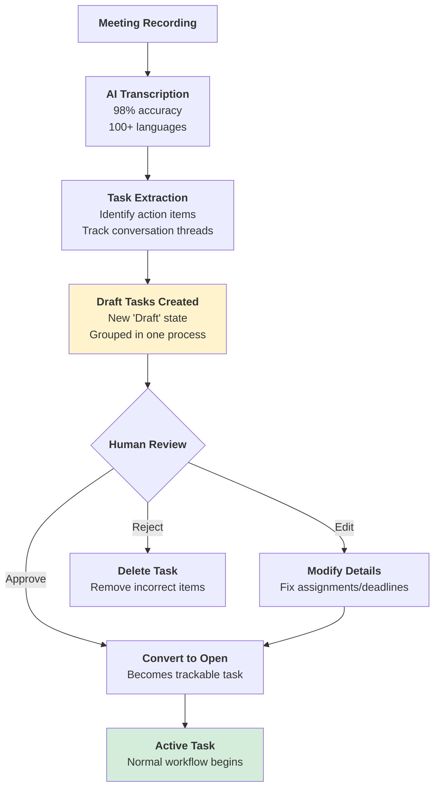

import { CardGrid, LinkTitleCard } from "~/components";
import { Aside, Card, Steps, TabItem, Tabs } from "@astrojs/starlight/components";

# Extract tasks from meetings (Coming Soon)

<Aside type="note">
  This feature is currently in development. We're working hard to bring automatic task extraction from your meeting recordings to Tallyfy. For now, check out the workaround guide below.
</Aside>

## The meeting productivity problem

Your team just finished an hour-long meeting. Six people agreed to do twelve different things. By next week? Three tasks get done, five are forgotten, and four were misunderstood.

Sound familiar?

Here's the reality - meetings generate tons of actionable work, but without proper tracking, those action items vanish into the ether. You've probably experienced this cycle: multiple meetings about the same project where people ask "wait, who was supposed to do that?" because nobody tracked the tasks from the last meeting. 

It's exhausting.

Research shows that extracting actionable tasks from meetings manually takes 3-8 hours per hour of recording. Teams using basic transcription still miss 40% of action items. And when tasks aren't properly assigned with clear owners and deadlines? They simply don't get done.

## How Tallyfy will solve this

We're building a smart integration that connects your meeting platform (Zoom, Teams, Google Meet) directly to Tallyfy's task management system. Record your meeting as usual. Tallyfy handles the rest.

The system transcribes your meeting using state-of-the-art AI that achieves 98% accuracy for English and works with over 100 languages. But transcription is just the beginning. The real magic happens when our AI analyzes the conversation to identify who committed to what - and when they'll deliver it.

### Identity recognition that actually works

"John, can you send the proposal to the client by Friday?" 

Simple for humans to understand. Surprisingly complex for AI.

Our system identifies both the task creator (the person asking) and the assignee (John) using Single Sign-On (SSO) integration. When your team logs into both the meeting platform and Tallyfy with the same SSO provider, we automatically match voices to user profiles. John gets assigned the task. The person who asked becomes the task creator. No manual mapping needed.

What if someone joins as a guest or SSO isn't configured? The system creates placeholder assignments that you can map to real users during the review phase. We never lose track of who said what.

### Rich task context, not just titles

A task titled "Send proposal" tells you nothing. Our system captures the full context:

**Task Title**: Send Q4 budget proposal to ACME Corp
**Description**: During the October 15 planning meeting, John committed to sending the revised Q4 budget proposal to ACME Corp's CFO. 
**Meeting Context**: 
- Quoted from recording at 23:45: "John, can you send the updated proposal with the new pricing structure to their CFO? They need it for their board meeting."
- AI Rationale: Identified as actionable due to specific assignee (John), clear deliverable (proposal), explicit deadline (Friday), and confirmation response ("Sure, I'll get that over by Thursday").
**Deadline**: October 18, 2024 at 5:00 PM
**Assignee**: John Smith
**Creator**: Sarah Johnson

Every extracted task includes the actual quote from the meeting and our AI's reasoning for why it identified this as an actionable item. You can always trace back to the source.

### The conversation thread challenge

Here's where it gets interesting. Conversations aren't linear.

Someone proposes an idea at minute 5. It gets discussed again at minute 15 with modifications. By minute 30, the team decides to do something completely different. Traditional extraction would create three conflicting tasks.

Our AI tracks these conversation threads throughout the meeting. It understands when an action item evolves, gets canceled, or morphs into something new. Using advanced dialogue understanding techniques, the system maintains context across the entire conversation - just like a human note-taker would.

Research from Stanford and Microsoft shows that dialogue tracking systems can now identify conversation threads with 85-95% accuracy. We leverage these advances to ensure you get the final, agreed-upon version of each task, not every iteration discussed along the way.

## The Draft state - your safety net

AI isn't perfect. That's why we're introducing a new task state: Draft.



**What to notice**:
- Draft tasks appear in a special review interface before becoming "real" tasks
- All tasks from one meeting are bundled into a single process for easy review
- Each draft task can be edited, converted, or deleted independently

Draft tasks work like a moderation queue. After your meeting, all extracted tasks appear in Draft state, grouped together as one process (using our [launch process without template](mdc:products/pro/integrations/open-api/code-samples/processes/launch-process-without-template) API capability). 

You'll see all proposed tasks from that meeting in one place. Review them. Edit assignments if needed. Adjust deadlines. Delete tasks that aren't actually actionable. Convert the good ones to Open tasks with a single click.

This human-in-the-loop approach solves the accuracy problem. The AI does the heavy lifting of extraction and organization. You provide the final quality check. Together, you get accurate task tracking in minutes instead of hours.

## Technical challenges we're solving

### Accuracy at scale

Current state-of-the-art systems face several hurdles:
- **Background noise and cross-talk** reduces transcription accuracy by up to 30%
- **Technical jargon and industry terms** cause misinterpretation
- **Multiple speakers talking simultaneously** creates attribution errors
- **Long meetings** exceed AI context windows, losing thread coherence

We're implementing solutions including adaptive noise filtering, custom vocabulary training for your industry, speaker diarization with 95% accuracy, and sliding window analysis that maintains context across 3+ hour meetings.

### The hallucination problem

Large language models sometimes generate tasks that were never discussed. A Stanford study found that 15% of AI-extracted action items were hallucinations - tasks the AI invented based on context clues rather than explicit discussion.

Our approach uses multiple validation layers. First, we require explicit evidence from the transcript. Every task must link to specific quoted text. Second, we use confidence scoring. Tasks with low confidence appear with warning flags in the Draft state. Third, the human review step catches any remaining hallucinations before tasks go live.

### Meeting evolution patterns

Academic research on meeting analysis reveals common patterns. Understanding these helps our AI extract better tasks:

- **Progressive refinement**: Ideas evolve through discussion before becoming tasks
- **Implicit delegation**: "Someone should..." becomes "John will..." over time  
- **Conditional commitments**: "If X happens, then I'll do Y" requires tracking conditions
- **Retroactive cancellation**: "Actually, let's not do that" negates earlier commitments

Our system recognizes these patterns and adjusts extraction accordingly.

## Platform roadmap

We're planning support for all major meeting platforms:

### Phase 1 - Video conferencing giants
- **Zoom** - 300+ million daily participants
- **Microsoft Teams** - 280 million monthly users
- **Google Meet** - 100+ million daily users
- **Cisco Webex** - 600 million monthly participants

### Phase 2 - Specialized platforms
- **Slack Huddles** - Quick team syncs
- **Discord** - Community meetings
- **GoToMeeting** - Enterprise focus
- **BlueJeans** - Healthcare and finance

### Phase 3 - Recording tools
- **Otter.ai** - Meeting transcription specialist
- **Fireflies.ai** - AI meeting assistant
- **Sembly AI** - Multi-language support
- **Jamie** - Bot-free recording

### Phase 4 - Async collaboration
- **Loom** - Video messages
- **Vidyard** - Sales conversations
- **BombBomb** - Video email
- **Soapbox** - Internal communications

Each integration will support automatic recording upload, real-time transcription where available, and full Draft task workflow.

## Current workaround - build it yourself

Can't wait for our official feature? You can build your own meeting-to-tasks pipeline today using Tallyfy's API. Fair warning - this requires technical expertise and ongoing maintenance.

### What you'll need to build

You're responsible for:
- Capturing and storing meeting recordings
- Transcribing audio to text (using services like OpenAI Whisper or Google Speech-to-Text)
- Extracting action items from transcripts (using GPT-4 or Claude)
- Mapping speakers to Tallyfy users
- Creating tasks via our API
- Handling errors and retries

Tallyfy provides the API to create and track tasks. Everything else is on you.

### High-level architecture

<Steps>

1. **Capture meeting recording**
   ```javascript
   // Option A: Webhook from Zoom/Teams
   app.post('/webhook/meeting-ended', async (req, res) => {
     const recordingUrl = req.body.download_url;
     await processRecording(recordingUrl);
   });
   
   // Option B: Poll cloud storage
   const recordings = await checkGoogleDrive('/meeting-recordings');
   ```

2. **Transcribe audio**
   ```python
   import openai
   
   def transcribe_meeting(audio_file):
       with open(audio_file, "rb") as f:
           transcript = openai.Audio.transcribe(
               model="whisper-1",
               file=f,
               response_format="verbose_json"  # Includes timestamps
           )
       return transcript
   ```

3. **Extract action items with AI**
   ```python
   def extract_tasks(transcript):
       prompt = """
       Extract action items from this transcript.
       Return JSON array with: task_name, assignee, deadline, context
       Only include items with clear owners and deadlines.
       Include quote from transcript as evidence.
       """
       
       response = openai.ChatCompletion.create(
           model="gpt-4",
           messages=[
               {"role": "system", "content": prompt},
               {"role": "user", "content": transcript}
           ],
           temperature=0.3  # Lower temperature for consistency
       )
       
       return json.loads(response.choices[0].message.content)
   ```

4. **Map to Tallyfy users**
   ```javascript
   const userMapping = {
     "John Smith": "user_abc123",
     "Sarah Johnson": "user_def456",
     "john@company.com": "user_abc123"
   };
   
   function resolveAssignee(extractedName) {
     // Try exact match first
     if (userMapping[extractedName]) {
       return userMapping[extractedName];
     }
     
     // Try email match
     const emailMatch = Object.keys(userMapping).find(key => 
       key.includes('@') && key.toLowerCase().includes(extractedName.toLowerCase())
     );
     
     return emailMatch ? userMapping[emailMatch] : null;
   }
   ```

5. **Create tasks in Tallyfy**
   ```javascript
   async function createTallyfyTasks(tasks, meetingTitle) {
     // Create process container for all tasks
     const firstTask = tasks[0];
     const processResponse = await fetch(
       `https://api.tallyfy.com/api/organizations/${orgId}/tasks`,
       {
         method: 'POST',
         headers: {
           'Authorization': `Bearer ${accessToken}`,
           'Content-Type': 'application/json'
         },
         body: JSON.stringify({
           title: `Tasks from: ${meetingTitle}`,
           summary: firstTask.context,
           owners: { users: [firstTask.assigneeId] },
           separate_task_for_each_assignee: true,
           deadline: firstTask.deadline
         })
       }
     );
     
     const process = await processResponse.json();
     const processId = process.data.run.id;
     
     // Add remaining tasks to same process
     for (let i = 1; i < tasks.length; i++) {
       await createTask(tasks[i], processId);
     }
   }
   ```

</Steps>

### Extraction patterns that work

Through testing, these heuristics improve extraction accuracy:

**Explicit action patterns**:
- "[Name] will/to [action] by [date]"
- "Action item: [description]"
- "Next steps: [list]"
- "@[name] please [action]"

**Temporal markers**:
- "by end of day" → today at 5 PM
- "next Friday" → calculate from meeting date
- "ASAP" → 2 business days default
- "before the board meeting" → check calendar API

**Assignment indicators**:
- Direct: "John, can you..."
- Confirmation: "I'll handle..." 
- Delegation: "Let's have Sarah..."
- Volunteering: "I can take that"

### Handling edge cases

Your extraction logic needs to handle:

```python
# Multiple assignees
if "and" in assignee_text or "," in assignee_text:
    assignees = parse_multiple_assignees(assignee_text)
    create_task_for_each(assignees)

# Conditional tasks
if "if" in task_text or "assuming" in task_text:
    task.add_note("Conditional: " + extract_condition(task_text))

# Rejected tasks
if check_for_cancellation(transcript, task_timestamp):
    skip_task(task)  # Don't create if later rejected

# Vague deadlines
deadline = parse_deadline(deadline_text)
if not deadline:
    deadline = meeting_date + timedelta(days=7)  # Default 1 week
```

### Production considerations

**Rate limiting**: Implement exponential backoff for API calls
```javascript
async function retryWithBackoff(fn, maxRetries = 3) {
  for (let i = 0; i < maxRetries; i++) {
    try {
      return await fn();
    } catch (error) {
      if (error.status === 429) {
        await sleep(Math.pow(2, i) * 1000);  // 1s, 2s, 4s
      } else {
        throw error;
      }
    }
  }
}
```

**Idempotency**: Prevent duplicate task creation
```python
def generate_task_fingerprint(task):
    # Create unique ID from meeting + content
    content = f"{meeting_id}:{task['assignee']}:{task['description']}"
    return hashlib.md5(content.encode()).hexdigest()

# Check before creating
if not task_exists(fingerprint):
    create_task(task)
```

**Privacy and compliance**:
- Store recordings in compliant storage (HIPAA/GDPR)
- Redact sensitive information from transcripts
- Implement access controls on task creation
- Maintain audit logs linking tasks to source recordings

### Testing your pipeline

Create test cases for common scenarios:

```python
test_cases = [
    {
        "transcript": "John, please send the proposal by Friday",
        "expected": {
            "assignee": "John",
            "task": "Send the proposal",
            "deadline": "Friday"
        }
    },
    {
        "transcript": "Someone should update the dashboard. Sarah: I'll do it tomorrow",
        "expected": {
            "assignee": "Sarah",
            "task": "Update the dashboard",
            "deadline": "tomorrow"
        }
    },
    {
        "transcript": "Let's review the budget next week. Actually, cancel that.",
        "expected": None  # Should not create task
    }
]
```

### Success metrics

Track these metrics to measure your pipeline's effectiveness:
- **Extraction accuracy**: Percentage of real action items captured
- **False positive rate**: Tasks created that weren't real action items
- **Assignment accuracy**: Correctly identified task owners
- **Deadline accuracy**: Properly parsed due dates
- **Processing time**: Meeting end to tasks created
- **User adoption**: Percentage of meetings processed

Aim for 85% extraction accuracy and less than 10% false positives before rolling out broadly.

## What's next

While you wait for our official feature, the workaround above gets you started. Yes, it requires significant development effort. But teams processing 10+ meetings weekly often find the investment worthwhile.

When our official feature launches, you'll get:
- Zero-configuration setup
- 98% transcription accuracy out of the box
- Smart conversation thread tracking
- The Draft state review workflow
- Native integration with all major platforms
- Automatic user mapping via SSO
- No maintenance or coding required

We're targeting Q2 2025 for the initial release with Zoom, Teams, and Google Meet support. Phase 2 platforms follow in Q3 2025.

Want early access? Contact our support team to join the beta program. We're especially interested in teams that run 20+ meetings weekly and can provide detailed feedback on extraction accuracy.

Remember - every meeting generates work. Soon, Tallyfy will ensure none of that work gets lost.

## Related articles
<CardGrid>
<LinkTitleCard header="<b>Integrations > Slack</b>" href="/products/pro/integrations/slack/" > The Tallyfy Slack integration bridges team communication with workflow management by enabling direct task creation and process launching from within Slack channels while maintaining comprehensive tracking and eliminating the need for context switching between platforms. </LinkTitleCard>
<LinkTitleCard header="<b>How To > Make people accountable for tasks</b>" href="/products/pro/tutorials/how-to/make-people-accountable-for-tasks/" > Tallyfy helps create accountability for tasks through transparent workflows automated reminders manual nudges single-person ownership features commenting systems blocker documentation clear task instructions expiration policies escalation paths and balanced accountability culture approaches. </LinkTitleCard>
<LinkTitleCard header="<b>Pro > Integrations</b>" href="/products/pro/integrations/" > Tallyfy connects with business systems through multiple integration methods including API implementations webhooks middleware platforms AI agents native connections email and analytics tools to create seamless automated workflows across your entire technology stack. </LinkTitleCard>
<LinkTitleCard header="<b>How To > Ensure task and approval completion</b>" href="/products/pro/tutorials/how-to/ensure-task-completion/" > Tallyfy helps ensure task completion through automated reminders clear task definitions consolidated approvals comment-based follow-ups personal communication escalation paths and recognition strategies that combine digital tools with effective management practices. </LinkTitleCard>
</CardGrid>