import { Steps, CardGrid, LinkTitleCard } from "~/components";

:::note[MCP Client Compatibility - August 2025 Update]
You can use Tallyfy's MCP server with any MCP client. Major updates in 2025:
- **OpenAI**: MCP support announced March 2025, available in Agents SDK, coming to ChatGPT desktop with GPT-5
- **Claude**: Desktop Extensions launched for one-click installation, remote MCP servers with OAuth
- **Microsoft**: Joined MCP ecosystem with Copilot Studio support
- **Slack**: Official MCP support coming Summer 2025

While these text-chat interfaces have UI limitations, the ecosystem is rapidly maturing. We're still building our own chat UI for optimal Tallyfy workflows.
:::

## Overview

Claude Desktop pioneered MCP support back in November 2024, becoming the first AI assistant to offer native MCP integration. With the latest Claude 4 models released in 2025:

- **Claude Opus 4.1** (August 2025): 74.5% on SWE-bench Verified, enhanced for agentic tasks and real-world coding
- **Claude Sonnet 4** (May 2025): Superior coding and reasoning with hybrid instant/deep thinking modes
- **Pricing**: Pro at $20/mo, Max at $100-200/mo with up to 20x usage limits
- **Claude Code**: Now generally available with IDE integrations and GitHub Actions support

We'll walk you through setting up Tallyfy's MCP server with Claude Desktop, show you what works (and what doesn't), and help you get the most out of this integration.

## MCP architecture flow

This diagram shows how Claude Desktop connects to Tallyfy through the MCP server middleware layer.

```mermaid
%%{init: {'theme':'forest'}}%%
sequenceDiagram
    autonumber
    participant User
    participant Claude as Claude Desktop
    participant Config as Config File
    participant MCP as MCP Server<br/>(tallyfy-server.js)
    participant API as Tallyfy API
    
    Note over User,API: Initialization Phase
    
    User->>Claude: Launch Claude Desktop
    Claude->>Config: Read claude_desktop_config.json
    Config-->>Claude: MCP server configuration
    Claude->>MCP: Start server via stdio
    MCP->>MCP: Load TALLYFY_API_KEY from env
    MCP-->>Claude: Server ready
    
    Claude->>MCP: Request tools/list
    MCP-->>Claude: Available tools<br/>(search_tasks, etc.)
    Claude->>Claude: Display tools in UI (🔨)
    
    Note over User,API: Usage Phase
    
    User->>Claude: "Search for open tasks"
    Claude->>MCP: tools/call: search_tasks<br/>{query: "", status: "open"}
    MCP->>API: GET /tasks<br/>Bearer: [API_KEY]
    API-->>MCP: Task data (JSON)
    MCP-->>Claude: Formatted results
    Claude-->>User: Display task summary
```



**What to notice:**
- The MCP server runs locally on your machine and uses stdio (standard input/output) for communication - not network protocols
- API authentication happens once when the server starts, using the Bearer token from your environment variable
- Claude automatically discovers available tools from the MCP server and displays them in the UI with the 🔨 icon

:::warning[Important: Claude Desktop vs Claude Computer Use]
This article covers **Claude Desktop's text-chat interface with MCP integration** - where you interact with Claude through natural language to access Tallyfy data via MCP servers. This is different from [Claude Computer Use](/products/pro/integrations/computer-ai-agents/vendors/claude-computer-use/), which allows Claude to visually perceive and control computer interfaces (mouse, keyboard, screenshots).

**Key differences:**
- **Claude Desktop + MCP** (this article): Text-based chat that connects to data sources and APIs
- **Claude Computer Use**: Visual perception and control of desktop applications through screenshots and mouse/keyboard actions

Both can work with Tallyfy, but serve different purposes:
- Use **Claude Desktop + MCP** for data queries, analysis, and API-based automation
- Use **Claude Computer Use** for automating visual UI tasks that require seeing and clicking interface elements
:::

## Claude Desktop MCP support status

As of August 2025, Claude Desktop's MCP implementation includes:

- **Native support**: Built-in MCP client with full protocol support
- **Desktop Extensions (DXT)**: One-click MCP server installation without manual configuration
- **Remote MCP servers**: Direct URL-based connection with OAuth authentication
- **Transport methods**: Standard input/output (stdio) for local servers, HTTP/SSE for remote servers
- **All Claude plans**: Available for all Claude.ai subscription tiers (Free, Pro at $20/mo, Max at $100-200/mo, Team)
- **Operating systems**: macOS and Windows (Linux support coming soon)
- **Dynamic tool discovery**: Automatic detection and display of available MCP tools

While OpenAI announced MCP support in March 2025 (available in their Agents SDK, coming to ChatGPT desktop), Claude Desktop remains the most mature MCP implementation.

## Prerequisites

You'll need these things:

- Claude Desktop app installed (latest version - supports Desktop Extensions as of 2025)
- Tallyfy API key (grab it from your organization settings)
- For manual setup: Node.js version 16 or higher and basic comfort with editing JSON files
- For simplified setup: Just use Desktop Extensions - no Node.js or manual configuration required

## MCP Ecosystem Growth (2025)

The MCP ecosystem has exploded in 2025 with major platform adoption:

### Official MCP Servers Available
- **GitHub**: Repository management, issue tracking, PR workflows
- **Stripe**: Payment processing and billing management  
- **PayPal**: Transaction handling and financial operations
- **Slack**: Team communication (official support Summer 2025)
- **Linear**: Project and issue management
- **Sentry**: Error tracking and debugging
- **PostgreSQL, MySQL, MongoDB**: Database operations
- **Filesystem**: Local file operations
- **Brave Search**: Privacy-focused web research

### MCP Directories & Marketplaces
- **mcpservers.org**: Web-based directory synced with GitHub
- **Cline's MCP Marketplace**: Discoverable by millions of developers
- **cursor.directory/mcp**: Specialized servers for Cursor IDE
- **GitHub awesome lists**: Multiple curated collections with 20k+ stars

### Industry Adoption
- OpenAI joined MCP steering committee (March 2025)
- Microsoft announced full MCP support
- Anthropic, LangChain leading development
- Companies like Asana, Atlassian, and Zapier building MCP servers

## Setting up Tallyfy MCP Server with Claude Desktop

<Steps>

1. **Install Claude Desktop**
   
   Download Claude Desktop from [claude.ai/download](https://claude.ai/download) for your operating system (macOS or Windows).

2. **Locate the configuration file**
   
   The MCP configuration file location varies by operating system:
   
   - **macOS**: `~/Library/Application Support/Claude/claude_desktop_config.json`
   - **Windows**: `%APPDATA%\Claude\claude_desktop_config.json`
   
   If the file doesn't exist, Claude will create it when you first edit the configuration.

3. **Create the Tallyfy MCP server**
   
   First, create a local directory for your MCP server:
   ```bash
   mkdir ~/tallyfy-mcp-server
   cd ~/tallyfy-mcp-server
   npm init -y
   npm install @modelcontextprotocol/sdk axios
   ```

4. **Implement the server script**
   
   Create a file named `tallyfy-server.js`:
   
   ```javascript
   const { Server } = require('@modelcontextprotocol/sdk/server/index.js');
   const { StdioServerTransport } = require('@modelcontextprotocol/sdk/server/stdio.js');
   const axios = require('axios');
   
   // Initialize Tallyfy API client
   const TALLYFY_API_KEY = process.env.TALLYFY_API_KEY;
   const TALLYFY_API_URL = 'https://mcp.tallyfy.com';
   
   const server = new Server({
     name: 'tallyfy-mcp',
     version: '1.0.0',
   });
   
   // Tool to search for tasks
   server.setRequestHandler('tools/call', async (request) => {
     if (request.params.name === 'search_tasks') {
       const { query, status } = request.params.arguments;
       
       const response = await axios.get(`${TALLYFY_API_URL}/tasks`, {
         headers: { 'Authorization': `Bearer ${TALLYFY_API_KEY}` },
         params: { q: query, status }
       });
       
       return {
         content: [{ 
           type: 'text', 
           text: JSON.stringify(response.data, null, 2) 
         }]
       };
     }
   });
   
   // List available tools
   server.setRequestHandler('tools/list', async () => {
     return {
       tools: [{
         name: 'search_tasks',
         description: 'Search for tasks in Tallyfy',
         inputSchema: {
           type: 'object',
           properties: {
             query: { type: 'string', description: 'Search query' },
             status: { type: 'string', enum: ['open', 'completed', 'all'] }
           }
         }
       }]
     };
   });
   
   // Start the server
   const transport = new StdioServerTransport();
   server.connect(transport);
   ```

5. **Configure Claude Desktop**
   
   **Option A: Use Desktop Extensions (Recommended - 2025)**
   - Look for MCP servers in the Claude Desktop Extensions directory
   - Click install on any server - no manual configuration needed
   - Servers update automatically and handle dependencies
   
   **Option B: Manual Configuration**
   Edit your `claude_desktop_config.json` file:
   
   ```json
   {
     "mcpServers": {
       "tallyfy": {
         "command": "node",
         "args": ["/Users/username/tallyfy-mcp-server/tallyfy-server.js"],
         "env": {
           "TALLYFY_API_KEY": "your-tallyfy-api-key-here"
         }
       }
     }
   }
   ```
   
   Replace:
   - `/Users/username/` with your actual home directory path
   - `your-tallyfy-api-key-here` with your Tallyfy API key

6. **Restart Claude Desktop**
   
   Completely quit Claude Desktop (Cmd+Q on macOS or close all windows on Windows) and relaunch it.

7. **Verify the connection**
   
   Look for the tools icon (🔨) at the bottom of Claude's chat interface. Click it - you should see your Tallyfy tools listed there.
   
   Try this test query:
   ```
   "Search for all open tasks in Tallyfy"
   ```

</Steps>

## Practical demonstrations

### Example 1: Task management workflow

**User prompt:**
```
Find all tasks assigned to me that are due this week and create a summary report.
```

**Claude with MCP will:**
1. Use the `search_tasks` tool to query Tallyfy
2. Filter results for current user and date range
3. Format findings into a structured report
4. Optionally save the report locally using filesystem MCP

### Example 2: Process automation

**User prompt:**
```
Check if there are any stalled processes in our "Customer Onboarding" template and suggest next actions.
```

**Claude with MCP will:**
1. Query for active processes using the template
2. Identify tasks that haven't progressed recently
3. Analyze blockers based on task data
4. Provide specific recommendations

### Example 3: Bulk operations

**User prompt:**
```
Reassign all of John's open tasks to Sarah due to his vacation.
```

**Claude with MCP will:**
1. Search for all tasks assigned to John
2. Filter for open status
3. Execute bulk reassignment to Sarah
4. Provide a summary of changes made

## Unique Claude Desktop features (2025 Updates)

### 1. Projects for persistent context

Claude Desktop's **Projects** feature is a game-changer for workflow management. Create a project for each major workflow or client, and Claude remembers everything. Upload process docs once, reference them forever. Your task history stays put between sessions. It's perfect when you're managing ongoing processes that span weeks or months.

With Claude 4 models, projects now benefit from enhanced memory capabilities - Claude can extract and save key facts to maintain continuity and build tacit knowledge over time when given access to local files.

### 2. Local file system integration

Web-based AI tools can't touch your local files. Claude Desktop can:

```json
{
  "mcpServers": {
    "filesystem": {
      "command": "npx",
      "args": [
        "-y",
        "@modelcontextprotocol/server-filesystem",
        "/Users/username/Documents/Tallyfy"
      ]
    }
  }
}
```

What can you do with this? Plenty:
- Read process documentation straight from your hard drive
- Export Tallyfy data to CSV files (hello, Excel reports)
- Sync local templates with Tallyfy in seconds

### 3. Tool composition

Claude Desktop really shines when you connect multiple MCP servers. Watch this:

**Real workflow we built last week:**
1. Filesystem MCP reads a CSV of 50 new employees
2. Tallyfy MCP creates onboarding processes for each one
3. Slack MCP pings the HR team with status updates
4. GitHub MCP automatically creates IT access tickets

### 4. Developer-friendly interface

Developers, you're in for a treat:
- MCP server logs live in `~/Library/Logs/Claude/`
- Watch tool calls happen in real-time
- Test your custom MCP servers without breaking anything
- Claude Code integration: Native support in VS Code and JetBrains IDEs
- Remote MCP servers: Connect via URL without local setup
- OAuth support: Secure authentication for remote servers

## Limitations in Claude Desktop

Let's be honest about what Claude Desktop can't do:

### 1. Visual interface constraints

**The problem**: Claude Desktop lives in text. No pretty pictures.

**What you lose:**
- Can't see Tallyfy's visual process tracker
- No clickable flowcharts or diagrams
- Progress bars? You get "75% complete" in plain text

**Fix it**: Have Claude generate the data, then visualize it in Tallyfy's web interface.

### 2. Real-time updates

**The problem**: MCP works like email, not instant messaging.

**What's missing:**
- No live alerts when tasks change
- You have to ask Claude to check for updates
- Can't watch processes update in real-time

**Fix it**: Schedule periodic checks or set up webhooks for the urgent stuff.

### 3. Complex form interactions

**The problem**: Fancy forms become plain text nightmares.

**Real examples that hurt:**
- Multi-select dropdown with 50 options? You're listing them all
- Need to upload a file? That's a separate workflow
- Date picker? Type "2025-03-15" and hope you get the format right

### 4. Authentication scope

**The problem**: One API key = one identity.

**The reality check:**
- Everything happens as the API key owner
- Can't switch between user accounts
- Your audit trail shows one person doing everything (spoiler: it's you)

## Ideal use cases for Claude Desktop + Tallyfy MCP

### 1. Morning workflow review

**Strength**: Quick status checks and prioritization.

**Example routine:**
```
"Good morning! Show me all tasks due today, any overdue items, and processes that need my attention. Create a prioritized action list."
```

In 30 seconds, you've got your entire day mapped out.

### 2. Process analysis and optimization

**Strength**: Deep analysis of workflow patterns.

**Example:**
```
"Analyze the last 50 completed 'Customer Onboarding' processes. Identify the steps with longest completion times and suggest optimizations."
```

Claude spots the bottlenecks you've been missing for months.

### 3. Documentation generation

**Strength**: Creating comprehensive process documentation.

**Example:**
```
"Generate a detailed SOP document for our 'Invoice Processing' template, including all steps, responsible parties, and average completion times."
```

Your 20-page SOP document? Done in 2 minutes.

### 4. Intelligent task routing

**Strength**: Complex decision-making for task assignments.

**Example:**
```
"Review the skills and current workload of team members, then suggest optimal task assignments for the next week's projects."
```

No more playing favorites - Claude assigns work based on actual capacity and skills.

### 5. Compliance reporting

**Strength**: Generating audit-ready reports.

**Example:**
```
"Create a compliance report showing all 'Data Access Request' processes from last quarter, including completion times and any SLA violations."
```

Auditor coming tomorrow? Your compliance report is ready today.

## Combining Claude MCP with Claude Computer Use

Here's where things get interesting. Combine Claude's text-based MCP with [Claude Computer Use](/products/pro/integrations/computer-ai-agents/vendors/claude-computer-use/), and you've got automation superpowers. As of 2025, Claude Computer Use has been enhanced with Claude 4 models for better visual perception and control:

### Complementary capabilities

**Claude MCP excels at:**
- Querying and analyzing Tallyfy data via API
- Bulk operations across multiple records
- Generating reports and insights
- Making data-driven decisions

**Claude Computer Use excels at:**
- Interacting with visual interfaces
- Filling forms in third-party applications
- Navigating complex UI workflows
- Handling applications without APIs

### Example hybrid workflow

**Scenario**: Monthly compliance reporting requiring both data analysis and visual form submission.

**Step 1: Claude MCP**
```
"Analyze all completed audit processes this month, identify any non-compliance issues, and prepare a summary report with statistics."
```

**Step 2: Claude Computer Use**
```
"Open the government compliance portal in the browser, navigate to the monthly report section, and fill in the form with the statistics from the report."
```

### Best practices for hybrid automation

1. **Use MCP for data operations**: Leverage API access for efficient data retrieval and processing
2. **Use Computer Use for UI-only tasks**: Reserve visual automation for applications without API access
3. **Pass data between modes**: Use files or clipboard to transfer data between MCP and Computer Use sessions
4. **Monitor costs**: Computer Use with screenshots is more expensive than MCP API calls
5. **Design for reliability**: MCP operations are more deterministic than visual UI automation

### Implementation considerations

When designing workflows that use both capabilities:

- Start with MCP for data gathering and preparation
- Switch to Computer Use only when visual interaction is required
- Return to MCP for final data validation and storage
- Document which parts of the workflow use which capability
- Test failure points and implement appropriate fallbacks

Mix these approaches right, and you can automate workflows that seemed impossible last year.

## Security considerations

Don't skip this part - security matters even more in 2025:

1. **Local configuration security**
   - Desktop Extensions automatically encrypt sensitive values using OS secure storage (Keychain on macOS, Credential Manager on Windows)
   - Store API keys in environment variables, not plaintext
   - Restrict file permissions on `claude_desktop_config.json`
   - Use separate API keys for different environments

2. **MCP server isolation**
   - Run MCP servers with minimal permissions
   - Remote MCP servers use OAuth authentication respecting existing permissions
   - Implement request validation in your server code
   - Log all API calls for audit purposes

3. **Data handling**
   - Be cautious about sensitive data in conversations
   - Claude Desktop stores conversation history locally
   - Consider data retention policies
   - Note: Claude now has web search capability - be mindful of information exposure

4. **Network security**
   - Use HTTPS for all API communications
   - Implement request rate limiting (note: Claude has new weekly rate limits as of August 2025)
   - Monitor for unusual access patterns
   - Remote MCP servers eliminate local server management risks

## Advanced configuration

### Running multiple MCP servers

Claude Desktop supports multiple simultaneous MCP connections. With Desktop Extensions (2025), you can now install many servers with one-click, or configure manually:

```json
{
  "mcpServers": {
    "tallyfy": {
      "command": "node",
      "args": ["~/tallyfy-mcp-server/server.js"],
      "env": { "TALLYFY_API_KEY": "key-1" }
    },
    "filesystem": {
      "command": "npx",
      "args": ["-y", "@modelcontextprotocol/server-filesystem", "~/Documents"]
    },
    "github": {
      "command": "npx",
      "args": ["-y", "@modelcontextprotocol/server-github"],
      "env": { "GITHUB_TOKEN": "ghp_xxx" }
    },
    "stripe": {
      "command": "npx",
      "args": ["-y", "@stripe/mcp-server"],
      "env": { "STRIPE_API_KEY": "sk_xxx" }
    }
  }
}
```

Popular MCP servers now available include GitHub, Stripe, PayPal, Slack, Linear, Sentry, and many more through community repositories.

### Custom server development tips

1. **Use TypeScript for better type safety**
   ```typescript
   import { Server } from '@modelcontextprotocol/sdk/server/index.js';
   import { TallyfyClient } from './tallyfy-client';
   ```

2. **Implement comprehensive error handling**
   ```javascript
   try {
     const result = await tallyfyApi.call();
     return { content: [{ type: 'text', text: result }] };
   } catch (error) {
     return { 
       error: { 
         code: 'TALLYFY_API_ERROR', 
         message: error.message 
       } 
     };
   }
   ```

3. **Add request logging for debugging**
   ```javascript
   console.error(`[Tallyfy MCP] ${new Date().toISOString()} - ${request.method}`);
   ```

## Known issues and workarounds (August 2025)

1. **Windows paths are weird**: Use forward slashes or double backslashes (\\\\)
2. **Too much data crashes things**: Paginate when pulling 1000+ items
3. **Connections drop randomly**: Add retry logic - trust me on this
4. **Memory leaks happen**: Restart Claude Desktop every few hours

## Claude vs ChatGPT for MCP (August 2025)

### Current Status Comparison

**Claude Desktop**:
- ✅ Full MCP support since November 2024
- ✅ Desktop Extensions for one-click installation
- ✅ Remote MCP servers with OAuth
- ✅ Claude 4 models with enhanced capabilities
- 💰 Pro: $20/mo, Max: $100-200/mo

**ChatGPT/OpenAI**:
- ⏳ MCP in Agents SDK (March 2025)
- ⏳ Desktop app support "coming soon"
- ✅ GPT-5 launched (August 7, 2025)
- ✅ Better pricing: $1.25/M input, $10/M output
- 💰 Plus: $20/mo, Pro: $200/mo

### Key Differentiators

**Choose Claude for MCP if you need**:
- Mature MCP implementation available today
- Desktop Extensions for easy setup
- Projects feature for persistent context
- Computer Use capability for visual automation

**Consider waiting for ChatGPT if you need**:
- GPT-5's superior reasoning (94.6% on AIME 2025)
- Lower API costs for high-volume usage
- Integration with Microsoft ecosystem
- 700M+ user community

## Best practices

1. **Start simple**: Begin with read-only operations before implementing modifications
2. **Test thoroughly**: Use a Tallyfy sandbox environment during development
3. **Document your tools**: Provide clear descriptions for each MCP tool
4. **Version your servers**: Include version numbers in your MCP server implementations
5. **Monitor usage**: Track API calls and respect new rate limits (Claude weekly limits, Slack API restrictions)

## Future outlook

What's happening with Claude Desktop MCP in 2025:

- **Desktop Extensions**: Now available - install MCP servers with one click
- **Remote MCP servers**: Launched with OAuth support for secure connections
- **OpenAI joining**: OpenAI joined the MCP steering committee in March 2025
- **Slack integration**: Official MCP support coming Summer 2025
- **Growing ecosystem**: Major platforms like Stripe, PayPal, GitHub, and Microsoft now support MCP
- **Claude 4 models**: Enhanced capabilities with Opus 4.1 and Sonnet 4 for better coding and reasoning

## Conclusion

Claude Desktop + Tallyfy MCP has matured significantly in 2025. With Desktop Extensions eliminating setup complexity, Claude 4's enhanced capabilities, and the growing MCP ecosystem (now including OpenAI, Microsoft, and soon Slack), the platform is more powerful than ever.

While you still won't get pretty pictures or instant updates in the text interface, the combination of Claude's advanced reasoning, web search, and simplified MCP installation makes it unbeatable for workflow automation. The 5 minutes you spend installing via Desktop Extensions (down from 20 minutes of manual config) will save you 20 hours next month.

## Related articles
<CardGrid>
<LinkTitleCard header="<b>Integrations > MCP server</b>" href="/products/pro/integrations/mcp-server/" > Tallyfy's MCP Server enables natural language interaction with workflows through AI assistants by providing tools for searching tasks and processes managing users and templates analyzing workflow health and creating automation rules without requiring API knowledge. </LinkTitleCard>
<LinkTitleCard header="<b>Vendors > Claude computer use</b>" href="/products/pro/integrations/computer-ai-agents/vendors/claude-computer-use/" > Anthropic's Claude Computer Use feature enables AI agents to control computers through visual perception and UI interaction working seamlessly with Tallyfy to automate repetitive desktop tasks like Excel filtering and data consolidation through structured workflows that provide clear instructions and track results. </LinkTitleCard>
<LinkTitleCard header="<b>Mcp Server > Using Tallyfy MCP server with ChatGPT</b>" href="/products/pro/integrations/mcp-server/openai-chatgpt/" > ChatGPT Enterprise Team and Education users can now connect to Tallyfy's MCP server through Deep Research enabling natural language workflow management with powerful search and analysis capabilities while being limited by text-based interactions that lack visual process tracking form field interactions and real-time collaboration features making it best suited as a complement to Tallyfy's native interface rather than a replacement. </LinkTitleCard>
<LinkTitleCard header="<b>Mcp Server > Using Tallyfy MCP server with Microsoft Copilot Studio</b>" href="/products/pro/integrations/mcp-server/microsoft-copilot-studio/" > Microsoft Copilot Studio brings enterprise-grade MCP support to organizations connecting Tallyfy's workflow automation with intelligent agents that handle complex multi-agent orchestration compliance management and deep Power Platform integration while requiring additional licensing and setup complexity compared to simpler alternatives. </LinkTitleCard>
</CardGrid>