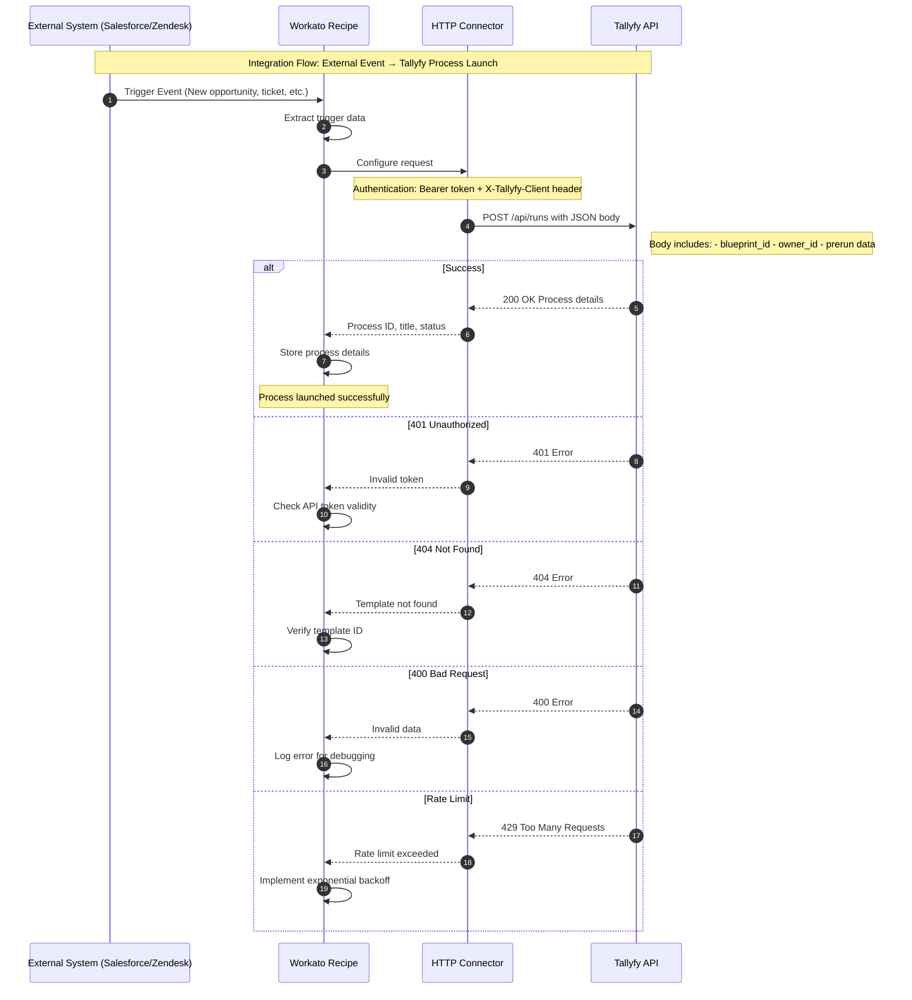

import { Steps } from '@astrojs/starlight/components';

## Automatically launch Tallyfy processes from Workato recipes

Want to launch Tallyfy workflows when something happens in Salesforce? Or maybe when a support ticket comes in? You can connect Workato to Tallyfy using the HTTP connector to automatically start [processes](/products/pro/tracking-and-tasks/processes/) based on events in your other business systems - whether that's your CRM, ERP, or help desk.

### Integration flow overview

This diagram shows how external triggers flow through Workato to launch Tallyfy processes automatically.



**What to notice:**
- The authentication setup (step 4) requires both a Bearer token and the X-Tallyfy-Client header - missing either will cause a 401 error
- Workato transforms trigger data into the prerun object that populates your kick-off form fields automatically
- Error handling paths show exactly what to check when processes don't launch - authentication, template ID, data format, or rate limits

### Prerequisites

Before you begin, make sure you have:
- A Workato account with HTTP connector access
- A Tallyfy account with API access enabled
- Your Tallyfy API token from **Settings > Integrations > REST API**
- The template ID of the Tallyfy process you want to launch
- The user ID who will own the launched processes

### Step 1: Create the HTTP connection in Workato

<Steps>
1. In Workato, go to **Connections** and click **Create connection**
2. Search for and select **HTTP**
3. Name your connection (e.g., "Tallyfy API")
4. Configure these settings:
   - **Authentication type**: API key
   - **How to apply**: Header
   - **Authorization header format**: Custom
   - **Custom authorization header**: `Bearer YOUR_API_TOKEN`
   - **Other headers**: Click **Add header** and add:
     - Name: `X-Tallyfy-Client`
     - Value: `APIClient`
5. Click **Connect** to save
</Steps>

### Step 2: Create a recipe to launch processes

<Steps>
1. Create a new recipe in Workato
2. Choose your trigger (e.g., "New row in database", "New Salesforce opportunity", etc.)
3. Add an **HTTP** action
4. Select your Tallyfy HTTP connection
5. Configure the HTTP request:
   - **Request name**: Launch Tallyfy Process
   - **Method**: POST
   - **URL**: `https://go.tallyfy.com/api/runs`
   - **Request headers**: Add `Content-Type` with value `application/json`
</Steps>

### Step 3: Configure the request body

Here's where you tell Tallyfy what process to launch and with what data. You'll need JSON in the **Request body** field:

```json
{
  "blueprint_id": "YOUR_TEMPLATE_ID",
  "title": "Process title from trigger data",
  "owner_id": "USER_ID",
  "organization_id": "YOUR_ORG_ID",
  "prerun": {
    "field1_name": "value from trigger",
    "field2_name": "another value"
  }
}
```

#### Mapping dynamic data

Real power comes from using data from your trigger. Instead of hardcoding values:

1. Click the **Formula** mode toggle
2. Build your JSON dynamically:

```ruby
{
  "blueprint_id": "abc123",
  "title": "Order " + trigger["order_number"] + " - " + trigger["customer_name"],
  "owner_id": "user456",
  "organization_id": "org789",
  "prerun": {
    "customer_name": trigger["customer_name"],
    "order_value": trigger["total_amount"],
    "priority": trigger["priority"]
  }
}
```

### Step 4: Handle kick-off form fields

Got a [kick-off form](/products/pro/launching/triggers/kick-off-forms/) in your template? You'll populate those fields through the `prerun` object. It's straightforward:

1. Identify all required kick-off form fields in your template
2. Map each field in the `prerun` section
3. Ensure data types match (text, number, date, etc.)

Here's an example with different field types:
```json
{
  "blueprint_id": "template123",
  "title": "New Employee: John Smith",
  "owner_id": "hr_manager_id",
  "prerun": {
    "employee_name": "John Smith",
    "start_date": "2024-03-15",
    "department": "Engineering",
    "salary": 75000,
    "remote_worker": true,
    "equipment_needed": ["Laptop", "Monitor", "Headset"]
  }
}
```

### Step 5: Process the Tallyfy response

Once Tallyfy launches your process, it sends back details you can use:

<Steps>
1. Add a **Variable** action after your HTTP request
2. Name it "Process Details"
3. Map these useful fields from the HTTP response:
   - `id` - The process ID
   - `title` - The process title
   - `status` - Current status
   - `owner` - Process owner details
   - `created_at` - When it was created
</Steps>

### Step 6: Add error handling

<Steps>
1. Click the HTTP action's error handler (⚠️ icon)
2. Add actions for different error scenarios:
   - **401 Unauthorized**: Check API token validity
   - **404 Not Found**: Verify template ID exists
   - **400 Bad Request**: Log the error details for debugging
3. Consider adding email notifications for failures
</Steps>

### Common integration patterns

#### Pattern 1: Launch from CRM opportunity

Picture this - a Salesforce opportunity hits "Closed Won" and your onboarding kicks off automatically:
1. Trigger: Salesforce - Updated opportunity
2. Condition: Status changed to "Closed Won"
3. Action: Launch Tallyfy customer onboarding process
4. Pass opportunity data to kick-off form

#### Pattern 2: Launch from support ticket

When urgent tickets need immediate attention:
1. Trigger: Zendesk - New ticket
2. Condition: Priority = "Urgent"
3. Action: Launch Tallyfy escalation process
4. Assign to on-call manager

#### Pattern 3: Scheduled launches

Perfect for monthly reports or weekly reviews:
1. Trigger: Scheduler - Daily/Weekly/Monthly
2. Action: Launch Tallyfy process
3. Use date formulas for dynamic titles

### Troubleshooting tips

#### Tallyfy process not launching?

Here's what to check:
- Verify your Tallyfy API token is active and has proper permissions
- Check that `X-Tallyfy-Client: APIClient` header is included
- Ensure the Tallyfy template ID is correct (not the template name)
- Confirm user ID exists and is active

#### Kick-off form data not appearing?

The usual suspects:
- Field names in `prerun` must match exactly (case-sensitive)
- Check data types match field expectations
- Required fields must have values

#### Rate limit errors?

You're hitting Tallyfy's API limits (100 requests per minute). Try these fixes:
- Add delays between bulk launches
- Implement exponential backoff for retries
- Space out your requests over time

### Next steps

Got your integration working? Time to level up:
- Set up webhooks to get notified when tasks complete
- Create recipes to update processes based on external events
- Build dashboards to track launched processes
- Implement two-way sync between systems

import { CardGrid, LinkTitleCard } from "~/components";

## Related articles
<CardGrid>
<LinkTitleCard header="<b>Middleware > Integrate Tallyfy with Workato</b>" href="/products/pro/integrations/middleware/workato/" > Organizations can seamlessly integrate Tallyfy with Workato using HTTP connectors or custom connector development to enable enterprise-scale workflow automation between Tallyfy processes and other business systems. </LinkTitleCard>
<LinkTitleCard header="<b>Triggers > Launch via API</b>" href="/products/pro/launching/triggers/via-api/" > Tallyfy's API enables automated process launching through REST endpoints that integrate with external systems to trigger workflows based on events conditions or schedules while supporting data pre-population and custom process parameters for enterprise-grade automation. </LinkTitleCard>
<LinkTitleCard header="<b>Triggers > Launch via middleware</b>" href="/products/pro/launching/triggers/via-middleware/" > Middleware platforms enable automated process launching in Tallyfy by connecting external applications through triggers that watch for events and automatically initiate workflows with mapped data transfer capabilities. </LinkTitleCard>
<LinkTitleCard header="<b>Workato > Complete Tallyfy tasks from Workato</b>" href="/products/pro/integrations/middleware/workato/how-to-complete-tallyfy-tasks-from-workato/" > This guide demonstrates how to programmatically complete Tallyfy tasks from Workato recipes by using HTTP requests with task IDs and form field data to create automated cross-platform workflows triggered by external system events. </LinkTitleCard>
</CardGrid>