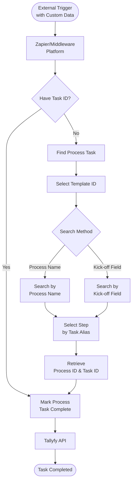

import { Steps } from '@astrojs/starlight/components';

## How can I automate task completion in Tallyfy using Zaps?

You can automate [tasks](/products/pro/tracking-and-tasks/tasks/) in Tallyfy through Zapier - and this guide shows you exactly how. The same approach works with other [middleware](/products/pro/integrations/middleware/) platforms like Power Automate too.

Why bother with automation? It cuts out manual steps, speeds up your workflows, and keeps everything running smoothly across your connected apps.

## Automation flow overview

This diagram shows how Zapier connects external triggers to Tallyfy task completion through two possible paths.

**What to notice:**
- The flow branches based on whether you already have the task ID - if not, you'll need to find it first
- Finding a task requires both the template ID and a search method (either process name or kick-off field value)
- Both paths converge at the final action where the task gets marked complete through Tallyfy's API

:::note[Considering Integration Alternatives]
While Zapier can be useful for simple connections, we generally recommend more capable and cost-effective [middleware](/products/pro/integrations/middleware/) solutions like **n8n**, **Make**, or **Microsoft Power Automate** for serious integrations.

For maximum control and flexibility, especially if you have development resources, consider using Tallyfy's [Open API](/products/pro/integrations/open-api/) to build custom integrations, potentially leveraging AI to generate code for serverless functions.
:::

First things first - pick a trigger that lets you send custom data, like a process name.

Got the [task](/products/pro/tracking-and-tasks/tasks/) ID already? Great, jump ahead to completing the task. If not, here's how to find it:

<Steps>
1. Create an action step, choose Tallyfy, and select "Find [Process Task](/products/pro/tracking-and-tasks/tasks/)."

    
2. Enter the [template](/products/pro/documenting/templates/) you want to find the [process](/products/pro/tracking-and-tasks/processes/) for. You can also let your trigger decide by sending the _Template ID_.
3. In the "Search By" field, pick whether you're searching by process name or Kick Off field.
4. The "Search Value" field needs the exact process name (yes, the whole thing). For Kick-Off field searches, use the "Filter Value" field instead.
5. Set which [task](/products/pro/tracking-and-tasks/tasks/) to complete in the "Selected Step" field. Your trigger can provide this value - just make sure it's a _task alias_.

    
</Steps>

Found your [process](/products/pro/tracking-and-tasks/processes/)? Perfect. Here's how to complete the [task](/products/pro/tracking-and-tasks/tasks/):

<Steps>
1. Create a new Tallyfy action step and select "Mark [Process Task](/products/pro/tracking-and-tasks/tasks/) Complete."
2. You'll need both the _Process ID_ and _Task ID_. Grab these by selecting "Use a Custom Value," then picking the "Find Process Task" action, and choosing either _Process ID_ or _Task ID_.
</Steps>

Want to see this in action? Watch how to set up a zap that marks a [process task](/products/pro/tracking-and-tasks/tasks/) complete:

<lite-vimeo videoid="326754823"></lite-vimeo>

Quick heads-up: Testing a zap that completes a [task](/products/pro/tracking-and-tasks/tasks/)? You'll need to manually re-open that task in Tallyfy afterwards.

import { CardGrid, LinkTitleCard } from "~/components";

## Related articles
<CardGrid>
<LinkTitleCard header="<b>Middleware > Zapier</b>" href="/products/pro/integrations/middleware/zapier/" > Tallyfy's Zapier integration enables automated workflows between Tallyfy and thousands of business applications by triggering processes completing tasks capturing form data synchronizing information and scheduling recurring workflows without requiring coding expertise. </LinkTitleCard>
<LinkTitleCard header="<b>Zapier > Tallyfy and Zapier</b>" href="/products/pro/integrations/middleware/zapier/how-can-i-improve-task-management-with-tallyfy/" > Tallyfy and Zapier work together to create an effective task management system by combining human-driven process management with automated application connections that streamline workflows while maintaining accountability and human oversight. </LinkTitleCard>
<LinkTitleCard header="<b>Workato > Complete Tallyfy tasks from Workato</b>" href="/products/pro/integrations/middleware/workato/how-to-complete-tallyfy-tasks-from-workato/" > This guide demonstrates how to programmatically complete Tallyfy tasks from Workato recipes by using HTTP requests with task IDs and form field data to create automated cross-platform workflows triggered by external system events. </LinkTitleCard>
<LinkTitleCard header="<b>Zapier > Connect Tallyfy to Zapier</b>" href="/products/pro/integrations/middleware/zapier/how-to-connect-your-tallyfy-account-to-zapier/" > This guide explains how to authenticate and establish a secure connection between your Tallyfy account and Zapier platform by obtaining your Organization ID from Tallyfy settings and configuring the connection in Zapier to enable automated workflow integrations. </LinkTitleCard>
</CardGrid>