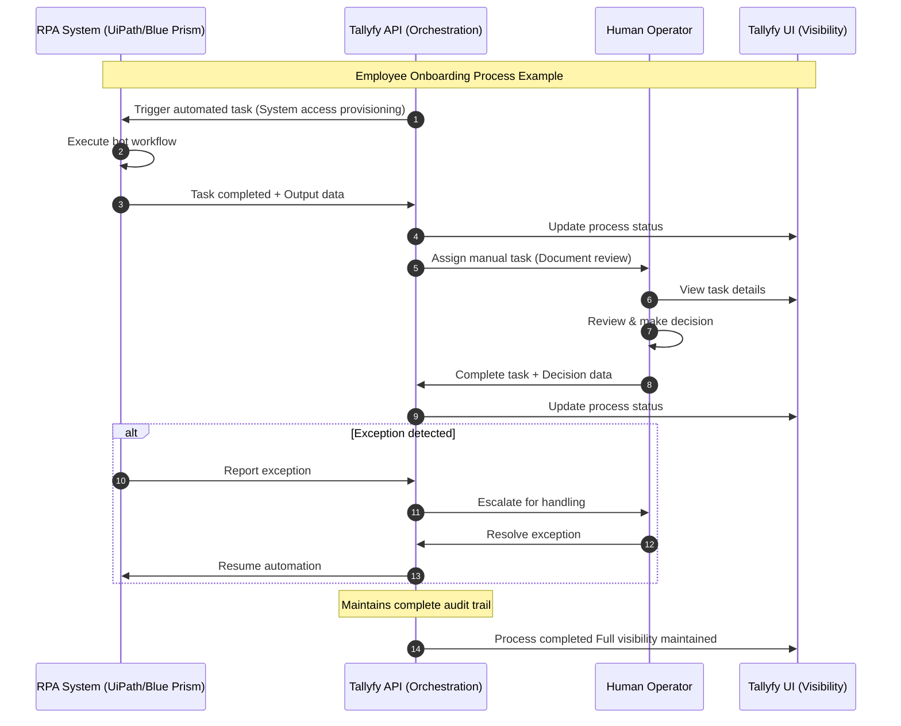

## Integrating RPA Systems with Human Workflows

Robotic Process Automation (RPA) excels at automating repetitive, rule-based tasks, but many business processes require a combination of automated and human-driven activities. Tallyfy provides the orchestration layer that connects RPA systems with human workflows, creating comprehensive end-to-end process automation.

:::note[API Documentation]
For integrating Tallyfy with RPA systems, refer to our [complete API documentation](https://go.tallyfy.com/api/)
:::

### The human-RPA integration challenge

RPA platforms like UiPath, Automation Anywhere, and Blue Prism effectively automate predictable, structured tasks. However, most business processes contain elements that require human judgment, decision-making, or exception handling. This creates several challenges:

- **Process fragmentation** - Automated and manual steps exist in separate systems
- **Visibility gaps** - Limited insight into the complete process status
- **Coordination issues** - Difficulty managing handoffs between bots and humans
- **Accountability concerns** - Unclear responsibility for process outcomes

### Tallyfy as the orchestration layer

Tallyfy addresses these challenges by providing a unified platform that:

1. **Coordinates the entire process** - Manages both automated and human tasks in a single workflow
2. **Provides end-to-end visibility** - Shows status of both RPA and human activities
3. **Facilitates effective handoffs** - Transitions work between systems and people
4. **Maintains accountability** - Tracks responsibility throughout the entire process

### Implementation architecture

The typical integration architecture includes:

- RPA bots executing automated tasks
- Tallyfy API managing the process flow and task assignments
- Human operators completing tasks requiring judgment
- API-based communication between all systems

### How RPA and human tasks flow together

This diagram shows the real-time interaction between RPA systems, Tallyfy's orchestration layer, and human operators during process execution.

**What to notice:**
- **Seamless handoffs** - Work transitions automatically between RPA bots and human operators through Tallyfy's API orchestration
- **Exception handling** - When RPA encounters issues, Tallyfy automatically escalates to human operators for resolution before resuming automation
- **Complete visibility** - Every action from both automated and human activities is tracked in real-time through the Tallyfy UI

### Example: Employee Onboarding Process

The following screenshot shows how Tallyfy orchestrates an employee onboarding process that combines RPA and human tasks:

In this example:
- RPA handles structured tasks like system access provisioning (marked with automation icons)
- Human operators manage judgment-based activities like document review
- Tallyfy tracks status across both automated and manual steps
- The entire process remains visible in a single Tallyfy interface

### Business benefits

This integrated approach delivers advantages:

- **Process acceleration** - Automation of appropriate tasks while maintaining quality
- **Error reduction** - Consistent execution of repetitive activities
- **Enhanced visibility** - Complete process transparency across all activities
- **Improved adoption** - User-friendly interface for business teams
- **Greater flexibility** - Modification of process flows without technical debt

For more information on implementing RPA with Tallyfy, visit our [RPA solution page](https://tallyfy.com/solutions/robotic-process-automation-rpa-orchestration-software/) or [schedule a consultation](https://tallyfy.com/booking).

import { CardGrid, LinkTitleCard } from "~/components";

## Related articles
<CardGrid>
<LinkTitleCard header="<b>Zapier > Tallyfy and Zapier</b>" href="/products/pro/integrations/middleware/zapier/how-can-i-improve-task-management-with-tallyfy/" > Tallyfy and Zapier work together to create an effective task management system by combining human-driven process management with automated application connections that streamline workflows while maintaining accountability and human oversight. </LinkTitleCard>
<LinkTitleCard header="<b>Power Automate > Introduction to RPA with Power Automate</b>" href="/products/pro/integrations/middleware/power-automate/introduction-to-rpa-with-power-automate/" > Power Automate Desktop enables automation of legacy desktop applications through RPA bots that mimic human interactions with user interfaces when API integration with Tallyfy is not possible. </LinkTitleCard>
<LinkTitleCard header="<b>Pro > Integrations</b>" href="/products/pro/integrations/" > Tallyfy connects with business systems through multiple integration methods including API implementations webhooks middleware platforms AI agents native connections email and analytics tools to create seamless automated workflows across your entire technology stack. </LinkTitleCard>
<LinkTitleCard header="<b>Computer Ai Agents > RPA vs. computer AI agents</b>" href="/products/pro/integrations/computer-ai-agents/rpa-vs-computer-use-agents/" > Businesses must understand the fundamental differences between RPA which follows rigid rule-based scripts for structured data tasks and Computer AI Agents which use artificial intelligence to adaptively handle complex unstructured tasks with Tallyfy serving as the orchestration platform that manages both automation types within comprehensive business processes. </LinkTitleCard>
</CardGrid>