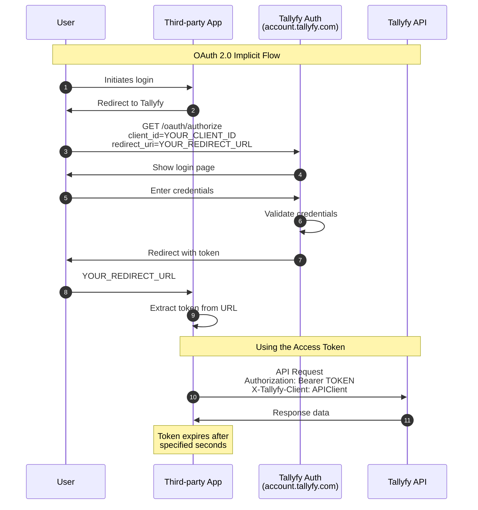

## Implementing the OAuth authorization flow

This guide explains how to implement a standard OAuth authorization flow for third-party applications integrating with Tallyfy. This approach allows your users to authenticate directly with Tallyfy without sharing their credentials with your application.

### Requirements

- Paid Tallyfy Professional or Enterprise subscription
- Client ID and Client Secret from Tallyfy
- A registered redirect URI for your application
- Basic understanding of OAuth 2.0 authorization flows

:::caution[Enterprise Feature]
The OAuth authorization flow is only available to paid organizations. Contact Tallyfy Support to request a Client ID and Client Secret for your application.
:::

### Standard OAuth flow implementation

The following diagram shows the complete OAuth 2.0 implicit flow for authenticating third-party applications with Tallyfy.



**What to notice:**
- The access token is returned in the URL fragment (after #) for security - fragments are not sent to servers
- Authentication happens entirely on Tallyfy's domain, your app never sees user credentials
- The `X-Tallyfy-Client` header is required for all API calls after authentication

#### Step 1: Redirect users to Tallyfy authorization page

Direct your users to the Tallyfy authorization endpoint:

```
https://account.tallyfy.com/oauth/authorize?client_id=YOUR_CLIENT_ID&response_type=token&redirect_uri=YOUR_REDIRECT_URL
```

Replace:
- `YOUR_CLIENT_ID` with your application's client ID
- `YOUR_REDIRECT_URL` with your application's registered redirect URI

Users will see the Tallyfy login page where they can authenticate using their Tallyfy credentials.

#### Step 2: Handle the redirect with access token

After successful authentication, Tallyfy redirects the user back to your specified redirect URI with the access token in the URL fragment:

```
YOUR_REDIRECT_URL?access_token=ACCESS_TOKEN&token_type=Bearer&expires_in=EXPIRES_IN_SECONDS
```

Your application should:
1. Extract the `access_token` from the URL
2. Store it securely
3. Use it for subsequent API requests

#### Step 3: Make API requests with the access token

Use the access token in the Authorization header for all Tallyfy API requests:

```
Authorization: Bearer ACCESS_TOKEN
Content-Type: application/json
X-Tallyfy-Client: APIClient
```

:::note[Required Headers]
Always include the `X-Tallyfy-Client: APIClient` header in all direct API calls to Tallyfy endpoints. Requests without this header will be rejected.
:::

### Example implementation

#### Example authorization URL

```
https://account.tallyfy.com/oauth/authorize?client_id=9999&response_type=token&redirect_uri=https://yourapp.com/auth/callback
```

#### Example redirect with access token

```
https://yourapp.com/auth/callback?access_token=eyJhbGciOiJIUzI1NiIsInR5cCI6IkpXVCJ9...&token_type=Bearer&expires_in=840
```

#### Handling multi-organization users

A user in Tallyfy can belong to multiple organizations. After authentication, the access token is associated with the organization the user is currently logged into. If your application needs to work with multiple Tallyfy organizations for a user:

1. Store the organization context along with the access token
2. Consider implementing organization selection in your application
3. For users in multiple organizations, you may need to handle organization-specific authentication flows

### Security best practices

- Always use HTTPS for all OAuth-related communication
- Implement PKCE (Proof Key for Code Exchange) for added security
- Store access tokens securely, preferably encrypted
- Implement token expiration handling
- Never expose your Client Secret in client-side code
- Validate all redirect URIs against expected patterns
- Implement state parameter to prevent CSRF attacks

### Troubleshooting

| Issue | Possible Cause | Solution |
|-------|----------------|----------|
| Authorization fails | Invalid client ID | Verify your client ID |
| Redirect fails | Mismatched redirect URI | Ensure the redirect URI matches exactly with the registered one |
| Token doesn't work | Token expired | Check expiration time and request a new token |
| Organization context issues | User belongs to multiple organizations | Clarify organization context during authentication |

For any issues with the OAuth implementation, contact Tallyfy Support with detailed information about the error and your implementation.

import { CardGrid, LinkTitleCard } from "~/components";

## Related articles
<CardGrid>
<LinkTitleCard header="<b>Open Api > Integrate with Tallyfy using the API</b>" href="/products/pro/integrations/open-api/how-to-integrate-with-tallyfy-using-api/" > Tallyfy provides a REST API for integrating workflow functionality into external applications with user-based or application-based authentication methods requiring specific headers token management best practices and support for multi-organization contexts while handling common authentication issues and implementing proper security measures. </LinkTitleCard>
<LinkTitleCard header="<b>Authentication > Use the Client Credentials Flow</b>" href="/products/pro/integrations/open-api/code-samples/authentication/client-credentials-flow/" > The OAuth 2.0 Client Credentials flow enables machine-to-machine authentication for third-party applications to interact with Tallyfy API through client credentials obtained from support allowing organizations to embed workflow functionality automate processes and manage users programmatically with secure token-based authentication. </LinkTitleCard>
<LinkTitleCard header="<b>Open Api > API usage as a third-party application instead of a user</b>" href="/products/pro/integrations/open-api/access-api-as-a-third-party-application-instead-of-a-user/" > A detailed walkthrough for integrating third-party applications with Tallyfy API using client credentials to make API requests and manage users through secure token-based authentication and authorization flows. </LinkTitleCard>
<LinkTitleCard header="<b>Code Samples > Authentication methods</b>" href="/products/pro/integrations/open-api/code-samples/authentication/" > The Tallyfy API requires proper authentication through personal access tokens or OAuth flow along with specific headers to enable secure platform access and custom integrations. </LinkTitleCard>
</CardGrid>