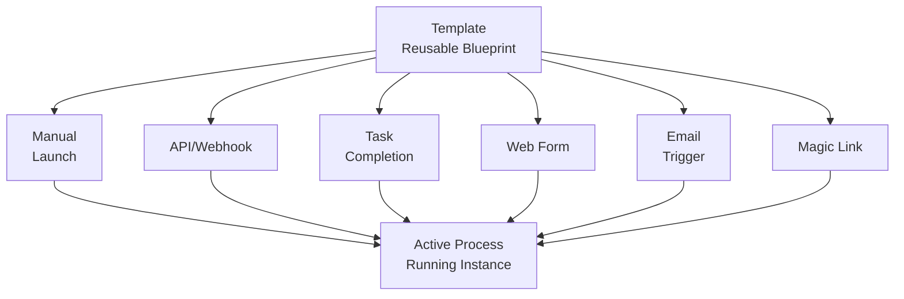

## Process launching in Tallyfy

Launching transforms templates into active, trackable processes with specific assignments and deadlines. When you launch a process, you create a running instance that team members work on.

Templates are reusable blueprints. Launched processes are specific instances executing those instructions. Each process operates independently with its own timeline, participants, and progress tracking.

### Why use process launching?

Launching turns documented procedures into active work with tracking and accountability. Task assignments reach team members at the right time with context.

### Templates vs. processes

*   **Templates** - Reusable master workflow designs with standardized step sequences (e.g., "Client Onboarding" template)
*   **Processes** - Individual workflow instances executing template instructions for specific cases (e.g., "Coca-Cola Client Onboarding" launched today)

Each process needs a unique name for tracking and monitoring multiple concurrent executions.

:::note[Template vs. blueprint]
In the Tallyfy app, we use the term **Template**. In the technical API documentation, the same concept is called a **Blueprint**.
:::

Launch a process every time you need to run the workflow from a template.

### Key concepts

#### Process independence from template changes
Template modifications only affect future launches. Running processes continue with their original instructions - they won't change mid-flight. This protects active workflows while enabling continuous template improvement.

:::tip[Adding tasks to running processes]
You can always add extra one-off [tasks](/products/pro/tracking-and-tasks/tasks/) to a process *after* it has launched. You aren't limited to the steps defined in the original template.
:::

#### Launch methods

*   **Manual launching** - From the template library interface
*   **Automatic triggers** - API calls, webhooks, or scheduled automation
*   **Cascade launching** - When tasks in other processes complete
*   **Web form integration** - Through form submissions
*   **Email triggers** - Send messages to designated addresses
*   **Magic links** - External stakeholders can initiate without login

#### How launch methods work together

This diagram shows how all launch methods converge to create an active process from a template.

**What to notice:**
- All six launch methods lead to the same outcome - an active process instance
- Every launch method allows optional customization before the process starts
- The template remains unchanged while each process runs independently with its own timeline

#### Customization during launch
When launching a process, you can:
*   Set a unique process name
*   Change task assignments
*   Adjust deadlines
*   Add guest participants
*   Fill in the kick-off form with relevant data

Alternatively, [set up auto-naming](/products/pro/tracking-and-tasks/processes/edit-processes/how-can-i-auto-name-a-process-in-tallyfy/) to automatically generate process names from kick-off form field values.

import PageTree from '@/components/PageTree.astro';

<PageTree />

## Next steps

Learn how to manually launch a process for full control over process details. For automation, explore launch triggers that start workflows automatically based on external events.

import { CardGrid, LinkTitleCard } from "~/components";

## Related articles
<CardGrid>
<LinkTitleCard header="<b>Launching > Launch manually</b>" href="/products/pro/launching/how-can-i-launch-a-process-in-tallyfy/" > Manual process launching in Tallyfy allows you to initiate workflow instances from templates with complete control over timing and customization by selecting a template naming the instance and clicking launch to create an active trackable process. </LinkTitleCard>
<LinkTitleCard header="<b>Tracking And Tasks > More about processes</b>" href="/products/pro/tracking-and-tasks/processes/" > A process in Tallyfy is a single execution instance of a template blueprint that represents actual work being done with its own unique identity activity log and ability to be tracked and modified independently from the original template. </LinkTitleCard>
<LinkTitleCard header="<b>Tutorials > Launch a process</b>" href="/products/pro/tutorials/your-first-process/" > This tutorial explains how to launch a workflow process from an existing template in Tallyfy by navigating to templates finding your desired template clicking launch completing any kick-off forms naming the process instance optionally reviewing and editing settings then launching to create an active trackable workflow. </LinkTitleCard>
<LinkTitleCard header="<b>Launching > Triggers</b>" href="/products/pro/launching/triggers/" > Tallyfy process launch triggers offer multiple methods including manual buttons API calls email addresses magic links scheduled automation task completion events and kick-off forms to initiate workflows automatically or manually while enabling data pre-population and integration with external systems. </LinkTitleCard>
</CardGrid>